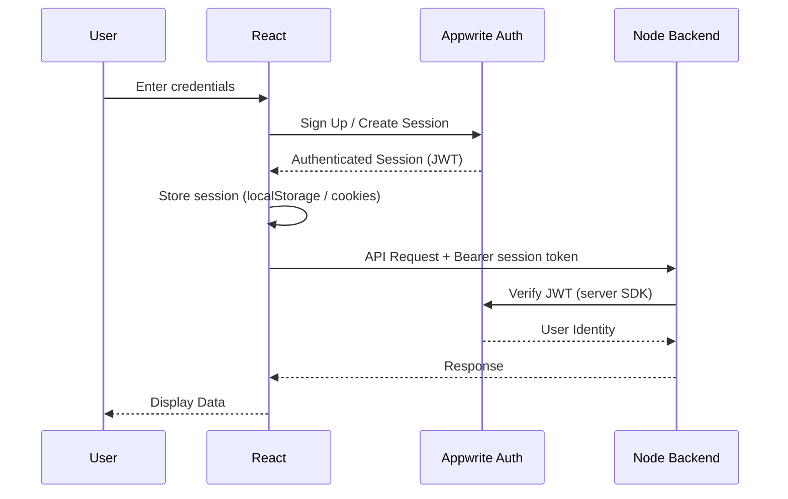
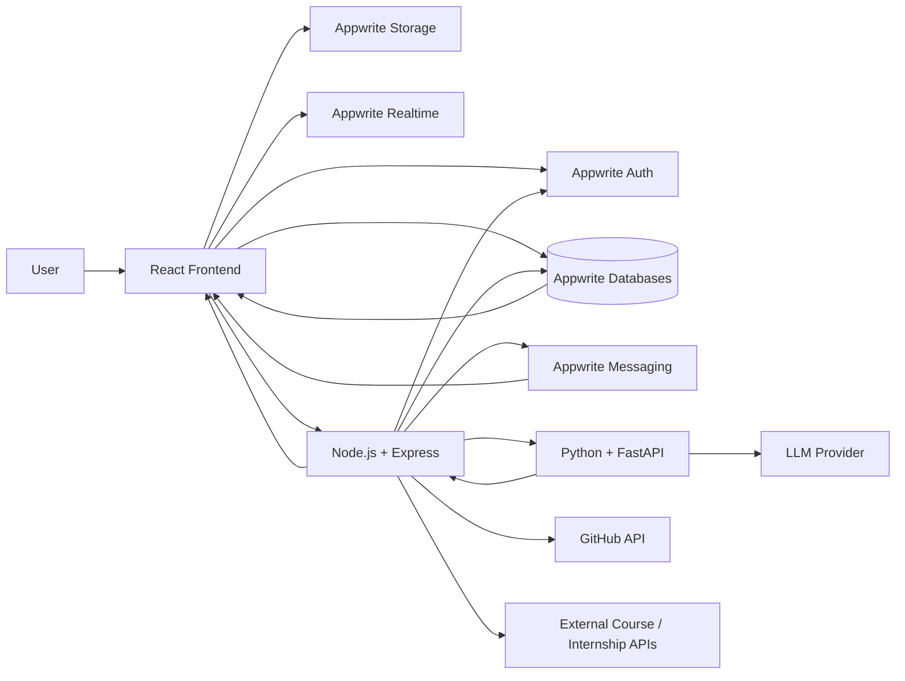

# Main Architecture — skillsaarthi

> Technical architecture and implementation blueprint for skillsaarthi.
>
> **Product:** One-Stop Personalized Career & Education Advisor
>
> **Architecture:** React + Appwrite (Auth / Databases / Storage / Messaging / Realtime / Functions) + Node.js/Express + Python/FastAPI

---

# 1. Architecture Overview

skillsaarthi follows a modular architecture consisting of four major application layers:

1. **Frontend Layer** — React + Tailwind CSS (repo root)
2. **Infrastructure & Data Layer** — Appwrite (Auth, Databases, Storage, Messaging, Realtime, Functions)
3. **Backend/Application Layer** — Node.js + Express (business logic & orchestration **plus scoring, career catalog, GitHub analysis, profile building** — `server/src/services/scoring.js`, `careerCatalog.js`, `profile.builder.js`, `github.service.js`)
4. **AI Layer** — Python + FastAPI (**resume-only LLM service** — 6 endpoints: `GET /health` + `POST /ai/resume/{extract,analyze,match,optimize,generate}`)

The core architectural principle is:

> **Appwrite handles infrastructure and primary data storage, Node.js handles business logic, scoring, catalog, GitHub analysis and orchestration, and Python handles resume LLM processing only. There is no MySQL — Appwrite Databases is the primary data store.**

---

# 2. High-Level Architecture

```text
                                      ┌──────────────────────┐
                                      │        USER          │
                                      └──────────┬───────────┘
                                                 │
                                                 ▼
                                  ┌──────────────────────────┐
                                  │      React Frontend      │
                                  │      Tailwind CSS        │
                                  │      (repo root)         │
                                  └────────────┬─────────────┘
                                               │
                            ┌──────────────────┴──────────────────┐
                            │                                     │
                            ▼                                     ▼
                 ┌────────────────────────────┐         ┌──────────────────────┐
                 │          Appwrite          │         │    Node.js/Express   │
                 │                            │         │       Backend        │
                 │ • Authentication           │         │   (server/)          │
                 │ • Databases (NoSQL)        │         │                      │
                 │ • File Storage             │         │ • Business Logic     │
                 │ • Messaging                │         │ • REST APIs          │
                 │ • Realtime                 │         │ • Appwrite Access    │
                 │ • Functions                │         │ • AI Orchestration   │
                 └────────────────────────────┘         │ • External APIs      │
                            │                            └───────────┬──────────┘
                            │                                        │
                            └───────────────┬────────────────────────┘
                                            ▼
                                   ┌─────────────────────┐
                                   │   Python/FastAPI    │
                                   │  Resume LLM Service │
                                   │    (ai-service/)    │
                                   │  (resume-only)      │
                                   │ • Resume Extract    │
                                   │ • Resume Analyze    │
                                   │ • Resume Match      │
                                   │ • Resume Optimize   │
                                   │ • Resume Generate   │
                                   └─────────────────────┘
                                 (Scoring/Catalog/GitHub → Node: scoring.js, careerCatalog.js, github.service.js)
```

---

# 3. Responsibility Matrix

| Technology | Responsibility |
|---|---|
| React | User interface |
| Tailwind CSS | UI styling |
| Appwrite Auth | Authentication |
| Appwrite Databases | Primary structured data storage (NoSQL) |
| Appwrite Storage | Resume/file storage |
| Appwrite Messaging | Notifications |
| Appwrite Realtime | Real-time events |
| Appwrite Functions | Lightweight server-side tasks (optional) |
| Node.js | Application backend (business logic, orchestration) |
| Express | REST API framework |
| Python | AI/ML processing |
| FastAPI | AI service API |
| GitHub API | Public GitHub data |
| External course/internship APIs | External opportunities |
| LLM API | Natural-language AI functionality |

---

# 4. Core Architectural Principle

The system must maintain strict separation between:

```text
Presentation & Client State
        ↓
React (repo root)

Infrastructure + Primary Data
        ↓
Appwrite (Auth / Databases / Storage / Messaging / Realtime)

Application Logic & Orchestration
        ↓
Node.js + Express (server/)

Artificial Intelligence
        ↓
Python + FastAPI (ai-service/)
```

- The frontend reads/writes data through Appwrite and calls the Node backend only for business logic.
- Business-critical logic must not live in the frontend.
- The Python service must not handle authentication.
- The AI service must not directly modify application data unless it goes through a controlled backend flow.

---

# 5. Frontend Architecture

## 5.1 Technology

```text
React
Tailwind CSS
React Router
Axios (Node backend calls)
Appwrite Web SDK (client-safe)
```

## 5.2 Responsibilities

The frontend is responsible for:

- Rendering UI
- Navigation (TopBar 3 hubs: **Discover / Build / Opportunities**; `CommunityFab` kept)
- Homes merged: single `Home` (public + private merged)
- Forms / Client-side validation / Dashboard (8 cards — reverted per user request; 800 ms retry on transient fetch failure)
- Onboarding 6→4 steps: **Skills+Interests tabs**, **Goals+Assessment sub-step**, removed silent auto-add at proficiency 2
- Recommendations: auto-generate on onboarding complete + inline `GapDrawer` for skill gaps
- GitHub: `ContributionGrid` (`src/components/github/ContributionGrid.jsx`) — 13 metrics, warm background with contrast, tooltip `"22 Sept — N contributions"`
- User interaction / Appwrite client integration (auth, DB reads/writes, file upload, realtime)
- API communication with Node backend (Axios via `src/services/api.js` — **JWT cached until 60 s before expiry**, avoids per-request `createJWT`)
- Displaying recommendations (now Node-native)
- Roadmap visualization / Progress tracking
- In-app notification inbox — Realtime via `appwriteClient.subscribe` + 45 s polling fallback (`src/components/layout/NotificationBell.jsx`)
- Daily-activity streak tracking (`touchStreak`) and display

---

# 6. Frontend Structure

```text
skillsaarthi/                      # repo root = React frontend
│
├── public/
│
├── src/
│   │
│   ├── assets/
│   │
│   ├── components/
│   │   ├── common/           # Icon.jsx, DecorativeShapes.jsx, CommunityFab.jsx (kept)
│   │   ├── auth/
│   │   ├── profile/
│   │   ├── career/           # GapDrawer.jsx (inline gaps on Recommendations)
│   │   ├── roadmap/
│   │   ├── resume/
│   │   ├── github/           # ContributionGrid.jsx (13 metrics, warm bg, tooltip)
│   │   ├── courses/
│   │   ├── internships/
│   │   ├── layout/           # TopBar.jsx (3 hubs: Discover/Build/Opportunities), NotificationBell.jsx (Realtime + polling)
│   │   └── assistant/
│   │
│   ├── pages/
│   │   ├── public/           # Home.jsx (merged public+private)
│   │   ├── auth/
│   │   └── private/          # Dashboard.jsx (8 cards + 800ms retry), Onboarding.jsx (4 steps), Recommendations.jsx (auto-generate)
│   │
│   ├── services/
│   │   ├── api.js            # Axios → Node (JWT cached until 60s before exp)
│   │   ├── appwrite.js       # Appwrite client + database helpers + appwriteClient for Realtime
│   │   ├── auth.js           # Auth helpers (login/signup/session + avatar)
│   │   └── notifications.js  # getNotifications / markRead (client SDK)
│   │
│   ├── hooks/
│   ├── context/
│   ├── utils/
│   ├── routes/
│   │   └── AppRoutes.jsx     # lazy-loaded routes (React.lazy + Suspense)
│   │
│   ├── App.jsx
│   ├── main.jsx
│   └── index.css
│
├── .env
├── .env.sample
├── vite.config.js
└── package.json
```

---

# 7. Appwrite Architecture

Appwrite is the application's **infrastructure and primary data layer**.

## 7.1 Appwrite Services Used

```text
Appwrite
│
├── Authentication
├── Databases          ← primary data store (NoSQL)
├── Storage
├── Messaging
└── Realtime
```

Appwrite Functions are optional and may be used later for small server-side tasks. Heavy business logic stays in the Node backend.

---

# 8. Appwrite Authentication

Appwrite handles:

- User registration
- Login
- Logout
- Session management
- Password recovery
- Email verification
- OAuth if implemented

## Authentication Flow

```text
User
 │
 ▼
React
 │
 │ Appwrite Auth SDK
 ▼
Appwrite Authentication
 │
 ├── Validate credentials
 ├── Create session
 └── Return authenticated session
 │
 ▼
React
 │
 │ Authenticated API Request (Appwrite session token)
 ▼
Node.js Backend
```

---

# 9. Authentication Architecture



---

# 10. User Identity Mapping

Appwrite owns the authentication identity.

Appwrite Databases owns the application profile and career data.

```text
Appwrite User (Auth)
      │
      │ user $id
      ▼
profiles collection (Appwrite Databases)
      │
      ├── skills        (user_skills collection)
      ├── interests     (user_interests collection)
      ├── assessments   (assessments collection)
      ├── roadmaps      (roadmaps collection)
      └── recommendations (career_recommendations collection)
```

The `profiles` document should use the Appwrite user ID as its document ID.

Example:

```text
profiles
--------------------
$id             = <Appwrite user $id>
user_id         = <Appwrite user $id>
education_level
degree
branch
study_year
cgpa
career_goal
created_at
updated_at
```

---

# 11. Appwrite Storage

Appwrite Storage is responsible for files.

Primary use case:

```text
Resume Upload
Profile pictures (avatars)
```

Two storage buckets are provisioned by `scripts/setup-appwrite.mjs`:

| Bucket | ID (env) | Allowed extensions | Use |
|---|---|---|---|
| `resumes` | `VITE_APPWRITE_RESUME_BUCKET_ID` | `pdf, docx, doc, png, jpg, jpeg, webp, gif` | Resume upload |
| `avatars` | `VITE_APPWRITE_AVATAR_BUCKET_ID` | `png, jpg, jpeg, webp, gif` | Profile pictures |

> The Appwrite **free plan allows a single storage bucket**, so by default avatars
> reuse the `resumes` bucket (`VITE_APPWRITE_AVATAR_BUCKET_ID=resumes`); the setup
> script broadens `resumes` to also accept image files. If the plan is upgraded,
> set `APPWRITE_AVATAR_BUCKET_ID` (scripts) / `VITE_APPWRITE_AVATAR_BUCKET_ID`
> (frontend) to a dedicated bucket id and re-run `setup:appwrite` to provision it.

Avatar files are stored client-side in the upload bucket and referenced from the
Appwrite **account prefs** (`account.updatePrefs({ avatar_file_id })`) rather than a DB
attribute, so no schema migration is needed. `loadAvatarUrl(user)` in
`src/services/auth.js` streams the original bytes via `storage.getFileView` through the
SDK client and returns a `blob:` URL (the free plan blocks `getFilePreview` image
transformations, so the avatar is shown at its uploaded size).

## Profile update flow

```text
User (TopBar avatar → /settings)
  ▼
React (ProfileSettings.jsx)
  │ account.updateName(name)          ──► Appwrite Auth (account name)
  │ storage.createFile(resumes, file) ──► Appwrite Storage (image)
  │ account.updatePrefs({ avatar_file_id })
  ▼
refreshUser() → TopBar avatar/name update immediately
```

## Resume Upload Flow

```text
User
 │
 ▼
React
 │
 │ Upload File
 ▼
Appwrite Storage
 │
 │ File ID
 ▼
Node Backend
 │
 ▼
Python AI Service
 │
 ▼
Resume Analysis
```

The database stores metadata rather than the actual resume binary.

Example (`resume_analyses` collection):

```text
resume_analyses
-----------------------------
$id
user_id
appwrite_file_id
file_name
analysis_result
created_at
```

---

# 12. Appwrite Messaging

Appwrite Messaging can be used for:

- Roadmap reminders
- Personalized notifications
- Course notifications
- Internship alerts
- Progress reminders

Flow:

```text
Roadmap Task
     │
     ▼
Node Backend
     │
     ▼
Appwrite Messaging
     │
     ▼
User
```

For MVP simplicity, in-app notifications can be stored in a `notifications` collection in Appwrite Databases and displayed through the dashboard. Appwrite Messaging is used when push/email/SMS delivery is needed.

---

# 13. Appwrite Realtime

Realtime is optional for the MVP.

It can be used for:

- Live roadmap progress updates
- Notification updates
- Dashboard updates
- AI processing status

Example:

```text
User completes task
        ↓
Node Backend
        ↓
Appwrite Databases updated
        ↓
Realtime Event
        ↓
React Dashboard
        ↓
UI updates
```

---

# 14. Node.js Backend Architecture

Node.js is the application server for business logic and orchestration (now also **scoring, career catalog, GitHub analysis, profile building** — not a thin proxy). It is **not** the primary data store.

Responsibilities:

- REST API (business-logic endpoints)
- Business logic + **scoring & skill-gap** (`scoring.js`), **career catalog** (`careerCatalog.js`), **profile building** (`profile.builder.js`), **GitHub analysis** (`github.service.js`)
- Authorization checks on server-only operations
- Validation + **rate limiting** (`express-rate-limit` 30/min on `/api/github|resume|admin` in `app.js`)
- Appwrite server-side integration (Admin SDK)
- AI service communication (**resume LLM only** — `ai.service.js` proxies to `/ai/resume/*`)
- External API integration (GitHub API, courses, internships)
- Recommendation / Roadmap orchestration
- Notification triggering (Realtime + polling fallback)

---

# 15. Backend Structure

```text
server/
│
├── src/
│   │
│   ├── config/
│   │   ├── appwrite.js
│   │   └── environment.js
│   │
│   ├── routes/
│   │   ├── profile.routes.js
│   │   ├── career.routes.js
│   │   ├── recommendation.routes.js
│   │   ├── roadmap.routes.js
│   │   ├── resume.routes.js
│   │   ├── github.routes.js
│   │   ├── course.routes.js
│   │   ├── internship.routes.js
│   │   ├── admin.routes.js
│   │   └── assistant.routes.js
│   │
│   ├── controllers/
│   │   ├── career.controller.js
│   │   ├── recommendation.controller.js
│   │   └── roadmap.controller.js
│   │
│   ├── services/
│   │   ├── scoring.js              # NEW — weighted scoring + skill-gap + compare + what-if (moved from Python)
│   │   ├── careerCatalog.js        # NEW — static careers catalog (moved from ai-service/careers.py)
│   │   ├── profile.builder.js      # NEW — builds normalized profile for scoring
│   │   ├── github.service.js       # Node-native GitHub analyzer (no Python, 13 metrics)
│   │   ├── recommendation.service.js # orchestrates scoring.js + Appwrite
│   │   ├── career.service.js
│   │   ├── appwrite.service.js
│   │   ├── ai.service.js           # resume-only LLM proxy (POST /ai/resume/* + fallback)
│   │   ├── roadmap.service.js
│   │   ├── notification.service.js
│   │   └── ...
│   │
│   ├── middleware/
│   │   ├── auth.middleware.js
│   │   ├── validation.middleware.js
│   │   ├── error.middleware.js
│   │   └── rateLimit.middleware.js  # express-rate-limit 30/min
│   │
│   ├── utils/
│   │
│   └── app.js                      # mounts routes + rate limiters on /api/github|resume|admin
│
├── .env
└── package.json
```

---

# 16. Backend Request Lifecycle

```text
HTTP Request
      ↓
Express Router
      ↓
Authentication Middleware (verify Appwrite JWT)
      ↓
Validation Middleware
      ↓
Controller
      ↓
Service Layer
      ↓
  ┌────┼─────────────┐
  ▼    ▼             ▼
Appwrite   External   AI Service
DB/Storage  APIs      (Python/FastAPI)
      │
      ▼
Response
```

---

# 17. Appwrite Database Architecture

Appwrite Databases is the primary data store. It is a NoSQL document database organized into **collections** (similar to tables) of **documents**.

## Collection Overview

| Collection | Purpose | Key attributes |
|---|---|---|
| `profiles` | One document per user | `user_id`, `education_level`, `degree`, `branch`, `study_year`, `cgpa`, `subjects`, `academic_strengths`, `career_goal`, `preferred_industry`, `preferred_role`, `preferred_location`, `work_preference`, `experience_years`, `assessment_score`, `onboarding_completed`, `github_username`, `current_streak`, `best_streak`, `last_active_date` |
| `skills` | Global skill catalog | `name`, `category` |
| `user_skills` | User ↔ skill proficiency | `user_id`, `skill_id`, `proficiency` |
| `interests` | Global interest catalog | `name` |
| `user_interests` | User ↔ interest link | `user_id`, `interest_id` |
| `careers` | Career catalog | `name`, `category`, `description` |
| `career_skills` | Career ↔ required skill | `career_id`, `skill_id`, `required_level` (1–5 proficiency), `importance` (1–5) |
| `assessments` | Assessment attempts | `user_id`, `type`, `score`, `responses`, `completed_at` |
| `career_recommendations` | Generated recommendations | `user_id`, `career_id`, `match_score`, `explanation` |
| `roadmaps` | Roadmaps per user + career | `user_id`, `career_id`, `title`, `status`, `progress_percent` |
| `roadmap_tasks` | Tasks inside a roadmap | `roadmap_id`, `title`, `description`, `order_index`, `estimated_hours`, `status`, `completed_at` |
| `courses` | Course catalog | `name`, `provider`, `skill_id`, `level`, `duration_hours`, `url`, `cost`, `rating` |
| `user_courses` | User course tracking | `user_id`, `course_id`, `status`, `progress` |
| `internships` | Internship catalog | `title`, `company`, `location`, `description`, `url`, `skills` (JSON array), `eligibility`, `status` (pending/active/rejected), `source`, `source_key`, `expires_at`, `fetched_at` |
| `internship_recommendations` | Internship matches | `user_id`, `internship_id`, `match_score` |
| `resume_analyses` | Resume analysis metadata | `user_id`, `appwrite_file_id`, `file_name`, `analysis_result` |
| `github_analyses` | GitHub analysis metadata | `user_id`, `github_username`, `analysis_result` |
| `notifications` | In-app notifications | `user_id`, `title`, `message`, `is_read` |
| `community_profiles` | Community bio + meta per user | `user_id`, `bio`, `location`, `role`, `interests` |
| `community_posts` | Community posts | `user_id`, `title`, `content`, `category`, `tags` (CSV), `status` (draft/published), `likes_count`, `comments_count` |
| `community_comments` | Comments on posts | `user_id`, `post_id`, `content` |
| `post_likes` | Like edges (unique per user+post) | `user_id`, `post_id` |
| `post_bookmarks` | Bookmark edges (unique per user+post) | `user_id`, `post_id` |

> **Security note:** Appwrite permissions are configured per collection. Most collections are `user` scoped (a user can only read/write their own documents). Global catalogs (`skills`, `careers`, `courses`, `internships`) are read-only for authenticated users.

---

# 18. Database Relationship Model

```mermaid
erDiagram

    PROFILES {
        string id PK
        string user_id UK
        string education_level
        string degree
        string branch
        int study_year
        decimal cgpa
        text subjects
        text academic_strengths
        text career_goal
        string preferred_industry
        string preferred_role
        string preferred_location
        string work_preference
        int experience_years
        float assessment_score
        boolean onboarding_completed
        string github_username
        int current_streak
        int best_streak
        string last_active_date
        datetime created_at
        datetime updated_at
    }

    SKILLS {
        string id PK
        string name UK
        string category
    }

    USER_SKILLS {
        string id PK
        string user_id FK
        string skill_id FK
        int proficiency
    }

    INTERESTS {
        string id PK
        string name UK
    }

    USER_INTERESTS {
        string id PK
        string user_id FK
        string interest_id FK
    }

    CAREERS {
        string id PK
        string name
        string category
        text description
    }

    CAREER_SKILLS {
        string id PK
        string career_id FK
        string skill_id FK
        int required_level
        int importance
    }

    ASSESSMENTS {
        string id PK
        string user_id FK
        string type
        decimal score
        json responses
        datetime completed_at
    }

    CAREER_RECOMMENDATIONS {
        string id PK
        string user_id FK
        string career_id FK
        decimal match_score
        json explanation
        datetime created_at
    }

    ROADMAPS {
        string id PK
        string user_id FK
        string career_id FK
        string title
        string status
        int progress_percent
        datetime created_at
        datetime updated_at
    }

    ROADMAP_TASKS {
        string id PK
        string roadmap_id FK
        string title
        text description
        int order_index
        int estimated_hours
        string status
        datetime completed_at
    }

    COURSES {
        string id PK
        string name
        string provider
        string skill_id FK
        string level
        int duration_hours
        string url
        int cost
        float rating
    }

    USER_COURSES {
        string id PK
        string user_id FK
        string course_id FK
        string status
        int progress
    }

    INTERNSHIPS {
        string id PK
        string title
        string company
        string location
        text description
        string url
        string skills
        string eligibility
        enum   status            // pending | active | rejected
        string source            // manual | file | remotive | <feeder>
        string source_key        // dedup key, e.g. <feed>:<title>:<company>
        datetime expires_at
        datetime fetched_at
    }

    INTERNSHIP_RECOMMENDATIONS {
        string id PK
        string user_id FK
        string internship_id FK
        decimal match_score
        datetime created_at
    }

    RESUME_ANALYSES {
        string id PK
        string user_id FK
        string appwrite_file_id
        string file_name
        json extracted_data
        json analysis_result
        datetime created_at
    }

    GITHUB_ANALYSES {
        string id PK
        string user_id FK
        string github_username
        json analysis_result
        datetime created_at
    }

    NOTIFICATIONS {
        string id PK
        string user_id FK
        string title
        text message
        boolean is_read
        datetime created_at
    }

    COMMUNITY_PROFILES {
        string id PK
        string user_id FK UK
        text bio
        string location
        string role
        string interests
        datetime updated_at
    }

    COMMUNITY_POSTS {
        string id PK
        string user_id FK
        string title
        text content
        enum   category        // Career Guidance | Skill Building | Internship | Success Story | Resource | General
        string tags
        enum   status          // draft | published
        int likes_count
        int comments_count
        datetime created_at
        datetime updated_at
    }

    COMMUNITY_COMMENTS {
        string id PK
        string user_id FK
        string post_id FK
        text content
        datetime created_at
        datetime updated_at
    }

    POST_LIKES {
        string id PK
        string user_id FK
        string post_id FK
    }

    POST_BOOKMARKS {
        string id PK
        string user_id FK
        string post_id FK
    }

    PROFILES ||--o{ USER_SKILLS : has
    SKILLS ||--o{ USER_SKILLS : contains

    PROFILES ||--o{ USER_INTERESTS : has
    INTERESTS ||--o{ USER_INTERESTS : contains

    CAREERS ||--o{ CAREER_SKILLS : requires
    SKILLS ||--o{ CAREER_SKILLS : required_by

    PROFILES ||--o{ ASSESSMENTS : completes

    PROFILES ||--o{ CAREER_RECOMMENDATIONS : receives
    CAREERS ||--o{ CAREER_RECOMMENDATIONS : recommended

    PROFILES ||--o{ ROADMAPS : owns
    CAREERS ||--o{ ROADMAPS : targets

    ROADMAPS ||--o{ ROADMAP_TASKS : contains

    SKILLS ||--o{ COURSES : teaches

    PROFILES ||--o{ USER_COURSES : tracks
    COURSES ||--o{ USER_COURSES : selected

    PROFILES ||--o{ INTERNSHIP_RECOMMENDATIONS : receives
    INTERNSHIPS ||--o{ INTERNSHIP_RECOMMENDATIONS : recommended

    PROFILES ||--o{ RESUME_ANALYSES : creates
    PROFILES ||--o{ GITHUB_ANALYSES : creates

    PROFILES ||--o{ NOTIFICATIONS : receives

    PROFILES ||--o{ COMMUNITY_PROFILES : expands
    PROFILES ||--o{ COMMUNITY_POSTS : authors
    COMMUNITY_POSTS ||--o{ COMMUNITY_COMMENTS : receives
    PROFILES ||--o{ COMMUNITY_COMMENTS : writes
    PROFILES ||--o{ POST_LIKES : gives
    COMMUNITY_POSTS ||--o{ POST_LIKES : receives
    PROFILES ||--o{ POST_BOOKMARKS : saves
    COMMUNITY_POSTS ||--o{ POST_BOOKMARKS : saved_in
```

---

# 19. Python AI Service

The AI service is an independent Python application — **resume-LLM only**. Scoring, catalog, GitHub and what-if/comparison now live in Node (`server/src/services/scoring.js`, `careerCatalog.js`, `profile.builder.js`, `github.service.js`).

Technology:

```text
Python
FastAPI
pypdf / pdf extraction
LLM provider (OpenAI-compatible)
LaTeX compiler (optional — tectonic/pdflatex for PDF generation)
```

## AI Service Responsibilities

The Python service handles **only** (6 endpoints: health + 5 resume):

- `GET /health` — health check
- `POST /ai/resume/extract` — resume text extraction
- `POST /ai/resume/analyze` — resume LLM analysis
- `POST /ai/resume/match` — resume ↔ career matching
- `POST /ai/resume/optimize` — resume optimization suggestions
- `POST /ai/resume/generate` — LaTeX/PDF generation (degrades to `.tex` when no compiler)

Moved to Node (no longer Python): skill normalization, skill matching, career recommendation/ranking, skill-gap, GitHub analysis, career comparison, what-if simulation, the static careers catalog, and legacy rule-based resume analysis.

---

# 20. AI Service Architecture

```text
ai-service/                  # resume-LLM only (scoring/github/catalog are Node-native)
│
├── app/
│   ├── main.py              # FastAPI app: GET /health + POST /ai/resume/{extract,analyze,match,optimize,generate}
│   │
│   ├── ai/
│   │   └── client.py        # LLM gateway client (OpenAI-compatible, Qwen3.6-35B-A3B)
│   │
│   ├── resume/
│   │   ├── ingest.py        # file ingestion (PDF/DOCX/DOC → text) + densify_text
│   │   ├── pipeline.py      # LLM pipeline: extract → analyze → match → optimize
│   │   ├── prompts.py       # versioned prompt builders
│   │   ├── schema.py        # resume JSON schema, normalization, validation
│   │   ├── scoring.py       # deterministic ATS + section scoring
│   │   └── latex/
│   │       ├── renderer.py  # resume JSON → LaTeX (Jake-style template)
│   │       ├── compile.py   # optional LaTeX → PDF (pdflatex/xelatex/latexmk)
│   │       └── escape.py    # safe LaTeX escaping
│   │
├── tests/                   # resume pipeline, schema, scoring, ingest, LaTeX, AI client tests
└── requirements.txt
```

> The Python service is now resume-only. All recommendation, GitHub, comparison, what-if, and legacy analysis features are Node-native: `server/src/services/scoring.js`, `careerCatalog.js`, `profile.builder.js`, `github.service.js`.

---

# 21. AI Communication

Node.js communicates with Python **only for resume LLM** (scoring/catalog/GitHub/what-if are now Node-native, in-process). Resume flows retain an AI-fallback; all other flows are Node-direct with no Python call.

```text
Resume path (Python):        Scoring/GitHub path (Node-native):
Node.js ──HTTP POST──► FastAPI ──► LLM          Node.js ──► scoring.js / careerCatalog.js
   │  /ai/resume/*         │ JSON                │           / github.service.js
   ◄───────────────────────┘                     └──────────► Appwrite / GitHub API
```

Resume example endpoint (Python):

```http
POST /ai/resume/analyze
```

Example resume request (Node → Python):

```json
{
  "file_id": "appwrite_file_id",
  "file_name": "resume.pdf"
}
```

Scoring example (Node-native, **no Python call**):

```http
POST /api/recommendations/generate   → server/src/services/scoring.js
POST /api/careers/compare            → scoring.js + careerCatalog.js
POST /api/what-if/simulate           → scoring.js + profile.builder.js
POST /api/github/analyze             → github.service.js (GitHub API + local heuristics)
GET  /api/careers                    → careerCatalog.js
```

> Removed Python endpoints: `POST /ai/recommend-careers`, `POST /ai/skill-gaps`, `GET /ai/careers`, `POST /ai/compare-careers`, `POST /ai/what-if/simulate`, `POST /ai/github/analyze`, `POST /ai/resume/analyze-legacy`. Skill-gap, recommendation, comparison, what-if, and legacy analysis are now pure Node (see §22-26). Only `GET /health` and `POST /ai/resume/{extract,analyze,match,optimize,generate}` remain on Python.

Previous recommendation response shape is unchanged but now produced by Node (`scoring.js`):

```json
{
  "recommendations": [
    {
      "career_id": "career_12",
      "career": "Frontend Developer",
      "category": "Software & Technology",
      "description": "Creates responsive user interfaces...",
      "score": 91,
      "breakdown": { "skill": 92.5, "interest": 100.0, "education": 100.0, "goal": 50.0, "assessment": 100.0, "experience": 100.0 },
      "reasons": ["Strong React skills (4/4)", "Strong JavaScript skills (4/4)"],
      "strengths": ["JavaScript", "React"],
      "skill_gaps": ["Testing", "Accessibility"],
      "next_steps": ["Learn TypeScript (level 0 → 3)"]
    }
  ]
}
```

---

# 22. Career Recommendation Pipeline (Node-native)

```text
User Profile (Appwrite Databases)
     ↓
Node Backend (profile.builder.js → builds normalized profile)
     ↓
scoring.js + careerCatalog.js (Node, in-process — no Python)
     ↓
Input Validation → Feature Extraction → Skill Normalization
     ↓
Career Matching → Career Scoring → Skill Gap Calculation → Ranking
     ↓
JSON Response (breakdown + reasons + strengths/gaps/next_steps)
     ↓
Appwrite Databases (career_recommendations)
     ↓
React Dashboard / Recommendations page
```

> Python is not involved. No fallback needed — scoring runs locally in Node. Resume path remains the only Python-dependent flow.

---

# 23. Recommendation Engine (Node-native)

The first implementation should **not** depend entirely on a complex ML model.

The recommended approach is a hybrid system:

```text
               Career Recommendation
                       │
          ┌────────────┼────────────┐
          ▼            ▼            ▼
      Skill Match   Interest     Education
                      Match        Match
          │            │            │
          └────────────┼────────────┘
                       ▼
                  Score Engine (Node)
                       │
                       ▼
                Career Ranking
```

The initial scoring model uses weighted factors:

```text
Career Score =
    Skill Match       × 0.40
  + Interest Match    × 0.20
  + Assessment Match  × 0.15
  + Education Match   × 0.10
  + Goal Match        × 0.10
  + Experience Match  × 0.05
```

Skill match is **importance-weighted**: each required skill contributes
`min(user, required) / required` scaled by its `importance` (1–5), so the skills
that matter most for a career dominate the score. Each career in the dataset
accepts a list of `education_levels` (comparison against the user's
`education_level`), a minimum assessment `assessment` threshold, minimum
`experience` years, and matching `interests` / `goals`.

Weights are configurable in `server/src/services/scoring.js` and the catalog in `server/src/services/careerCatalog.js`.

Machine learning can be introduced later when enough suitable training/evaluation data exists.

### Career Comparison (Node-native)

Career comparison (PRD §18) reuses the same hybrid scoring engine instead of
inventing a separate metric, so a career ranked #1 in *matches* also wins the
side-by-side *comparison* as the "best pick".

```text
User selects career names → POST /api/careers/compare (Node)
    ├── profile.builder.js builds normalized profile
    ├── scoring.js scores via §23 formula (breakdown + reasons + strengths)
    ├── skill gaps (strong vs needs_improvement, current → required levels)
    ├── difficulty = f(avg required proficiency, assessment bar, years exp.)
    └── best pick = highest score, summary sentence (careerCatalog.js)
```

Data flow: frontend (`/career-compare`) → `POST /api/careers/compare` (Node
builds profile via `profile.builder.js`, maps names via `careerCatalog.js`,
scores via `scoring.js`). Comparison is stateless — nothing is persisted, no
Python call, no fallback needed.

---

# 24. Skill Gap Engine (Node-native: scoring.js)

The skill-gap engine compares (Node `scoring.js::analyzeSkillGaps`, catalog from `careerCatalog.js`):

```text
Required Career Skills (careerCatalog.js)
        VS
User Skills (profile.builder.js)
```

Example:

```text
Career: Full Stack Developer

Required:

JavaScript → 4
React      → 4
Node.js    → 3
SQL        → 3
Git        → 2

User:

JavaScript → 4
React      → 4
Node.js    → 1
SQL        → 1
Git        → 3
```

Output:

```text
Strong:
JavaScript
React
Git

Needs Improvement:
Node.js
SQL
```

---

# 25. Roadmap Generation (Node-native)

The roadmap engine uses the output of the Node skill-gap engine (`scoring.js` + `careerCatalog.js`, no Python).

```text
Target Career
      ↓
Required Skills
      ↓
User Skills
      ↓
Skill Gap
      ↓
Priority Calculation
      ↓
Learning Resources
      ↓
Projects
      ↓
Roadmap Tasks
      ↓
Appwrite Databases
```

Example:

```text
Career:
Full Stack Developer

Roadmap:

1. Learn Node.js
2. Build REST API
3. Learn SQL
4. Build database-backed project
5. Learn authentication
6. Build full-stack project
7. Deploy project
```

---

# 26. What-If Simulator

The simulator must not modify the real user profile unless the user explicitly chooses to apply the changes.

```text
Current Profile
      ↓
Temporary Copy (in memory)
      ↓
Modify Skills / Goals / Interests
      ↓
Recommendation Engine
      ↓
Simulated Results
      ↓
Compare Results
```

Example:

```text
Current:

React = 3
Python = 1

What If:

Python = 4

↓

New Career Recommendations
```

### Implementation (Node-native)

Implemented end-to-end as `POST /api/what-if/simulate` (Node only — `server/src/services/scoring.js` + `profile.builder.js` + `careerCatalog.js`, no Python). The Node service builds the user's real profile, validates requested changes (each `{ name, proficiency 1–5 }`), copies the profile via `_applyWhatIfChanges` (upsert skills by normalized name, append interests/goals), scores the full catalog for both baseline and simulated profiles via `scoring.js`, and returns per-career `delta`s plus a summary. `top_n` caps the returned rankings; the `changes` table always covers the whole catalog. The real profile is never written to. Results are labelled **estimated**. No AI fallback — simulation is local. Frontend: `WhatIfSimulator.jsx` at `/what-if`.

---

# 27. Resume Analysis

Resume files are stored in Appwrite Storage.

The analysis metadata is stored in the `resume_analyses` collection in Appwrite Databases.

```text
Resume
   ↓
Appwrite Storage
   ↓
File ID
   ↓
Node Backend
   ↓
Python/FastAPI
   ↓
Text Extraction
   ↓
Skill Extraction
   ↓
Experience Extraction
   ↓
Career Alignment
   ↓
Appwrite Databases
   ↓
React
```

### Implementation

The frontend (`src/pages/private/ResumeAnalysis.jsx`) supports click-to-browse and
drag-and-drop upload, storing the file in the Appwrite `resumes` bucket via the web
SDK. The Node backend (`server/src/services/resume.service.js`) fetches the file
bytes and calls the Python analyzer at `POST /ai/resume/analyze`, which uses pypdf
to extract the text layer and normalizes letter-spaced fonts (`densify_text`) so
word-boundary detection works. Results are persisted in `resume_analyses`
(latest analysis per user), and detected skills can optionally be written to
`user_skills` to feed recommendations. If the AI service is unreachable, a built-in
heuristic (`computeFallbackAnalysis`) returns the same result shape with
`source: "fallback"`.

---

# 28. GitHub Analysis (Node-native)

The GitHub analysis service uses the GitHub API to retrieve publicly accessible information — **Node only**, no Python.

```text
GitHub Username
       ↓
Node Backend (server/src/services/github.service.js)
       ↓
GitHub API (public profile + repos)
       ↓
Languages / Repositories / Activity / Project Signals
       ↓
Local Analyzer (github.service.js heuristics — 13 metrics)
       ↓
Technical Profile + ContributionGrid data
       ↓
Appwrite Databases (github_analyses)
       ↓
React (ContributionGrid.jsx, warm bg contrast, tooltip "22 Sept — N contributions")
```

The system should only process publicly available GitHub information.

### Implementation

*Only public data is used* — profile fields and repository metadata (name, description, language, topics, stars/forks, activity dates). No private code is fetched or stored.
The Node backend (`server/src/services/github.service.js`) calls the GitHub API and runs the local analyzer in-process (no `POST /ai/github/analyze`). Results include 13 metrics consumed by `src/components/github/ContributionGrid.jsx` (warm background with sufficient contrast, tooltip shows date + count). Persisted in `github_analyses`; detected skills at ≥70 confidence can be written to `user_skills`. No AI fallback — service is Node-native. `GITHUB_TOKEN` raises rate limits; API routes are rate-limited (see §32, §39).

---

# 29. AI Career Assistant

The AI assistant uses the user's skillsaarthi context.

Context can include:

```text
User Profile
Skills
Interests
Target Career
Skill Gaps
Roadmap
Progress
```

Architecture:

```text
User Question
      ↓
React
      ↓
Node Backend
      ↓
Context Builder
      ↓
Python AI Service
      ↓
LLM
      ↓
Response
      ↓
Node Backend
      ↓
React
```

The assistant should not invent structured career information when reliable application data exists.

---

# 30. Course Recommendation Architecture

Courses are stored in the `courses` collection in Appwrite Databases.

```text
User Skill Gap
      ↓
Required Skills
      ↓
Course Matching
      ↓
Filtering
      ↓
Ranking
      ↓
Recommended Courses
```

Filtering parameters can include:

- Skill
- Difficulty
- Duration
- Provider
- Free/Paid
- Rating
- User preference

---

# 31. Internship Recommendation Architecture

```text
User Profile
      ↓
Skills
      ↓
Career Interest
      ↓
Education Level
      ↓
Location Preference
      ↓
Internship Data
      ↓
Matching
      ↓
Ranking
      ↓
Recommended Internships
```

External internship data must pass through the Node backend before reaching the frontend.

### Implementation

Internship rows live in the `internships` catalog with a JSON `skills` array and `eligibility` string. Matching is a weighted formula in `server/src/services/internship.service.js`:

```text
Internship Score =
    Skill Match            × 0.55   (against the user's skill proficiencies)
  + Role/Goals/Interests   × 0.20   (tokens from preferred_role, career_goal, interests)
  + Education Match        × 0.15   (against the internship eligibility text)
  + Location Match         × 0.10   (preferred_location, remote/hybrid preference)
```

The top 10 matches are persisted per user in `internship_recommendations`, and scores ≥80 are surfaced as strong matches in the UI.

### Hybrid catalog lifecycle

Listings pass through a review gate instead of being published automatically:

- The scheduled importer (`scripts/import-internships.mjs`) reads a JSON feed (`scripts/feeds/internships.json`, `FEED_FILE` override) or the Remotive API (`--source remotive`), dedups by `source_key`, and creates **new** rows as `pending`. Re-imports refresh existing rows and keep their status.
- An admin approves (`active`) or rejects (`rejected`) rows from the admin page (`src/pages/private/AdminInternships.jsx`).
- The admin page loads the full list once and filters client-side by status/search, so status counts stay accurate under any filter; the manual add form includes a `description` field and pre-fills `expires_at` 30 days out (importer default TTL).
- Admin accounts bypass the student onboarding flow: signup routes admins to `/home`, the home hero shows an "Open admin panel" CTA, and `ProfileCompleteRoute` skips the `onboarding_completed` gate for admins. `useAdmin` caches the `/api/admin/me` result per user to avoid a flash of the non-admin UI on revisit.
- `expires_at` + the `active`-only public filter make stale listings disappear automatically without manual cleanup.
- Manually added listings default to `pending`; seeded catalog rows are `active`.

---

# 32. API Architecture

Authentication is handled entirely by Appwrite Auth from the client — the Node backend exposes business-logic APIs only. **Rate limiting:** `express-rate-limit` 30 req/min on `/api/github`, `/api/resume`, `/api/admin` (and their sub-routes) configured in `server/src/app.js`. Scoring, catalog, GitHub and what-if are Node-native (`server/src/services/scoring.js`, `careerCatalog.js`, `profile.builder.js`, `github.service.js`); only resume proxies to Python (`/ai/resume/*`) with a local fallback.

## Profile

```text
GET    /api/profile
PUT    /api/profile
POST   /api/profile/skills
DELETE /api/profile/skills/:skillId
POST   /api/profile/interests
```

## Careers

```text
GET  /api/careers
GET  /api/careers/:careerId
POST /api/careers/compare
```

## Recommendations

```text
POST /api/recommendations/generate
GET  /api/recommendations
GET  /api/recommendations/:id
GET  /api/recommendations/careers/:careerId/skill-gaps
```

## Roadmaps

```text
POST   /api/roadmaps
GET    /api/roadmaps
GET    /api/roadmaps/:id
PUT    /api/roadmaps/:id
DELETE /api/roadmaps/:id
```

## Roadmap Tasks

```text
POST   /api/roadmaps/:id/tasks
PUT    /api/roadmaps/:id/tasks/:taskId
DELETE /api/roadmaps/:id/tasks/:taskId
```

## Resume (Python-backed, with fallback)

```text
POST /api/resume/analyze          (implemented — proxies to POST /ai/resume/analyze; fallback computeFallbackAnalysis on AI down, rate-limited)
GET  /api/resume/analysis/:id     (implemented)
POST /api/resume/extract          (implemented — proxies to POST /ai/resume/extract)
POST /api/resume/match|optimize|generate (implemented — proxy to Python resume LLM)
```

> **Hold:** resume flow is the only Python-dependent flow; keep as-is per session hold.

## GitHub (Node-native, rate-limited)

```text
POST /api/github/analyze          (implemented — Node-native via github.service.js, no Python)
GET  /api/github/analysis/:id     (implemented)
```

UI: `src/components/github/ContributionGrid.jsx` renders 13 metrics, warm background with contrast, tooltip `"22 Sept — N contributions"`.

## What-If (Node-native)

```text
POST /api/what-if/simulate   (implemented — Node-native via scoring.js + profile.builder.js, no Python)
```

## Courses

```text
GET /api/courses
GET /api/courses/recommended
```

## Internships

```text
GET /api/internships              (implemented)
GET /api/internships/recommended  (implemented)
```

## Community

All community routes require `requireAuth`; post/comment writes verify document
ownership (`req.user.$id` = `user_id`). Draft posts are only visible to their
author; other users get `404` on a private draft.

```text
GET    /api/community/posts               (implemented — ?category&sort=newest|popular&search&scope=published|mine|drafts)
POST   /api/community/posts               (implemented — { title, content, category?, tags?, status? })
GET    /api/community/posts/:id           (implemented)
PUT    /api/community/posts/:id           (implemented — owner only)
DELETE /api/community/posts/:id           (implemented — owner only; cascades comments/likes/bookmarks)
POST   /api/community/posts/:id/like      (implemented — toggles like)
POST   /api/community/posts/:id/bookmark  (implemented — toggles bookmark)
GET    /api/community/posts/:id/comments  (implemented)
POST   /api/community/posts/:id/comments  (implemented)
PUT    /api/community/comments/:commentId        (implemented — owner only)
DELETE /api/community/comments/:commentId        (implemented — owner only)
GET    /api/community/saved               (implemented — my bookmarks)
GET    /api/community/profile             (implemented — my profile + account identity)
PUT    /api/community/profile             (implemented — upsert bio/location/role/interests)
GET    /api/community/users/:userId       (implemented — public profile + up to 20 published posts)
```

Author display name/avatar are resolved live from the Appwrite account
(`Users.get`) with a 120s in-memory cache; the backend API key needs the
`users.read` scope (already required for admin notifications).

## Admin (internships + notifications)

```text
GET    /api/admin/me              (implemented)
GET    /api/admin/internships     (implemented)
POST   /api/admin/internships     (implemented)
PATCH  /api/admin/internships/:id (implemented)
DELETE /api/admin/internships/:id (implemented)
POST   /api/admin/notifications   (implemented — send to one user or broadcast)
```

Admin endpoints require `requireAuth` + `requireAdmin` (`ADMIN_EMAILS` in the
backend environment; empty = admin API disabled). The public catalog
`GET /api/internships` returns only `active`, non-expired rows.

## Assistant

```text
POST /api/assistant/chat
```

## Notifications

In-app notifications live in the `notifications` collection, one document per
recipient, with per-document permissions scoped to that user. The frontend reads
and marks them via the Appwrite client SDK; the backend and admins create them
server-side.

```text
GET   /api/notifications        (implemented — frontend reads via Appwrite client)
PUT   /api/notifications/:id/read (implemented — frontend marks via Appwrite client)
POST  /api/admin/notifications  (admin — send to one user or broadcast)
```

- `notify(userId, title, message)` and `notifyAllUsers(title, message)` live in
  `server/src/services/notification.service.js` and run with the Appwrite service key.
- System notifications are triggered automatically when a recommendation
  (`recommendation.controller.js`) or roadmap (`roadmap.controller.js`) is generated.
- The admin broadcast (`POST /api/admin/notifications`) accepts `{ title, message, email? | user_id? }`;
  without a recipient it pages through all `profiles` and sends one notification per user.
  `email` is resolved to the account `$id` via `resolveUserIdByEmail` (Appwrite `Users` service),
  which requires the backend API key to have the **`users.read`** scope.

### Frontend

- `src/services/notifications.js` — `getNotifications`, `markNotificationRead`,
  `markAllNotificationsRead`, `timeAgo` (Appwrite client SDK).
- `src/components/layout/NotificationBell.jsx` — bell icon with unread badge, dropdown inbox, mark-all-read, marked read on click; **Realtime** via `appwriteClient.subscribe` on `notifications` collection + **45 s polling fallback**; mounted in `TopBar`.
- `src/components/common/Icon.jsx` — shared semantic icon component (Lucide `lucide-react`)
  plus a real GitHub brand SVG for the GitHub-analysis tiles; no emoji anywhere in the UI.
- `src/components/common/DecorativeShapes.jsx` — low-opacity decorative circles
  (`default` hero pair, `band` full-width blobs, `card` corner pair) rendered behind
  `relative overflow-hidden` heroes/cards, matching the Dashboard hero pattern.

### Profile settings (`/settings`)

- `src/services/auth.js` — `updateName` (Appwrite `account.updateName`), `uploadAvatar`
  (client-side upload to the upload bucket + `account.updatePrefs({ avatar_file_id })`),
  `removeAvatar`, `loadAvatarUrl` (SDK-authenticated `storage.getFileView` → blob URL;
  `getFilePreview` is blocked on the free plan).
- `src/pages/private/ProfileSettings.jsx` — update display name + profile picture (≤ 5 MB
  image, client-side validated, local preview), email read-only; calls `refreshUser` on save.
- `src/context/AuthContext.jsx` — `refreshUser` re-fetches the current user so the TopBar
  avatar/name update immediately after a save.
- `src/components/layout/TopBar.jsx` — the profile section (avatar + name) is a CSS
  `group-hover` dropdown exposing "Update profile" → `/settings` and "Logout".

---

# 33. Complete Request Flow

A typical recommendation request:

```text
                         USER
                           │
                           ▼
                    React Frontend
                           │
                           │ Appwrite session (JWT)
                           ▼
                    Node REST API
                           │
                    Auth Middleware
                           │
                           ▼
              Fetch Profile (Appwrite Databases)
                           │
                           ▼
                  Recommendation Service
                           │
                           ▼
                     Python/FastAPI
                           │
                           ▼
                   AI Recommendation
                           │
                           ▼
                     JSON Response
                           │
                           ▼
                      Node Backend
                           │
                           ├── Store Result (Appwrite Databases)
                           │
                           ▼
                    React Dashboard
```

---

# 34. Complete System Interaction



---

# 35. Data Ownership

A strict data ownership model must be followed.

| Data | Owner |
|---|---|
| Authentication identity | Appwrite Auth |
| Sessions | Appwrite Auth |
| Password | Appwrite Auth |
| Resume binary | Appwrite Storage |
| Profile | Appwrite Databases |
| Skills | Appwrite Databases |
| Careers | Appwrite Databases |
| Recommendations | Appwrite Databases |
| Roadmaps | Appwrite Databases |
| Courses | Appwrite Databases |
| Internships | Appwrite Databases |
| AI calculations | Python |
| AI analysis results | Appwrite Databases |
| Notifications | Appwrite Messaging + `notifications` collection |

---

# 36. Environment Configuration

No secrets should be committed to Git.

## Frontend (repo root `.env`)

```env
VITE_APPWRITE_ENDPOINT=
VITE_APPWRITE_PROJECT_ID=
VITE_APPWRITE_DATABASE_ID=
VITE_API_BASE_URL=
```

Only values safe for client-side exposure should use the `VITE_` prefix.

## Node Backend (`server/.env`)

```env
PORT=5000

APPWRITE_ENDPOINT=
APPWRITE_PROJECT_ID=
APPWRITE_API_KEY=
APPWRITE_DATABASE_ID=

AI_SERVICE_URL=http://localhost:8000

GITHUB_TOKEN=
LLM_API_KEY=
```

## Python AI Service (`ai-service/.env`)

```env
PORT=8000

LLM_API_KEY=
```

---

# 37. Local Development Architecture

Docker is not required.

The development environment consists of:

```text
React (Vite)
localhost:5173

Node.js / Express
localhost:5000

Python / FastAPI
localhost:8000

Appwrite
Cloud / configured Appwrite instance
```

---

# 38. Local Development Flow

Start:

```text
1. Appwrite (cloud console or local instance)
      ↓
2. Node.js Backend
      ↓
3. Python AI Service
      ↓
4. React Frontend
```

Appwrite services remain accessible through the configured Appwrite endpoint.

---

# 39. Security Architecture

Security responsibilities are divided between Appwrite and the application backend.

## Appwrite

Handles:

- Authentication
- Sessions
- User identity
- File permissions
- Database document permissions

## Node Backend

Handles:

- Authorization
- Business-level permissions
- Input validation
- API security
- Rate limiting
- User-resource ownership
- Server-side secrets (API keys, tokens)

## Python

Handles:

- AI processing
- Input validation
- AI-specific security controls

---

# 40. Important Security Rule

The frontend must never contain:

```text
Appwrite server API key
GitHub private token
LLM secret key
```

Only public Appwrite client configuration may be exposed to the frontend.

---

# 41. Error Handling

All backend APIs should return consistent responses.

Success:

```json
{
  "success": true,
  "data": {}
}
```

Error:

```json
{
  "success": false,
  "message": "Unable to generate recommendations",
  "code": "RECOMMENDATION_SERVICE_ERROR"
}
```

Internal implementation details must not be exposed to users.

---

# 42. AI Failure Handling

The application must remain usable if the resume LLM service is unavailable. **Only resume has a fallback** — scoring, catalog, GitHub, what-if/comparison are Node-native (`scoring.js`, `careerCatalog.js`, `profile.builder.js`, `github.service.js`) and never call Python.

```text
Resume path (only Python-dependent):
User requests resume analyze
          ↓
Node Backend (ai.service.js → POST /ai/resume/analyze)
          ↓
Python AI Service unavailable
          ↓
Node computeFallbackAnalysis
          ↓
Return same shape + source:"fallback" (200) — UI shows heuristic results, no crash

Node-native paths (no Python call — always succeed locally):
User requests recommendations / skill-gaps / compare / what-if / GitHub
          ↓
Node Backend (scoring.js / careerCatalog.js / github.service.js / profile.builder.js)
          ↓
JSON Response (no AI failure mode, no fallback tag)
```

The application must not crash because the resume AI service is temporarily unavailable; non-resume features are unaffected by Python downtime.

---

# 43. Repository Architecture

```text
skillsaarthi/
│
├── src/                      # React frontend (repo root)
│   ├── assets/
│   ├── components/
│   ├── pages/
│   ├── services/
│   ├── hooks/
│   ├── context/
│   ├── routes/
│   ├── App.jsx
│   └── main.jsx
│
├── public/
│
├── server/                   # Node.js + Express backend
│   ├── src/
│   └── package.json
│
├── ai-service/               # Python AI/ML service
│   ├── app/
│   ├── models/
│   ├── data/
│   └── requirements.txt
│
├── docs/
│   ├── PRD.md
│   ├── main_architecture.md
│   └── rules.md
│
├── .env
├── .env.sample
├── .gitignore
├── vite.config.js
├── package.json
└── README.md
```

---

# 44. Development Strategy

## Phase 1 — Foundation

```text
React
+
Appwrite Authentication
+
Appwrite Databases
+
Node.js
```

## Phase 2 — Profile

Implement:

```text
User Profile
Education
Skills
Interests
Career Goals
```

## Phase 3 — Career Engine (complete)

```text
Career Database          ✓   careerCatalog.js (13 careers) + Appwrite careers collection
Skill Database           ✓   Appwrite skills collection (seeded)
Career-Skill Mapping     ✓   Appwrite career_skills (required_level 1–5, importance 1–5)
Basic Recommendation Engine ✓ scoring.js (hybrid weighted scoring)
Skill-gap analysis       ✓   analyzeSkillGaps / POST /api/recommendations/skill-gaps
Recommendation explanations ✓ reasons / strengths / next_steps / breakdown
Node API                 ✓   /api/careers, /api/recommendations/*, skill-gaps
```

## Phase 4 — AI (complete)

```text
Python                       ✓   ai-service/ (FastAPI on port 8000)
FastAPI                      ✓   /health + /ai/resume/{extract,analyze,match,optimize,generate}
Skill Matching               ✓   importance-weighted matching (scoring.js, §23)
Recommendation Ranking       ✓   score_careers — hybrid weights, sorted, reasons/strengths/next_steps
Skill Gap                    ✓   analyze_skill_gaps (§24, strong vs needs_improvement)
Tests                        ✓   ai-service/tests (pytest) — resume pipeline, schema, scoring, ingest, LaTeX, AI client
Node resilience              ✓   rule-based fallback in recommendation.service.js when the AI
                                 service is down (200 + source:"fallback" instead of 503); mirrored
                                 UI badges ("Estimated · AI offline")
```

## Phase 5 — Roadmap (complete)

```text
Roadmap generator       ✓   roadmap.service.js — buildSkillTasks + milestones from analyzeCareerGaps (AI or fallback)
Roadmap tasks           ✓   /api/roadmaps/:id/tasks — add, start/pause/complete, batch reorder, delete
Progress tracking       ✓   completed / total × 100, recomputed on every write; completed→active auto-revert
Roadmap management      ✓   rename, pause, mark completed (auto-completes tasks), delete (cascade)
Dashboard wiring        ✓   /roadmaps pages + Dashboard "Current roadmap" card
```

### Data model (already deployed)

Both collections are user-scoped (`USER_SCOPE`). Statuses are stored as plain strings
(no enum constraint in the live DB).

| Collection | Attributes (key → type) | Indexes |
|---|---|---|
| `roadmaps` | `user_id` (string, 100, `required`), `career_id` (string, 100, `required`), `title` (string, 200, `required`), `status` (`active` \| `paused` \| `completed`, default `active`), `progress_percent` (integer, default 0), `created_at`, `updated_at` | `user_idx` (`user_id`) |
| `roadmap_tasks` | `roadmap_id` (string, 100, `required`), `title` (string, 300, `required`), `description` (string, 4000), `order_index` (integer, default 0), `estimated_hours` (integer, default 0), `status` (`pending` \| `in_progress` \| `paused` \| `completed`, default `pending`), `completed_at` (datetime) | `roadmap_idx` (`roadmap_id`) |

`roadmap_tasks` docs **create the parent roadmap** (`roadmap_id`), cascade-delete with it,
and order by `order_index ASC` (kept contiguous 1..n on add/remove).

### Generation algorithm (`roadmap.service.js::generateRoadmap`)

Inputs: `career_id` + `userId`. Reuses `recommendation.service.js::analyzeCareerGaps`
(strong / `needs_improvement[]` with `skill`, `required`, `current`, `importance`), so the
AI-service + fallback path comes for free.

1. For each `needs_improvement` entry create a task: title
   `Learn {skill}` / `Strengthen {skill}`, `estimated_hours = (required - current) × 8`.
2. Append milestone tasks: `Build {career} project` (40h) and
   `Update resume and prepare for interviews` (8h).
3. Assign `order_index` 1..n; persist roadmap (`title` default `{career} Roadmap`) + tasks.
4. Skills the user already meets are not turned into tasks (they remain "strong" in gaps).

### Progress tracking

`completed / total × 100`. Recompute on every task status/CRUD write and update the parent
`roadmaps.progress_percent`. `roadmaps.status = completed` auto-marks remaining tasks completed.

**Status auto-revert:** a `completed` roadmap flips back to `active` the moment it no longer
holds every task completed — reopening, adding, or removing a task recalculates progress and
reverts the roadmap status (`progressRoadmapUpdate` in `roadmap.service.js`). The UI chip and
Dashboard card reflect this immediately.

### Performance

Appwrite cloud round-trips dominate latency, so the service layer minimizes and parallelizes them:

- Independent reads (`getRoadmap` ownership check + `listRoadmapTasks`) run concurrently via
  `Promise.all`; independent writes (task update + progress update) run concurrently too.
- Mutations return detail from in-memory state instead of re-fetching via `getRoadmapDetail`
  (eliminates 2 redundant round-trips per write).
- Roadmap generation creates the roadmap and runs skill-gap analysis in parallel, and creates
  all tasks in parallel (`Promise.all`).
- Reordering is a single **batch** call — `PUT /api/roadmaps/:id/tasks` with the full ordered
  id list — instead of N sequential updates + a reload. The frontend applies the returned
  state without re-fetching.
- Renumbering (`order_index` 1..n) and cascade operations (mark completed, delete roadmap)
  batch their writes with `Promise.all`.

Measured live (Appwrite cloud): single task status change ~0.8s, reorder ~0.9s,
generate a 10-task roadmap ~1.5s.

### API (new `roadmap.routes.js`, mounted at `/api/roadmaps`, JWT-guarded)

| Method | Route | Body / Notes |
|---|---|---|
| `POST` | `/api/roadmaps` | `{ career_id, title? }` → generate + save; returns `{ roadmap, tasks }` |
| `GET` | `/api/roadmaps` | list user's roadmaps (active first) with `progress_percent` |
| `GET` | `/api/roadmaps/:id` | roadmap + tasks sorted by `order_index` |
| `PUT` | `/api/roadmaps/:id` | `{ title?, status? }` (`completed` → complete all tasks; later task reopen reverts to `active`) |
| `DELETE` | `/api/roadmaps/:id` | cascade-delete tasks |
| `POST` | `/api/roadmaps/:id/tasks` | custom task `{ title, description?, estimated_hours?, order_index? }` (append) |
| `PUT` | `/api/roadmaps/:id/tasks` | batch reorder `{ order: [taskId, …] }` (renumbers 1..n, single call) |
| `PUT` | `/api/roadmaps/:id/tasks/:taskId` | `{ status?, title?, estimated_hours?, order_index? }` → start/pause/complete/reorder, recompute progress |
| `DELETE` | `/api/roadmaps/:id/tasks/:taskId` | remove task, recompute + renumber `order_index` |

### File layout

```text
scripts/setup-appwrite.mjs                    roadmaps + roadmap_tasks collections (idempotent, already deployed)
server/src/services/appwrite.service.js       roadmap/task CRUD helpers (owner-scoped)
server/src/services/roadmap.service.js         generateRoadmap, progress recompute, task ops, ownership guards
server/src/controllers/roadmap.controller.js   thin handlers
server/src/routes/roadmap.routes.js            routes (mirror recommendation.routes.js)
server/src/app.js                              roadmapRoutes mounted at /api/roadmaps
src/services/roadmaps.js                       frontend API calls
src/pages/private/Roadmaps.jsx                 list + "Generate roadmap from career" + progress bars
src/pages/private/RoadmapDetail.jsx            task start/pause/complete, reorder, add custom task, rename, delete
src/routes/AppRoutes.jsx + TopBar.jsx           /roadmaps + /roadmaps/:id (behind ProfileCompleteRoute), nav link
Home.jsx + Dashboard.jsx                        Home hero + Dashboard "Current roadmap" card with progress
```

Static milestone templates live in `roadmap.service.js`; the catalog stays user-data-free.

## Phase 6 — Advanced Features

Implement:

```text
Resume Analysis (implemented)
GitHub Analysis (implemented)
What-If Simulator (implemented)
Career Comparison (implemented)
AI Assistant
```

## Phase 7 — External Integrations

Implement:

```text
Courses
Internships (implemented)
Notifications (implemented)
```

### Notifications (implemented)

In-app notification inbox backed by the `notifications` collection in Appwrite
Databases (per-user document permissions):

- **Creation** — `notify(userId, title, message)` + `notifyAllUsers(title, message)`
  in `server/src/services/notification.service.js`; system triggers fire when a
  recommendation or roadmap is generated (`recommendation.controller.js`,
  `roadmap.controller.js`); admins broadcast from the admin page.
- **Delivery** — the frontend reads its own documents via the Appwrite client SDK
  (`src/services/notifications.js`) and shows them in a bell dropdown
  (`src/components/layout/NotificationBell.jsx`, 45s polling).
- **Admin route** — `POST /api/admin/notifications` (`{ title, message, user_id? }`,
  broadcast when `user_id` is omitted).

### Streak tracking (implemented)

- Daily activity streak stored on `profiles`: `current_streak`, `best_streak`,
  `last_active_date`.
- `touchStreak(userId)` in `src/services/streak.js` — no change if already visited
  today, `+1` if last visit was yesterday, otherwise reset to `1`.
- Wired into `AuthContext` on mount; shown as a Lucide-flame `{n} day streak` pill in the
  TopBar and in the Dashboard hero/stat cards.

---

# 45. Recommended Architecture Boundary

```text
┌───────────────────────────────────────────────────────┐
│                    React Frontend                    │
│                    Presentation                       │
│                    Appwrite client SDK                │
└───────────────────────┬───────────────────────────────┘
                        │
                        ▼
┌───────────────────────────────────────────────────────┐
│                  Appwrite Services                    │
│                                                       │
│   Auth │ Databases │ Storage │ Messaging │ Realtime  │
└───────────────────────────────────────────────────────┘
                        │
                        │
                        ▼
┌───────────────────────────────────────────────────────┐
│                Node.js + Express                     │
│                                                       │
│       APIs │ Business Logic │ Integrations           │
└───────────────┬───────────────────────┬───────────────┘
                │                       │
                ▼                       ▼
       ┌─────────────────┐      ┌─────────────────────┐
       │  Appwrite DB    │      │   Python/FastAPI    │
       │  (via SDK)      │      │                     │
       │                 │      │ AI / ML             │
       └─────────────────┘      └─────────────────────┘
```

---

# 46. Architecture Decision Summary

skillsaarthi uses Appwrite as its infrastructure and primary data layer instead of running a separate database.

### Appwrite

Used for:

```text
Authentication
Databases (primary data store)
Storage
Messaging
Realtime
```

### Node.js

Used for:

```text
REST APIs
Business Logic + Scoring / Career Catalog / GitHub Analysis / Profile Building
Authorization + Rate Limiting (express-rate-limit)
External Integrations
AI Orchestration (resume LLM proxy only)
```

### Python/FastAPI

Used for:

```text
Resume LLM only (6 endpoints: health + resume/extract|analyze|match|optimize|generate)
LLM integration (resume prompts)
Optional LaTeX → PDF (tectonic/pdflatex)
```

This separation keeps the system understandable, maintainable, and scalable while allowing the team to develop each part independently.

---

# 47. Production Hosting & Deployment

## 47.1 Live Services

| Service | Platform | URL | Health check |
| --- | --- | --- | --- |
| Frontend (React + Vite) | Vercel | `https://skillsaarthi.vercel.app` | — |
| Backend (Node.js + Express) | Render (web service) | `https://skillsaarthi-node.onrender.com` | `/api/health` |
| AI service (Python + FastAPI) | Render (web service) | `https://skillsaarthi-f14x.onrender.com` | `/health` |
| Infrastructure & data | Appwrite Cloud | `https://cloud.appwrite.io` | — |

## 47.2 Production Topology

```text
Browser
  │
  ▼
https://skillsaarthi.vercel.app (Vercel — static React frontend)
  │                                        │
  │ direct: auth, DB reads/writes,         │ business logic + AI orchestration
  │ storage (Appwrite Web SDK)             │
  ▼                                        ▼
Appwrite Cloud                      https://skillsaarthi-node.onrender.com
(cloud.appwrite.io)                 (Render — Node.js backend)
                                                 │
                                                 ▼
                                          https://skillsaarthi-f14x.onrender.com
                                          (Render — Python FastAPI AI service)
```

## 47.3 Responsibility by Platform

| Platform | Hosts | Notes |
| --- | --- | --- |
| Vercel | Frontend static build (`dist/`) | Vite preset; React Router SPA fallback handled automatically |
| Render | Backend (Node) + AI service (Python) | Two separate web services from one repo |
| Appwrite Cloud | Auth, Databases, Storage, Messaging, Realtime | Kept on the cloud — not self-hosted for the MVP |

## 47.4 Production Environment Configuration

### Frontend (Vercel env vars)

```env
VITE_APPWRITE_ENDPOINT=https://cloud.appwrite.io/v1
VITE_APPWRITE_PROJECT_ID=<project_id>
VITE_APPWRITE_DATABASE_ID=<database_id>
VITE_APPWRITE_RESUME_BUCKET_ID=resumes
VITE_APPWRITE_AVATAR_BUCKET_ID=resumes
VITE_API_BASE_URL=https://skillsaarthi-node.onrender.com
```

### Backend (Render env vars)

```env
APPWRITE_ENDPOINT=https://cloud.appwrite.io/v1
APPWRITE_PROJECT_ID=<project_id>
APPWRITE_DATABASE_ID=<database_id>
APPWRITE_RESUME_BUCKET_ID=resumes
APPWRITE_API_KEY=<api_key>
AI_SERVICE_URL=https://skillsaarthi-f14x.onrender.com
GITHUB_TOKEN=<optional>
LLM_API_KEY=<optional>
ADMIN_EMAILS=admin@skillguide.com
```

`PORT` is injected by Render — do not override it.

### AI service (Render env vars)

```env
PYTHON_VERSION=3.12.10
LLM_API_KEY=<optional>
```

`PORT` is injected by Render.

> **Python 3.12 requirement.** The AI service pins `pandas==2.2.3`, `numpy==2.2.1`,
> `scikit-learn==1.6.0`, and `pydantic==2.10.4`, which ship prebuilt wheels only through
> Python 3.12. Render's default runtime (3.14) forces source builds that fail on `pydantic-core`
> (needs Rust/maturin against a read-only cargo cache). Set the `PYTHON_VERSION` env var to
> `3.12.10` (fully qualified) to use prebuilt wheels.

> **Resume PDF generation.** The LaTeX compiler is **optional** and detected at runtime
> (`app/resume/latex/compile.py`). Without one, `/ai/resume/generate` still returns the `.tex`
> source with `compiled: false` and the UI shows "PDF compiler not found" instead of the download
> button — the flow degrades gracefully. Locally on Windows: `winget install MiKTeX.MiKTeX`.
> On Render's Linux container the compiler must be installed at deploy time:
>
> 1. **Tectonic** (recommended) — install the single binary in the build command, then add
>    `tectonic` to `COMPILERS` in `app/resume/latex/compile.py`.
> 2. **TeX Live via apt** — prepend the build command with
>    `apt-get update && apt-get install -y texlive-latex-extra texlive-fonts-recommended`
>    (~1.5GB, may exceed free-tier disk); no code change needed (`pdflatex`/`xelatex` appear on
>    PATH).

## 47.5 Render Service Settings

| Setting | Backend (`skillsaarthi-node`) | AI service (`skillsaarthi-ai`) |
| --- | --- | --- |
| Environment | Node | Python |
| Root directory | `server` | `ai-service` |
| Build command | `npm install` | `pip install -r requirements.txt` |
| Start command | `npm start` | `uvicorn app.main:app --host 0.0.0.0 --port $PORT` |
| Python version | — | `3.12.10` (`PYTHON_VERSION`) |

## 47.6 Vercel Settings

* Framework preset: **Vite**
* Build command: `npm run build`
* Output directory: `dist`

## 47.7 Deployment Order

1. Deploy the **AI service** first; copy `https://skillsaarthi-f14x.onrender.com`.
2. Deploy the **backend** with `AI_SERVICE_URL` pointing at the AI service URL.
3. Deploy the **frontend** with `VITE_API_BASE_URL` pointing at the backend URL.
4. Add `https://skillsaarthi.vercel.app` to **Appwrite → Settings → Platforms** (Web App) so
   email/password auth sessions work in production.
5. Run `npm run setup:appwrite` and `npm run seed:catalog` once against the cloud project.

## 47.8 Production Notes

* Render free tier services sleep after ~15 minutes of inactivity. Two cron-job.org cron jobs (every 5 minutes) ping the backend and AI service to keep them awake (`skillsaarthi-node.onrender.com` and `skillsaarthi-f14x.onrender.com`); warm them up manually before a demo as a backup.
* The Node backend serves only `/api/*`; `/` intentionally returns 404 (the frontend handles all routing).
* Secrets (Appwrite API key, GitHub token, LLM key) live only in the hosting dashboards; `.env` files are gitignored and never committed.
* All user data persists in Appwrite Cloud, so the stateless Node/Python services can be redeployed freely without data loss.
* If the AI service is down the backend returns a controlled `503 AI_SERVICE_UNAVAILABLE` (see §42).
