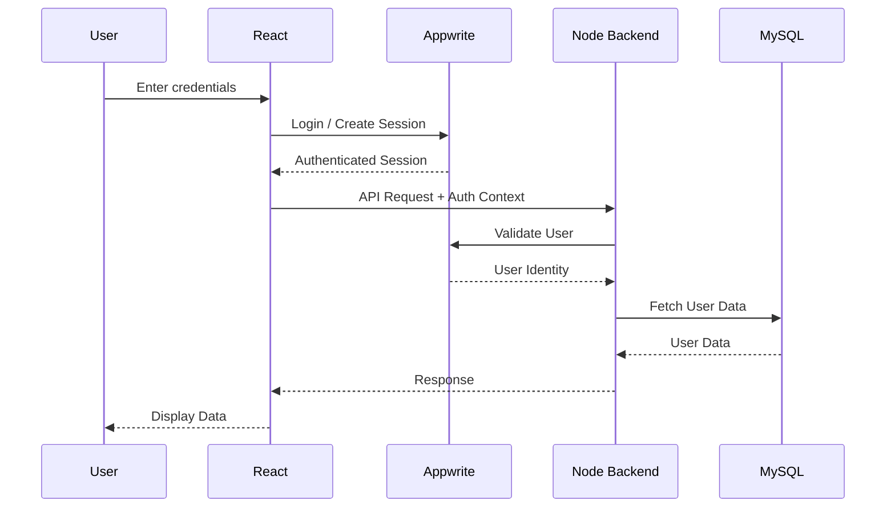
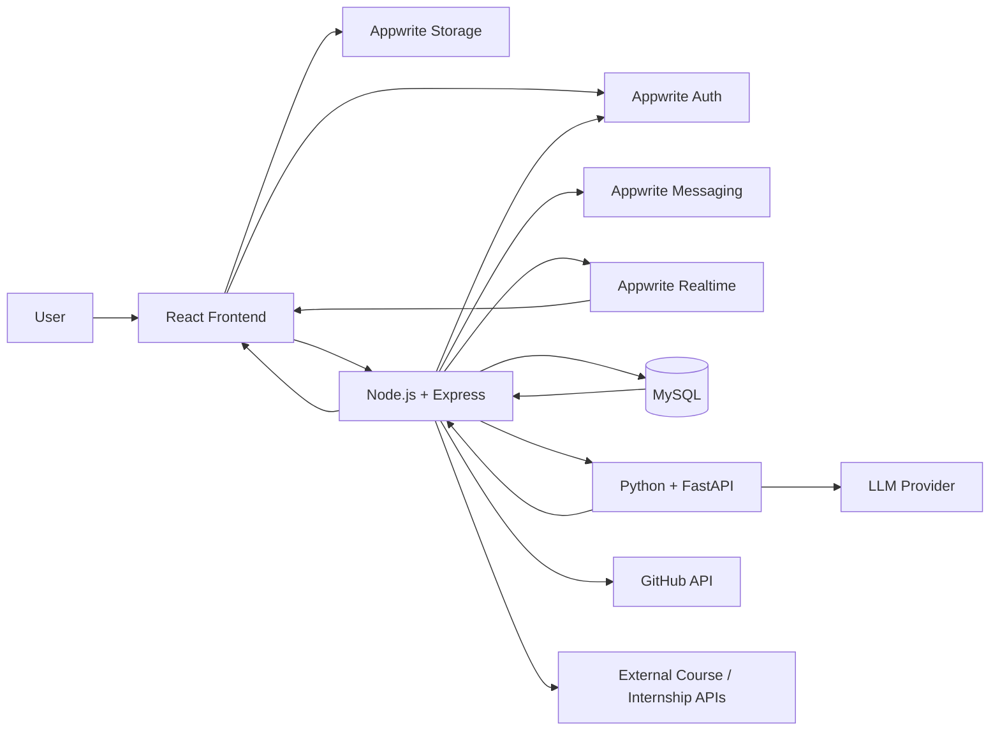

# Main Architecture — Skill_Guide

> Technical architecture and implementation blueprint for Skill_Guide.
>
> **Product:** One-Stop Personalized Career & Education Advisor
>
> **Architecture:** React + Appwrite + Node.js/Express + MySQL + Python/FastAPI

---

# 1. Architecture Overview

Skill_Guide follows a modular architecture consisting of four major application layers:

1. **Frontend Layer** — React + Tailwind CSS
2. **Backend/Application Layer** — Node.js + Express
3. **Infrastructure Layer** — Appwrite
4. **Data & AI Layer** — MySQL + Python/FastAPI

The core architectural principle is:

> **Appwrite handles infrastructure-heavy functionality, Node.js handles application/business logic, MySQL handles structured application data, and Python handles AI/ML processing.**

---

# 2. High-Level Architecture

```text
                                      ┌──────────────────────┐
                                      │        USER          │
                                      └──────────┬───────────┘
                                                 │
                                                 ▼
                                  ┌──────────────────────────┐
                                  │      React Frontend      │
                                  │      Tailwind CSS        │
                                  └────────────┬─────────────┘
                                               │
                            ┌──────────────────┴──────────────────┐
                            │                                     │
                            ▼                                     ▼
                 ┌──────────────────────┐              ┌──────────────────────┐
                 │       Appwrite       │              │    Node.js/Express   │
                 │                      │              │       Backend        │
                 │ • Authentication    │              │                      │
                 │ • File Storage      │              │ • Business Logic     │
                 │ • Messaging         │              │ • REST APIs          │
                 │ • Realtime          │              │ • MySQL Access       │
                 └──────────────────────┘              │ • AI Orchestration   │
                                                       │ • External APIs      │
                                                       └───────────┬──────────┘
                                                                   │
                                               ┌───────────────────┴──────────────────┐
                                               │                                      │
                                               ▼                                      ▼
                                    ┌─────────────────────┐                ┌─────────────────────┐
                                    │        MySQL        │                │   Python/FastAPI    │
                                    │      Database       │                │      AI Service     │
                                    │                     │                │                     │
                                    │ • Users/Profile     │                │ • Skill Matching    │
                                    │ • Careers           │                │ • Recommendations  │
                                    │ • Skills            │                │ • Resume Analysis  │
                                    │ • Roadmaps          │                │ • GitHub Analysis  │
                                    │ • Courses           │                │ • AI Assistant     │
                                    │ • Internships       │                │ • ML Models        │
                                    └─────────────────────┘                └─────────────────────┘
```

---

# 3. Responsibility Matrix

| Technology | Responsibility |
|---|---|
| React | User interface |
| Tailwind CSS | UI styling |
| Appwrite Auth | Authentication |
| Appwrite Storage | Resume/file storage |
| Appwrite Messaging | Notifications |
| Appwrite Realtime | Real-time events |
| Node.js | Application backend |
| Express | REST API framework |
| MySQL | Structured persistent data |
| Python | AI/ML processing |
| FastAPI | AI service API |
| GitHub API | Public GitHub data |
| External course/internship APIs | External opportunities |
| LLM API | Natural-language AI functionality |

---

# 4. Core Architectural Principle

The system must maintain strict separation between:

```text
Infrastructure
        ↓
Appwrite

Application Logic
        ↓
Node.js + Express

Persistent Relational Data
        ↓
MySQL

Artificial Intelligence
        ↓
Python + FastAPI
```

The frontend must never directly access MySQL.

The frontend should not contain business-critical logic.

The Python service should not directly handle authentication.

The AI service should not directly modify application data unless explicitly required through a controlled backend flow.

---

# 5. Frontend Architecture

## 5.1 Technology

```text
React
Tailwind CSS
React Router
Fetch / Axios
```

## 5.2 Responsibilities

The frontend is responsible for:

- Rendering UI
- Navigation
- Forms
- Client-side validation
- Dashboard
- User interaction
- API communication
- Appwrite client integration
- Displaying AI recommendations
- Roadmap visualization
- Progress tracking

---

# 6. Frontend Structure

```text
client/
│
├── public/
│
├── src/
│   │
│   ├── assets/
│   │
│   ├── components/
│   │   ├── common/
│   │   ├── auth/
│   │   ├── profile/
│   │   ├── career/
│   │   ├── roadmap/
│   │   ├── resume/
│   │   ├── github/
│   │   ├── courses/
│   │   ├── internships/
│   │   └── assistant/
│   │
│   ├── pages/
│   │   ├── public/
│   │   ├── auth/
│   │   └── private/
│   │
│   ├── services/
│   │   ├── api.js
│   │   └── appwrite.js
│   │
│   ├── hooks/
│   ├── context/
│   ├── utils/
│   ├── routes/
│   └── App.jsx
│
└── package.json
```

---

# 7. Appwrite Architecture

Appwrite is used as the application's infrastructure layer.

Appwrite is **not** responsible for the core Skill_Guide business logic.

## 7.1 Appwrite Services Used

```text
Appwrite
│
├── Authentication
├── Storage
├── Messaging
└── Realtime
```

---

# 8. Appwrite Authentication

Appwrite handles:

- User registration
- Login
- Logout
- Session management
- Password recovery
- Email verification
- OAuth if implemented

## Authentication Flow

```text
User
 │
 ▼
React
 │
 │ Appwrite Auth SDK
 ▼
Appwrite Authentication
 │
 ├── Validate credentials
 ├── Create session
 └── Return authenticated session
 │
 ▼
React
 │
 │ Authenticated API Request
 ▼
Node.js Backend
```

---

# 9. Authentication Architecture



---

# 10. User Identity Mapping

Appwrite owns the authentication identity.

MySQL owns the application's profile and career data.

```text
Appwrite User
      │
      │ appwrite_user_id
      ▼
MySQL users table
      │
      ├── profile
      ├── skills
      ├── interests
      ├── assessments
      ├── roadmaps
      └── recommendations
```

The MySQL `users` table should contain the Appwrite user ID.

Example:

```text
users
---------------------------
id
appwrite_user_id
email
created_at
updated_at
```

The `appwrite_user_id` should be unique.

---

# 11. Appwrite Storage

Appwrite Storage is responsible for files.

Primary use case:

```text
Resume Upload
```

Possible future use cases:

- Profile pictures
- Certificates
- Project files
- Other user documents

## Resume Upload Flow

```text
User
 │
 ▼
React
 │
 │ Upload File
 ▼
Appwrite Storage
 │
 │ File ID
 ▼
React
 │
 │ File ID
 ▼
Node Backend
 │
 ▼
Python AI Service
 │
 ▼
Resume Analysis
```

The database should store metadata rather than the actual resume binary.

Example:

```text
resume_analyses
-----------------------------
id
user_id
appwrite_file_id
file_name
analysis_result
created_at
```

---

# 12. Appwrite Messaging

Appwrite Messaging can be used for:

- Roadmap reminders
- Personalized notifications
- Course notifications
- Internship alerts
- Progress reminders

Flow:

```text
Roadmap Task
     │
     ▼
Node Backend
     │
     ▼
Appwrite Messaging
     │
     ▼
User
```

---

# 13. Appwrite Realtime

Realtime is optional for the MVP.

It can be used for:

- Live roadmap progress updates
- Notification updates
- Dashboard updates
- AI processing status

Example:

```text
User completes task
        ↓
Node Backend
        ↓
MySQL updated
        ↓
Realtime Event
        ↓
React Dashboard
        ↓
UI updates
```

---

# 14. Node.js Backend Architecture

Node.js is the central application server.

Responsibilities:

- REST API
- Business logic
- Authorization
- Validation
- MySQL operations
- Appwrite server-side integration
- AI service communication
- External API integration
- Recommendation orchestration
- Roadmap management
- Course/internship processing

---

# 15. Backend Structure

```text
server/
│
├── src/
│   │
│   ├── config/
│   │   ├── database.js
│   │   ├── appwrite.js
│   │   └── environment.js
│   │
│   ├── routes/
│   │   ├── profile.routes.js
│   │   ├── career.routes.js
│   │   ├── recommendation.routes.js
│   │   ├── roadmap.routes.js
│   │   ├── resume.routes.js
│   │   ├── github.routes.js
│   │   ├── course.routes.js
│   │   ├── internship.routes.js
│   │   └── assistant.routes.js
│   │
│   ├── controllers/
│   │
│   ├── services/
│   │   ├── career.service.js
│   │   ├── recommendation.service.js
│   │   ├── roadmap.service.js
│   │   ├── appwrite.service.js
│   │   ├── github.service.js
│   │   └── ai.service.js
│   │
│   ├── middleware/
│   │   ├── auth.middleware.js
│   │   ├── validation.middleware.js
│   │   └── error.middleware.js
│   │
│   ├── models/
│   │
│   ├── validators/
│   │
│   ├── utils/
│   │
│   └── app.js
│
└── package.json
```

---

# 16. Backend Request Lifecycle

```text
HTTP Request
      ↓
Express Router
      ↓
Authentication Middleware
      ↓
Validation Middleware
      ↓
Controller
      ↓
Service Layer
      ↓
 ┌────┼──────────────┐
 ▼    ▼              ▼
MySQL Appwrite    AI Service
      │
      ▼
Response
```

---

# 17. MySQL Architecture

MySQL is the primary relational database.

It stores application-specific structured data.

## Database Responsibilities

MySQL stores:

- User application profile
- Education
- Skills
- Interests
- Careers
- Career requirements
- Assessments
- Recommendations
- Skill gaps
- Roadmaps
- Roadmap tasks
- Courses
- Internships
- Resume analysis metadata
- GitHub analysis metadata
- Notifications metadata
- User progress

---

# 18. Database ER Diagram

```mermaid
erDiagram

    USERS {
        BIGINT id PK
        VARCHAR appwrite_user_id UK
        VARCHAR email
        DATETIME created_at
        DATETIME updated_at
    }

    PROFILES {
        BIGINT id PK
        BIGINT user_id FK
        VARCHAR education_level
        VARCHAR degree
        VARCHAR branch
        INT study_year
        DECIMAL cgpa
        TEXT career_goal
        VARCHAR preferred_industry
        VARCHAR preferred_location
        DATETIME created_at
        DATETIME updated_at
    }

    SKILLS {
        BIGINT id PK
        VARCHAR name UK
        VARCHAR category
    }

    USER_SKILLS {
        BIGINT id PK
        BIGINT user_id FK
        BIGINT skill_id FK
        INT proficiency
    }

    INTERESTS {
        BIGINT id PK
        VARCHAR name UK
    }

    USER_INTERESTS {
        BIGINT id PK
        BIGINT user_id FK
        BIGINT interest_id FK
    }

    CAREERS {
        BIGINT id PK
        VARCHAR name
        VARCHAR category
        TEXT description
    }

    CAREER_SKILLS {
        BIGINT id PK
        BIGINT career_id FK
        BIGINT skill_id FK
        INT required_level
        INT importance
    }

    ASSESSMENTS {
        BIGINT id PK
        BIGINT user_id FK
        VARCHAR type
        DECIMAL score
        JSON responses
        DATETIME completed_at
    }

    CAREER_RECOMMENDATIONS {
        BIGINT id PK
        BIGINT user_id FK
        BIGINT career_id FK
        DECIMAL match_score
        JSON explanation
        DATETIME created_at
    }

    ROADMAPS {
        BIGINT id PK
        BIGINT user_id FK
        BIGINT career_id FK
        VARCHAR title
        VARCHAR status
        INT progress_percent
        DATETIME created_at
        DATETIME updated_at
    }

    ROADMAP_TASKS {
        BIGINT id PK
        BIGINT roadmap_id FK
        VARCHAR title
        TEXT description
        INT order_index
        INT estimated_hours
        VARCHAR status
        DATETIME completed_at
    }

    COURSES {
        BIGINT id PK
        VARCHAR name
        VARCHAR provider
        BIGINT skill_id FK
        VARCHAR level
        VARCHAR url
    }

    USER_COURSES {
        BIGINT id PK
        BIGINT user_id FK
        BIGINT course_id FK
        VARCHAR status
        INT progress
    }

    INTERNSHIPS {
        BIGINT id PK
        VARCHAR title
        VARCHAR company
        VARCHAR location
        TEXT description
        VARCHAR url
    }

    INTERNSHIP_RECOMMENDATIONS {
        BIGINT id PK
        BIGINT user_id FK
        BIGINT internship_id FK
        DECIMAL match_score
        DATETIME created_at
    }

    RESUME_ANALYSES {
        BIGINT id PK
        BIGINT user_id FK
        VARCHAR appwrite_file_id
        VARCHAR file_name
        JSON extracted_data
        JSON analysis_result
        DATETIME created_at
    }

    GITHUB_ANALYSES {
        BIGINT id PK
        BIGINT user_id FK
        VARCHAR github_username
        JSON analysis_result
        DATETIME created_at
    }

    NOTIFICATIONS {
        BIGINT id PK
        BIGINT user_id FK
        VARCHAR title
        TEXT message
        BOOLEAN is_read
        DATETIME created_at
    }

    USERS ||--|| PROFILES : owns

    USERS ||--o{ USER_SKILLS : has
    SKILLS ||--o{ USER_SKILLS : contains

    USERS ||--o{ USER_INTERESTS : has
    INTERESTS ||--o{ USER_INTERESTS : contains

    CAREERS ||--o{ CAREER_SKILLS : requires
    SKILLS ||--o{ CAREER_SKILLS : required_by

    USERS ||--o{ ASSESSMENTS : completes

    USERS ||--o{ CAREER_RECOMMENDATIONS : receives
    CAREERS ||--o{ CAREER_RECOMMENDATIONS : recommended

    USERS ||--o{ ROADMAPS : owns
    CAREERS ||--o{ ROADMAPS : targets

    ROADMAPS ||--o{ ROADMAP_TASKS : contains

    SKILLS ||--o{ COURSES : teaches

    USERS ||--o{ USER_COURSES : tracks
    COURSES ||--o{ USER_COURSES : selected

    USERS ||--o{ INTERNSHIP_RECOMMENDATIONS : receives
    INTERNSHIPS ||--o{ INTERNSHIP_RECOMMENDATIONS : recommended

    USERS ||--o{ RESUME_ANALYSES : creates
    USERS ||--o{ GITHUB_ANALYSES : creates

    USERS ||--o{ NOTIFICATIONS : receives
```



---

# 19. Python AI Service

The AI service is an independent Python application.

Technology:

```text
Python
FastAPI
scikit-learn
pandas
numpy
```

Additional libraries may be introduced when required.

## AI Service Responsibilities

The Python service handles:

- Skill normalization
- Skill matching
- Career recommendation
- Skill-gap calculation
- Resume analysis
- GitHub technical profile analysis
- Career ranking
- What-if simulation
- LLM-based processing where required

---

# 20. AI Service Architecture

```text
Python/FastAPI
│
├── API
│
├── preprocessing/
│
├── recommendation/
│   ├── skill_matcher
│   ├── career_ranker
│   └── scoring
│
├── resume/
│   ├── parser
│   └── analyzer
│
├── github/
│   └── analyzer
│
├── assistant/
│   └── llm_service
│
├── models/
│
└── utils/
```

---

# 21. AI Communication

Node.js communicates with Python through HTTP.

```text
Node.js
   │
   │ HTTP POST
   ▼
FastAPI
   │
   ▼
AI Processing
   │
   ▼
JSON Response
   │
   ▼
Node.js
```

Example endpoint:

```http
POST /ai/recommend-careers
```

Example request:

```json
{
  "education_level": "college",
  "skills": [
    {
      "name": "JavaScript",
      "proficiency": 4
    },
    {
      "name": "React",
      "proficiency": 4
    }
  ],
  "interests": [
    "Web Development",
    "Software Engineering"
  ]
}
```

Example response:

```json
{
  "recommendations": [
    {
      "career_id": 12,
      "career": "Frontend Developer",
      "score": 91,
      "reasons": [
        "Strong React skills",
        "Strong JavaScript skills"
      ],
      "skill_gaps": [
        "Testing",
        "Accessibility"
      ]
    }
  ]
}
```

---

# 22. Career Recommendation Pipeline

```text
User Profile
     ↓
Node Backend
     ↓
FastAPI
     ↓
Input Validation
     ↓
Feature Extraction
     ↓
Skill Normalization
     ↓
Career Matching
     ↓
Career Scoring
     ↓
Skill Gap Calculation
     ↓
Recommendation Ranking
     ↓
JSON Response
     ↓
Node Backend
     ↓
MySQL
     ↓
React Dashboard
```

---

# 23. Recommendation Engine

The first implementation should **not** depend entirely on a complex ML model.

The recommended approach is a hybrid system:

```text
               Career Recommendation
                       │
          ┌────────────┼────────────┐
          ▼            ▼            ▼
      Skill Match   Interest     Education
                      Match        Match
          │            │            │
          └────────────┼────────────┘
                       ▼
                  Score Engine
                       │
                       ▼
                Career Ranking
```

An initial scoring model can use weighted factors:

```text
Career Score =
    Skill Match × 0.45
  + Interest Match × 0.20
  + Education Match × 0.15
  + Assessment Match × 0.10
  + Experience Match × 0.10
```

Weights can be changed during testing.

Machine learning can be introduced later when enough suitable training/evaluation data exists.

---

# 24. Skill Gap Engine

The skill-gap engine compares:

```text
Required Career Skills
        VS
User Skills
```

Example:

```text
Career: Full Stack Developer

Required:

JavaScript → 4
React      → 4
Node.js    → 3
SQL        → 3
Git        → 2

User:

JavaScript → 4
React      → 4
Node.js    → 1
SQL        → 1
Git        → 3
```

Output:

```text
Strong:
JavaScript
React
Git

Needs Improvement:
Node.js
SQL
```

---

# 25. Roadmap Generation

The roadmap engine uses the output of the skill-gap engine.

```text
Target Career
      ↓
Required Skills
      ↓
User Skills
      ↓
Skill Gap
      ↓
Priority Calculation
      ↓
Learning Resources
      ↓
Projects
      ↓
Roadmap Tasks
      ↓
MySQL
```

Example:

```text
Career:
Full Stack Developer

Roadmap:

1. Learn Node.js
2. Build REST API
3. Learn SQL
4. Build MySQL project
5. Learn authentication
6. Build full-stack project
7. Deploy project
```

---

# 26. What-If Simulator

The simulator must not modify the real user profile unless the user explicitly chooses to apply the changes.

```text
Current Profile
      ↓
Temporary Copy
      ↓
Modify Skills / Goals / Interests
      ↓
Recommendation Engine
      ↓
Simulated Results
      ↓
Compare Results
```

Example:

```text
Current:

React = 3
Python = 1

What If:

Python = 4

↓

New Career Recommendations
```

---

# 27. Resume Analysis

Resume files are stored in Appwrite Storage.

The analysis metadata is stored in MySQL.

```text
Resume
   ↓
Appwrite Storage
   ↓
File ID
   ↓
Node Backend
   ↓
Python/FastAPI
   ↓
Text Extraction
   ↓
Skill Extraction
   ↓
Experience Extraction
   ↓
Career Alignment
   ↓
MySQL
   ↓
React
```

---

# 28. GitHub Analysis

The GitHub analysis service uses the GitHub API to retrieve publicly accessible information.

```text
GitHub Username
       ↓
Node Backend
       ↓
GitHub API
       ↓
Public Repository Data
       ↓
Python Analyzer
       ↓
Languages
Repositories
Activity
Project Signals
       ↓
Technical Profile
       ↓
MySQL
```

The system should only process publicly available GitHub information.

---

# 29. AI Career Assistant

The AI assistant uses the user's Skill_Guide context.

Context can include:

```text
User Profile
Skills
Interests
Target Career
Skill Gaps
Roadmap
Progress
```

Architecture:

```text
User Question
      ↓
React
      ↓
Node Backend
      ↓
Context Builder
      ↓
Python AI Service
      ↓
LLM
      ↓
Response
      ↓
Node Backend
      ↓
React
```

The assistant should not invent structured career information when reliable application data exists.

---

# 30. Course Recommendation Architecture

Courses are stored or indexed in MySQL.

```text
User Skill Gap
      ↓
Required Skills
      ↓
Course Matching
      ↓
Filtering
      ↓
Ranking
      ↓
Recommended Courses
```

Filtering parameters can include:

- Skill
- Difficulty
- Duration
- Provider
- Free/Paid
- Rating
- User preference

---

# 31. Internship Recommendation Architecture

```text
User Profile
      ↓
Skills
      ↓
Career Interest
      ↓
Education Level
      ↓
Location Preference
      ↓
Internship Data
      ↓
Matching
      ↓
Ranking
      ↓
Recommended Internships
```

External internship data must pass through the Node backend before reaching the frontend.

---

# 32. API Architecture

## Profile

```text
GET    /api/profile
PUT    /api/profile
POST   /api/profile/skills
DELETE /api/profile/skills/:skillId
POST   /api/profile/interests
```

## Careers

```text
GET  /api/careers
GET  /api/careers/:careerId
POST /api/careers/compare
```

## Recommendations

```text
POST /api/recommendations/generate
GET  /api/recommendations
GET  /api/recommendations/:id
```

## Roadmaps

```text
POST   /api/roadmaps
GET    /api/roadmaps
GET    /api/roadmaps/:id
PUT    /api/roadmaps/:id
DELETE /api/roadmaps/:id
```

## Roadmap Tasks

```text
POST   /api/roadmaps/:id/tasks
PUT    /api/roadmaps/:id/tasks/:taskId
DELETE /api/roadmaps/:id/tasks/:taskId
```

## Resume

```text
POST /api/resume/analyze
GET  /api/resume/analysis/:id
```

## GitHub

```text
POST /api/github/analyze
GET  /api/github/analysis/:id
```

## What-If

```text
POST /api/what-if/simulate
```

## Courses

```text
GET /api/courses
GET /api/courses/recommended
```

## Internships

```text
GET /api/internships
GET /api/internships/recommended
```

## Assistant

```text
POST /api/assistant/chat
```

## Notifications

```text
GET /api/notifications
PUT /api/notifications/:id/read
```

---

# 33. Complete Request Flow

A typical recommendation request:

```text
                         USER
                           │
                           ▼
                    React Frontend
                           │
                           ▼
                    Node REST API
                           │
                    Authentication
                           │
                           ▼
                    Fetch Profile
                           │
                           ▼
                         MySQL
                           │
                           ▼
                  Recommendation Service
                           │
                           ▼
                     Python/FastAPI
                           │
                           ▼
                   AI Recommendation
                           │
                           ▼
                    JSON Response
                           │
                           ▼
                     Node Backend
                           │
                           ├── Store Result
                           ▼
                         MySQL
                           │
                           ▼
                    React Dashboard
```

---

# 34. Complete System Interaction



---

# 35. Data Ownership

A strict data ownership model must be followed.

| Data | Owner |
|---|---|
| Authentication identity | Appwrite |
| Sessions | Appwrite |
| Password | Appwrite |
| Resume binary | Appwrite Storage |
| Profile | MySQL |
| Skills | MySQL |
| Careers | MySQL |
| Recommendations | MySQL |
| Roadmaps | MySQL |
| Courses | MySQL |
| Internships | MySQL |
| AI calculations | Python |
| AI analysis results | MySQL |
| Notifications | Appwrite Messaging + MySQL metadata |

---

# 36. Environment Configuration

No secrets should be committed to Git.

## Frontend

```env
VITE_APPWRITE_ENDPOINT=
VITE_APPWRITE_PROJECT_ID=
VITE_API_BASE_URL=
```

Only values safe for client-side exposure should use the `VITE_` prefix.

## Node Backend

```env
PORT=5000

DB_HOST=localhost
DB_PORT=3306
DB_USER=root
DB_PASSWORD=
DB_NAME=career_advisor

APPWRITE_ENDPOINT=
APPWRITE_PROJECT_ID=
APPWRITE_API_KEY=

AI_SERVICE_URL=http://localhost:8000

GITHUB_TOKEN=
LLM_API_KEY=
```

## Python AI Service

```env
PORT=8000

LLM_API_KEY=
```

---

# 37. Local Development Architecture

Docker is not required.

The development environment consists of:

```text
React
localhost:3000

Node.js / Express
localhost:5000

Python / FastAPI
localhost:8000

MySQL
localhost:3306

Appwrite
Cloud / configured Appwrite instance
```

---

# 38. Local Development Flow

Start:

```text
1. MySQL
      ↓
2. Node.js Backend
      ↓
3. Python AI Service
      ↓
4. React Frontend
```

Appwrite services remain accessible through the configured Appwrite endpoint.

---

# 39. Security Architecture

Security responsibilities are divided between Appwrite and the application backend.

## Appwrite

Handles:

- Authentication
- Sessions
- User identity
- File permissions

## Node Backend

Handles:

- Authorization
- Business-level permissions
- Input validation
- API security
- Rate limiting
- User-resource ownership

## MySQL

Handles:

- Data integrity
- Foreign keys
- Constraints
- Access through backend only

## Python

Handles:

- AI processing
- Input validation
- AI-specific security controls

---

# 40. Important Security Rule

The frontend must never contain:

```text
MySQL credentials
Appwrite server API key
GitHub private token
LLM secret key
```

Only public Appwrite client configuration may be exposed to the frontend.

---

# 41. Error Handling

All backend APIs should return consistent responses.

Success:

```json
{
  "success": true,
  "data": {}
}
```

Error:

```json
{
  "success": false,
  "message": "Unable to generate recommendations",
  "code": "RECOMMENDATION_SERVICE_ERROR"
}
```

Internal implementation details must not be exposed to users.

---

# 42. AI Failure Handling

The application must remain usable if the AI service is unavailable.

```text
User requests recommendation
          ↓
Node Backend
          ↓
Python AI Service
          ↓
Service unavailable
          ↓
Node detects failure
          ↓
Return controlled error
          ↓
Frontend displays:
"Recommendations are temporarily unavailable."
```

The application must not crash because the AI service is temporarily unavailable.

---

# 43. Repository Architecture

```text
career-advisor/
│
├── client/
│   ├── public/
│   ├── src/
│   └── package.json
│
├── server/
│   ├── src/
│   └── package.json
│
├── ai-service/
│   ├── app/
│   ├── models/
│   ├── data/
│   └── requirements.txt
│
├── database/
│   ├── schema.sql
│   └── seed.sql
│
├── docs/
│   ├── PRD.md
│   ├── main_architecture.md
│   └── rules.md
│
├── .env.example
├── .gitignore
└── README.md
```

---

# 44. Development Strategy

## Phase 1 — Foundation

```text
React
+
Appwrite Authentication
+
Node.js
+
MySQL
```

## Phase 2 — Profile

Implement:

```text
User Profile
Education
Skills
Interests
Career Goals
```

## Phase 3 — Career Engine

Implement:

```text
Career Database
Skill Database
Career-Skill Mapping
Basic Recommendation Engine
```

## Phase 4 — AI

Introduce:

```text
Python
FastAPI
Skill Matching
Recommendation Ranking
Skill Gap
```

## Phase 5 — Roadmap

Implement:

```text
Skill Gap
↓
Learning Resources
↓
Projects
↓
Roadmap
↓
Progress Tracking
```

## Phase 6 — Advanced Features

Implement:

```text
Resume Analysis
GitHub Analysis
What-If Simulator
Career Comparison
AI Assistant
```

## Phase 7 — External Integrations

Implement:

```text
Courses
Internships
Notifications
```

---

# 45. Recommended Architecture Boundary

```text
┌───────────────────────────────────────────────────────┐
│                    React Frontend                    │
│                    Presentation                       │
└───────────────────────┬───────────────────────────────┘
                        │
                        ▼
┌───────────────────────────────────────────────────────┐
│                  Appwrite Services                    │
│                                                       │
│        Auth │ Storage │ Messaging │ Realtime         │
└───────────────────────────────────────────────────────┘
                        │
                        │
                        ▼
┌───────────────────────────────────────────────────────┐
│                Node.js + Express                     │
│                                                       │
│       APIs │ Business Logic │ Integrations           │
└───────────────┬───────────────────────┬───────────────┘
                │                       │
                ▼                       ▼
       ┌─────────────────┐      ┌─────────────────────┐
       │      MySQL      │      │   Python/FastAPI    │
       │                 │      │                     │
       │ Application     │      │ AI / ML             │
       │ Data            │      │                     │
       └─────────────────┘      └─────────────────────┘
```

---

# 46. Architecture Decision Summary

Skill_Guide intentionally uses Appwrite as a supporting backend infrastructure platform instead of making Appwrite the application's complete backend.

### Appwrite

Used for:

```text
Authentication
Storage
Messaging
Realtime
```

### Node.js

Used for:

```text
REST APIs
Business Logic
Authorization
Database Access
External Integrations
AI Orchestration
```

### MySQL

Used for:

```text
Profiles
Skills
Careers
Recommendations
Roadmaps
Courses
Internships
Analysis Results
```

### Python/FastAPI

Used for:

```text
AI
ML
Recommendation
Skill Matching
Resume Analysis
GitHub Analysis
LLM Integration
```

This separation keeps the system understandable, maintainable, and scalable while allowing the team to develop each part independently.
