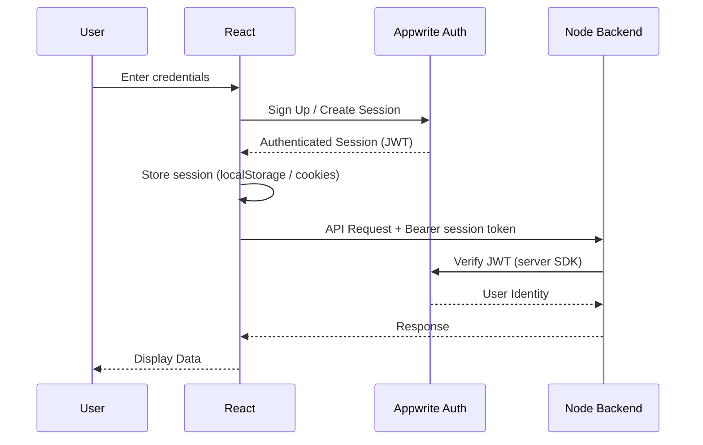
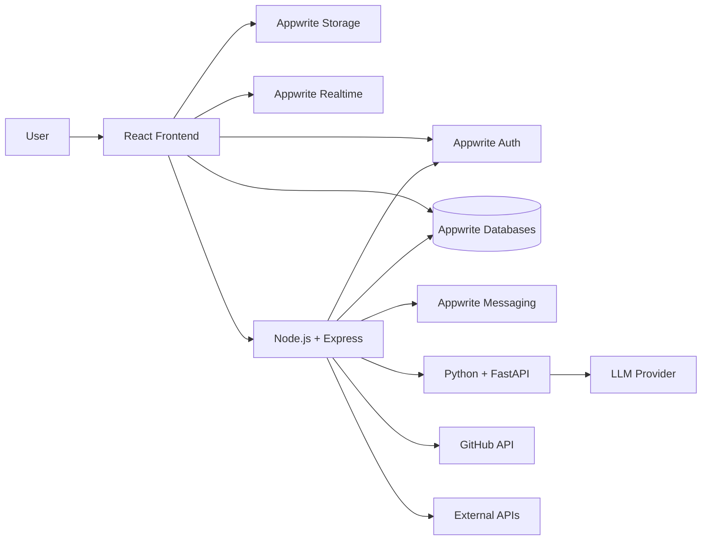

# Main Architecture — skillsaarthi

> Technical architecture and implementation blueprint for skillsaarthi.
>
> **Product:** One-Stop Personalized Career & Education Advisor
>
> **Architecture:** React + Appwrite (Auth / Databases / Storage / Messaging / Realtime / Functions) + Node.js/Express + Python/FastAPI

---

# 1. Architecture Overview

skillsaarthi follows a modular architecture consisting of four major application layers:

1. **Frontend Layer** — React + Tailwind CSS (repo root)
2. **Infrastructure & Data Layer** — Appwrite (Auth, Databases, Storage, Messaging, Realtime, Functions)
3. **Backend/Application Layer** — Node.js + Express (business logic & orchestration **plus scoring, career catalog, GitHub analysis, profile building** — `server/src/services/scoring.js`, `careerCatalog.js`, `profile.builder.js`, `github.service.js`)
4. **AI Layer** — Python + FastAPI (**resume-only LLM service** — 6 endpoints: `GET /health` + `POST /ai/resume/{extract,analyze,match,optimize,generate}`)

The core architectural principle is:

> **Appwrite handles infrastructure and primary data storage, Node.js handles business logic, scoring, catalog, GitHub analysis and orchestration, and Python handles resume LLM processing only. There is no MySQL — Appwrite Databases is the primary data store.**

---

# 2. High-Level Architecture

```text
                                      ┌──────────────────────┐
                                      │        USER          │
                                      └──────────┬───────────┘
                                                 │
                                                 ▼
                                  ┌──────────────────────────┐
                                  │      React Frontend      │
                                  │      Tailwind CSS        │
                                  │      (repo root)         │
                                  └────────────┬─────────────┘
                                               │
                            ┌──────────────────┴──────────────────┐
                            │                                     │
                            ▼                                     ▼
                 ┌────────────────────────────┐         ┌──────────────────────┐
                 │          Appwrite          │         │    Node.js/Express   │
                 │                            │         │       Backend        │
                 │ • Authentication           │         │   (server/)          │
                 │ • Databases (NoSQL)        │         │                      │
                 │ • File Storage             │         │ • Business Logic     │
                 │ • Messaging                │         │ • REST APIs          │
                 │ • Realtime                 │         │ • Appwrite Access    │
                 │ • Functions                │         │ • AI Orchestration   │
                 └────────────────────────────┘         │ • External APIs      │
                            │                            └───────────┬──────────┘
                            │                                        │
                            └───────────────┬────────────────────────┘
                                            ▼
                                   ┌─────────────────────┐
                                   │   Python/FastAPI    │
                                   │  Resume LLM Service │
                                   │    (ai-service/)    │
                                   │  (resume-only)      │
                                   │ • Resume Extract    │
                                   │ • Resume Analyze    │
                                   │ • Resume Match      │
                                   │ • Resume Optimize   │
                                   │ • Resume Generate   │
                                   └─────────────────────┘
                                 (Scoring/Catalog/GitHub → Node: scoring.js, careerCatalog.js, github.service.js)
```

---

# 3. Responsibility Matrix

| Technology | Responsibility |
|---|---|
| React | User interface |
| Tailwind CSS | UI styling |
| Appwrite Auth | Authentication |
| Appwrite Databases | Primary structured data storage (NoSQL) |
| Appwrite Storage | Resume/file storage |
| Appwrite Messaging | Notifications |
| Appwrite Realtime | Real-time events |
| Appwrite Functions | Lightweight server-side tasks (optional) |
| Node.js | Application backend (business logic, orchestration) |
| Express | REST API framework |
| Python | AI/ML processing |
| FastAPI | AI service API |
| GitHub API | Public GitHub data |
| External course/internship APIs | External opportunities |
| LLM API | Natural-language AI functionality |

---

# 4. Core Architectural Principle (summary)

> Same layering as §2: Presentation (React) → Infrastructure + Primary Data (Appwrite Auth/DB/Storage/Messaging/Realtime) → Application Logic & Orchestration (Node/Express,incl. scoring/catalog/GitHub) → AI (Python/FastAPI resume-only). Frontend reads Appwrite directly for auth/DB/storage/realtime and calls Node only for business logic; Python never handles auth.
>
> **Single source:** diagram + responsibilities → §2 High-Level Architecture and §3 Responsibility Matrix.

---

# 5. Frontend Architecture (summary)

> Stack: React + Tailwind + React Router + Axios (`api.js` JWT cached 60s) + Appwrite Web SDK + lazy routes (`AppRoutes.jsx`, 662k→409k). Responsibilities: UI/nav (TopBar 3 hubs, Homes merged, `CommunityFab` kept), forms/validation/Dashboard (8 cards, `400ms` delay + `1500ms` single retry, same-size `StatCard` skeletons `h-8 w-20` + `h-4 w-28`, `streakLoading` skeletons, `Home` `bg-black/[0.06]` on `bg-warm`), Onboarding 4 steps (Skills+Interests tabs, Goals+Assessment sub-step, no silent proficiency-2), Recommendations (auto-generate + GapDrawer), GitHub `ContributionGrid` (13 metrics), notifications (Realtime + 45s polling), streak (`touchStreak` cached profile), Community `offsetRef` pagination + realtime `subscribe`.
>
> **Single source:** layout/tokens → [`docs/design.md`](design.md); structure → §6 summary; auth → §9; data → §17.

# 6. Frontend Structure (summary)

> `src/` at repo root: `assets/`, `components/` (`common/Icon/DecorativeShapes/CommunityFab`, `layout/TopBar/NotificationBell`, `github/ContributionGrid`, `career/GapDrawer`, etc.), `pages/` (`public/Home` merged, `auth/`, `private/Dashboard/Onboarding/Recommendations/...`), `services/` (`api`, `appwrite`, `auth`, `profile`, `skills`, `interests`, `assessment`, `careers`, `recommendations`, `roadmaps`, `streak`, `notifications`, `github`, `comparison`, `whatif`), `hooks/context/utils/routes/AppRoutes` (lazy), `App.jsx`/`main.jsx`/`index.css`; root `.env`, `vite.config.js`, `package.json`.
>
> **Single source:** detailed tree with canonical file references → README Project Structure summary and [`PROJECT_AUDIT.md`](../PROJECT_AUDIT.md); tokens → [`docs/design.md`](design.md).

---

# 7. Appwrite Architecture

Appwrite is the application's **infrastructure and primary data layer**.

## 7.1 Appwrite Services Used

```text
Appwrite
│
├── Authentication
├── Databases          ← primary data store (NoSQL)
├── Storage
├── Messaging
└── Realtime
```

Appwrite Functions are optional and may be used later for small server-side tasks. Heavy business logic stays in the Node backend.

---

# 8. Appwrite Authentication (summary)

> Appwrite handles registration, login/logout, session, password recovery, email verification, OAuth. Client uses Appwrite Auth SDK; backend verifies JWT via server SDK. Permissions are per-collection (user-scoped vs catalog read-only).
>
> **Single source:** sequence + middleware → §9 Authentication Architecture; identity mapping → §10 User Identity Mapping.

---

# 9. Authentication Architecture



---

# 10. User Identity Mapping

Appwrite owns the authentication identity.

Appwrite Databases owns the application profile and career data.

```text
Appwrite User (Auth)
      │
      │ user $id
      ▼
profiles collection (Appwrite Databases)
      │
      ├── skills        (user_skills collection)
      ├── interests     (user_interests collection)
      ├── assessments   (assessments collection)
      ├── roadmaps      (roadmaps collection)
      └── recommendations (career_recommendations collection)
```

The `profiles` document should use the Appwrite user ID as its document ID.

Example:

```text
profiles
--------------------
$id             = <Appwrite user $id>
user_id         = <Appwrite user $id>
education_level
degree
branch
study_year
cgpa
career_goal
created_at
updated_at
```

---

# 11. Appwrite Storage (summary)

> Two buckets provisioned by `scripts/setup-appwrite.mjs`: `resumes` (`VITE_APPWRITE_RESUME_BUCKET_ID`, `pdf/docx/doc/png/jpg/jpeg/webp/gif`, resume upload) and `avatars` (`VITE_APPWRITE_AVATAR_BUCKET_ID`, `png/jpg/jpeg/webp/gif`, profile pictures). Free plan allows one bucket, so avatars reuse `resumes` (broadened to accept images); paid plan sets `avatars` and re-runs `setup:appwrite`. Avatars stored via `storage.createFile` + `account.updatePrefs({ avatar_file_id })` and shown via `storage.getFileView` blob URL (`getFilePreview` blocked on free plan). Profile flow: `TopBar avatar → /settings → account.updateName` + `storage.createFile` + `updatePrefs` → `refreshUser()`.
>
> **Flows:** Resume: `User → React (Upload) → Appwrite Storage (File ID) → Node Backend → Python AI → Resume Analysis (metadata in `resume_analyses`)`. Bucket/collection spec → §17 and [`docs/rules.md` §5](rules.md).

---

# 12. Appwrite Messaging (summary)

> Used for roadmap reminders, personalized/course/internship alerts, progress reminders. In-app MVP uses the `notifications` collection (per-user permissions) shown via dashboard; Appwrite Messaging is for push/email/SMS when needed. Node `notification.service.js` triggers on recommendation/roadmap; admin broadcasts via `POST /api/admin/notifications` (needs `users.read`).
>
> **Single source:** API + UI → §32 API Architecture (Notifications) and [`docs/rules.md` §7](rules.md) (Notifications & Streaks); realtime → §13.

---

# 13. Appwrite Realtime (summary)

> Optional for live roadmap progress, notification updates, dashboard/AI status: `Node → Appwrite DB update → Realtime Event → React`. MVP uses Realtime for `NotificationBell` (`appwriteClient.subscribe` to `notifications` + 45s polling fallback).
>
> **Single source:** notifications → §32 and [`docs/rules.md` §7](rules.md).

---

# 14. Node.js Backend Architecture (summary)

> Application server for business logic + orchestration (now also scoring/catalog/GitHub/profile via `scoring.js`, `careerCatalog.js`, `profile.builder.js`, `github.service.js`), not primary store. Handles REST business APIs, authz (ownership checks `req.user.$id == doc.user_id`), validation, rate-limit 30/min on `/api/github|resume|admin` (`express-rate-limit`, `trust proxy 1`), Appwrite server SDK (bulk `Promise.all`, in-memory returns, batch reorder), AI resume proxy (`ai.service.js` → `POST /ai/resume/*` with 120s timeout + fallback), external APIs (GitHub REST+GraphQL, courses, internships feed), recommendation/roadmap orchestration, notification triggers (`notify`/`notifyAllUsers`, Realtime + polling), streak `touchStreak`.
>
> **Single source:** layering → §2–§3; env → §36 summary; failure handling → §42; security → §39–§40.

# 15. Backend Structure (summary)

> `server/src/`: `config/` (`appwrite.js`, `environment.js`), `routes/` (profile, career, recommendation, roadmap, resume, github, course, internship, admin, assistant, community), `controllers/` (career/recommendation/roadmap thin), `services/` (`scoring.js` + `careerCatalog.js` + `profile.builder.js` + `github.service.js` Node-native, `recommendation`/`career`/`appwrite`/`ai` resume-only/`roadmap`/`notification`/...), `middleware/` (`auth`, `validation`, `error`, `rateLimit` 30/min), `utils/`, `app.js` (mounts limiters on `/api/github|resume|admin`).
>
> **Single source:** design tokens → [`docs/design.md`](design.md); repo layout → §43 summary.

---

# 16. Backend Request Lifecycle (summary)

> `HTTP Request → Express Router → Auth Middleware (verify Appwrite JWT) → Validation → Controller → Service (Appwrite / External APIs / Python resume-only) → Response`. Scoring/GitHub/what-if paths are Node-in-process (`scoring.js` etc.) with no Python call; only resume proxies to `POST /ai/resume/*` with fallback.
>
> **Single source:** layering → §2–§3; auth flow → §9 Authentication Architecture; resilience → §42 AI Failure Handling.

---

# 17. Appwrite Database Architecture

Appwrite Databases is the primary data store. It is a NoSQL document database organized into **collections** (similar to tables) of **documents**.

## Collection Overview

| Collection | Purpose | Key attributes |
|---|---|---|
| `profiles` | One document per user | `user_id`, `education_level`, `degree`, `branch`, `study_year`, `cgpa`, `subjects`, `academic_strengths`, `career_goal`, `preferred_industry`, `preferred_role`, `preferred_location`, `work_preference`, `experience_years`, `assessment_score`, `onboarding_completed`, `github_username`, `current_streak`, `best_streak`, `last_active_date` |
| `skills` | Global skill catalog | `name`, `category` |
| `user_skills` | User ↔ skill proficiency | `user_id`, `skill_id`, `proficiency` |
| `interests` | Global interest catalog | `name` |
| `user_interests` | User ↔ interest link | `user_id`, `interest_id` |
| `careers` | Career catalog | `name`, `category`, `description` |
| `career_skills` | Career ↔ required skill | `career_id`, `skill_id`, `required_level` (1–5 proficiency), `importance` (1–5) |
| `assessments` | Assessment attempts | `user_id`, `type`, `score`, `responses`, `completed_at` |
| `career_recommendations` | Generated recommendations | `user_id`, `career_id`, `match_score`, `explanation` |
| `roadmaps` | Roadmaps per user + career | `user_id`, `career_id`, `title`, `status`, `progress_percent` |
| `roadmap_tasks` | Tasks inside a roadmap | `roadmap_id`, `title`, `description`, `order_index`, `estimated_hours`, `status`, `completed_at` |
| `courses` | Course catalog | `name`, `provider`, `skill_id`, `level`, `duration_hours`, `url`, `cost`, `rating` |
| `user_courses` | User course tracking | `user_id`, `course_id`, `status`, `progress` |
| `internships` | Internship catalog | `title`, `company`, `location`, `description`, `url`, `skills` (JSON array), `eligibility`, `status` (pending/active/rejected), `source`, `source_key`, `expires_at`, `fetched_at` |
| `internship_recommendations` | Internship matches | `user_id`, `internship_id`, `match_score` |
| `resume_analyses` | Resume analysis metadata | `user_id`, `appwrite_file_id`, `file_name`, `analysis_result` |
| `github_analyses` | GitHub analysis metadata | `user_id`, `github_username`, `analysis_result` |
| `notifications` | In-app notifications | `user_id`, `title`, `message`, `is_read` |
| `community_profiles` | Community bio + meta per user | `user_id`, `bio`, `location`, `role`, `interests` |
| `community_posts` | Community posts | `user_id`, `title`, `content`, `category`, `tags` (CSV), `status` (draft/published), `likes_count`, `comments_count` |
| `community_comments` | Comments on posts | `user_id`, `post_id`, `content` |
| `post_likes` | Like edges (unique per user+post) | `user_id`, `post_id` |
| `post_bookmarks` | Bookmark edges (unique per user+post) | `user_id`, `post_id` |

> **Security note:** Appwrite permissions are configured per collection. Most collections are `user` scoped (a user can only read/write their own documents). Global catalogs (`skills`, `careers`, `courses`, `internships`) are read-only for authenticated users.

---

# 18. Database Relationship Model

```mermaid
erDiagram

    PROFILES {
        string id PK
        string user_id UK
        string education_level
        string degree
        string branch
        int study_year
        decimal cgpa
        text subjects
        text academic_strengths
        text career_goal
        string preferred_industry
        string preferred_role
        string preferred_location
        string work_preference
        int experience_years
        float assessment_score
        boolean onboarding_completed
        string github_username
        int current_streak
        int best_streak
        string last_active_date
        datetime created_at
        datetime updated_at
    }

    SKILLS {
        string id PK
        string name UK
        string category
    }

    USER_SKILLS {
        string id PK
        string user_id FK
        string skill_id FK
        int proficiency
    }

    INTERESTS {
        string id PK
        string name UK
    }

    USER_INTERESTS {
        string id PK
        string user_id FK
        string interest_id FK
    }

    CAREERS {
        string id PK
        string name
        string category
        text description
    }

    CAREER_SKILLS {
        string id PK
        string career_id FK
        string skill_id FK
        int required_level
        int importance
    }

    ASSESSMENTS {
        string id PK
        string user_id FK
        string type
        decimal score
        json responses
        datetime completed_at
    }

    CAREER_RECOMMENDATIONS {
        string id PK
        string user_id FK
        string career_id FK
        decimal match_score
        json explanation
        datetime created_at
    }

    ROADMAPS {
        string id PK
        string user_id FK
        string career_id FK
        string title
        string status
        int progress_percent
        datetime created_at
        datetime updated_at
    }

    ROADMAP_TASKS {
        string id PK
        string roadmap_id FK
        string title
        text description
        int order_index
        int estimated_hours
        string status
        datetime completed_at
    }

    COURSES {
        string id PK
        string name
        string provider
        string skill_id FK
        string level
        int duration_hours
        string url
        int cost
        float rating
    }

    USER_COURSES {
        string id PK
        string user_id FK
        string course_id FK
        string status
        int progress
    }

    INTERNSHIPS {
        string id PK
        string title
        string company
        string location
        text description
        string url
        string skills
        string eligibility
        enum   status            // pending | active | rejected
        string source            // manual | file | remotive | <feeder>
        string source_key        // dedup key, e.g. <feed>:<title>:<company>
        datetime expires_at
        datetime fetched_at
    }

    INTERNSHIP_RECOMMENDATIONS {
        string id PK
        string user_id FK
        string internship_id FK
        decimal match_score
        datetime created_at
    }

    RESUME_ANALYSES {
        string id PK
        string user_id FK
        string appwrite_file_id
        string file_name
        json extracted_data
        json analysis_result
        datetime created_at
    }

    GITHUB_ANALYSES {
        string id PK
        string user_id FK
        string github_username
        json analysis_result
        datetime created_at
    }

    NOTIFICATIONS {
        string id PK
        string user_id FK
        string title
        text message
        boolean is_read
        datetime created_at
    }

    COMMUNITY_PROFILES {
        string id PK
        string user_id FK UK
        text bio
        string location
        string role
        string interests
        datetime updated_at
    }

    COMMUNITY_POSTS {
        string id PK
        string user_id FK
        string title
        text content
        enum   category        // Career Guidance | Skill Building | Internship | Success Story | Resource | General
        string tags
        enum   status          // draft | published
        int likes_count
        int comments_count
        datetime created_at
        datetime updated_at
    }

    COMMUNITY_COMMENTS {
        string id PK
        string user_id FK
        string post_id FK
        text content
        datetime created_at
        datetime updated_at
    }

    POST_LIKES {
        string id PK
        string user_id FK
        string post_id FK
    }

    POST_BOOKMARKS {
        string id PK
        string user_id FK
        string post_id FK
    }

    PROFILES ||--o{ USER_SKILLS : has
    SKILLS ||--o{ USER_SKILLS : contains

    PROFILES ||--o{ USER_INTERESTS : has
    INTERESTS ||--o{ USER_INTERESTS : contains

    CAREERS ||--o{ CAREER_SKILLS : requires
    SKILLS ||--o{ CAREER_SKILLS : required_by

    PROFILES ||--o{ ASSESSMENTS : completes

    PROFILES ||--o{ CAREER_RECOMMENDATIONS : receives
    CAREERS ||--o{ CAREER_RECOMMENDATIONS : recommended

    PROFILES ||--o{ ROADMAPS : owns
    CAREERS ||--o{ ROADMAPS : targets

    ROADMAPS ||--o{ ROADMAP_TASKS : contains

    SKILLS ||--o{ COURSES : teaches

    PROFILES ||--o{ USER_COURSES : tracks
    COURSES ||--o{ USER_COURSES : selected

    PROFILES ||--o{ INTERNSHIP_RECOMMENDATIONS : receives
    INTERNSHIPS ||--o{ INTERNSHIP_RECOMMENDATIONS : recommended

    PROFILES ||--o{ RESUME_ANALYSES : creates
    PROFILES ||--o{ GITHUB_ANALYSES : creates

    PROFILES ||--o{ NOTIFICATIONS : receives

    PROFILES ||--o{ COMMUNITY_PROFILES : expands
    PROFILES ||--o{ COMMUNITY_POSTS : authors
    COMMUNITY_POSTS ||--o{ COMMUNITY_COMMENTS : receives
    PROFILES ||--o{ COMMUNITY_COMMENTS : writes
    PROFILES ||--o{ POST_LIKES : gives
    COMMUNITY_POSTS ||--o{ POST_LIKES : receives
    PROFILES ||--o{ POST_BOOKMARKS : saves
    COMMUNITY_POSTS ||--o{ POST_BOOKMARKS : saved_in
```

---

# 19. Python AI Service (summary)

> Independent Python app, **resume-LLM only** (scoring/catalog/GitHub/what-if now Node). Stack: Python + FastAPI + pypdf + LLM (OpenAI-compatible) + optional LaTeX (`tectonic`/`pdflatex`). **6 endpoints:** `GET /health` + `POST /ai/resume/{extract,analyze,match,optimize,generate}` (moved to Node: skill normalization, career ranking, skill-gap, GitHub, comparison, what-if, catalog, legacy rule-based).
>
> **Single source:** resume flows → §27 summary and §42; scoring → §23.

# 20. AI Service Architecture (summary)

> `ai-service/app/`: `main.py` (FastAPI), `ai/client.py` (LLM gateway), `resume/` (`ingest.py` + `densify_text`, `pipeline.py` LLM, `prompts.py` versioned, `schema.py` validation, `scoring.py` ATS, `latex/` renderer/compile/escape), `tests/` (resume pipeline), `requirements.txt`. Resume-only.
>
> **Single source:** deployment → §47; env → [`docs/rules.md` §5](rules.md).

# 21. AI Communication (summary)

> Node ↔ Python **only for resume LLM** (scoring/GitHub/what-if Node-in-process). Resume: `Node --HTTP POST /ai/resume/*--> FastAPI --JSON--> LLM`. Other paths Node-direct via `scoring.js`/`careerCatalog.js`/`github.service.js` (`POST /api/recommendations/generate`, `POST /api/careers/compare`, `POST /api/what-if/simulate`, `POST /api/github/analyze`, `GET /api/careers`). Removed Python endpoints: `/ai/recommend-careers`, `/ai/skill-gaps`, `/ai/careers`, `/ai/compare-careers`, `/ai/what-if/simulate`, `/ai/github/analyze`, etc.

---

# 22. Career Recommendation Pipeline (Node-native, summary)

> `User Profile (Appwrite) → Node (profile.builder builds normalized profile) → scoring.js + careerCatalog.js (in-process, no Python) → Input Validation → Skill Normalization → Career Matching/Scoring → Skill Gap → Ranking → JSON (breakdown/reasons/strengths/gaps/next_steps) → career_recommendations → React`. No Python, no fallback needed.
>
> **Single source:** formula + weights → §23 Recommendation Engine (0.40/0.20/0.15/0.10/0.10/0.05).

---

# 23. Recommendation Engine (Node-native)

The first implementation should **not** depend entirely on a complex ML model.

The recommended approach is a hybrid system:

```text
               Career Recommendation
                       │
          ┌────────────┼────────────┐
          ▼            ▼            ▼
      Skill Match   Interest     Education
                      Match        Match
          │            │            │
          └────────────┼────────────┘
                       ▼
                  Score Engine (Node)
                       │
                       ▼
                Career Ranking
```

The initial scoring model uses weighted factors:

```text
Career Score =
    Skill Match       × 0.40
  + Interest Match    × 0.20
  + Assessment Match  × 0.15
  + Education Match   × 0.10
  + Goal Match        × 0.10
  + Experience Match  × 0.05
```

Skill match is **importance-weighted**: each required skill contributes
`min(user, required) / required` scaled by its `importance` (1–5), so the skills
that matter most for a career dominate the score. Each career in the dataset
accepts a list of `education_levels` (comparison against the user's
`education_level`), a minimum assessment `assessment` threshold, minimum
`experience` years, and matching `interests` / `goals`.

Weights are configurable in `server/src/services/scoring.js` and the catalog in `server/src/services/careerCatalog.js`.

Machine learning can be introduced later when enough suitable training/evaluation data exists.

### 23.1 Weights & Breakdown (summary)

> Weights live in `scoring.js` (configurable) and catalog in `careerCatalog.js` (13 careers). Breakdown per recommendation is `{ skill, interest, education, goal, assessment, experience }` (0–100 scale) plus `reasons` (e.g., `Strong React skills (3/4)`), `strengths` (met required_level), `skill_gaps` (current → required), `next_steps` (ordered `Learn/Strengthen X (a → b)`). Skill match is `sum(min(user,required)/required * importance) / sum(importance)` (importance 1–5, proficiency 1–5), so high-importance gaps dominate ranking. Assessment/education/goal/experience are normalized to 0–100 and weighted. Frontend `Recommendations.jsx` renders `score` + `breakdown` + `reasons` + `strengths`/`gaps`/`next_steps` in `RecommendationCard` + inline `GapDrawer` (no navigation).

> **Single source:** `scoring.js::scoreCareers`, `analyzeSkillGaps`, `compareCareers`, `simulateWhatIf`; profile via `profile.builder.js` (skills map, interests, assessment, education, goals, experience).

### Career Comparison (Node-native)

Career comparison (PRD §18) reuses the same hybrid scoring engine instead of
inventing a separate metric, so a career ranked #1 in *matches* also wins the
side-by-side *comparison* as the "best pick".

```text
User selects career names → POST /api/careers/compare (Node)
    ├── profile.builder.js builds normalized profile
    ├── scoring.js scores via §23 formula (breakdown + reasons + strengths)
    ├── skill gaps (strong vs needs_improvement, current → required levels)
    ├── difficulty = f(avg required proficiency, assessment bar, years exp.)
    └── best pick = highest score, summary sentence (careerCatalog.js)
```

Data flow: frontend (`/career-compare`) → `POST /api/careers/compare` (Node
builds profile via `profile.builder.js`, maps names via `careerCatalog.js`,
scores via `scoring.js`). Comparison is stateless — nothing is persisted, no
Python call, no fallback needed.

---

# 24. Skill Gap Engine (Node-native, summary)

> Compares Required Career Skills (`careerCatalog.js` with `required_level` 1–5, `importance` 1–5) vs User Skills (`profile.builder.js` via `scoring.js::analyzeSkillGaps`). Output: `Strong` vs `Needs Improvement` (with `current → required` levels), fed to roadmap generation.
>
> **Single source:** scoring → §23 Recommendation Engine; implementation → `scoring.js::analyzeSkillGaps`.

---

# 25. Roadmap Generation (Node-native, summary)

> Reuses Node skill-gap (`scoring.js` + `careerCatalog.js`): `Target Career → Required Skills → User Skills → Skill Gap → Priority → Resources → Projects → Roadmap Tasks → Appwrite`. Example: Full Stack 6 phases Node.js → Express → PostgreSQL → Auth → Full-stack project → Deploy. Gaps → `Learn/Strengthen {skill}` tasks, not duplicating `strong` skills.
>
> **Single source:** generation/progress/performance → §44 Phase 5 (Roadmap) and §17 (collections).

---

# 26. What-If Simulator

The simulator must not modify the real user profile unless the user explicitly chooses to apply the changes.

```text
Current Profile
      ↓
Temporary Copy (in memory)
      ↓
Modify Skills / Goals / Interests
      ↓
Recommendation Engine
      ↓
Simulated Results
      ↓
Compare Results
```

Example:

```text
Current:

React = 3
Python = 1

What If:

Python = 4

↓

New Career Recommendations
```

### Implementation (Node-native)

Implemented end-to-end as `POST /api/what-if/simulate` (Node only — `server/src/services/scoring.js` + `profile.builder.js` + `careerCatalog.js`, no Python). The Node service builds the user's real profile, validates requested changes (each `{ name, proficiency 1–5 }`), copies the profile via `_applyWhatIfChanges` (upsert skills by normalized name, append interests/goals), scores the full catalog for both baseline and simulated profiles via `scoring.js`, and returns per-career `delta`s plus a summary. `top_n` caps the returned rankings; the `changes` table always covers the whole catalog. The real profile is never written to. Results are labelled **estimated**. No AI fallback — simulation is local. Frontend: `WhatIfSimulator.jsx` at `/what-if`.

---

# 27. Resume Analysis (summary)

> Store file in Appwrite Storage (`resumes` bucket), Node `resume.service.js` fetches bytes and calls Python `POST /ai/resume/analyze` (pypdf + `densify_text` letter-spacing normalizer), persists `resume_analyses` (latest per user), optionally writes `user_skills`. UI is `ResumeAnalysis.jsx` (drag-and-drop, results, add-skills checkbox). If AI unreachable, `computeFallbackAnalysis` returns same shape `source:"fallback"`.
>
> **Single source:** pipeline pages → §19–§21 (AI Service resume-only) and §42 (failure handling). Detailed flow → README summary and [`docs/rules.md` §7](rules.md).

---

# 28. GitHub Analysis (Node-native, summary)

> Node-only: GitHub REST (`users/:user`, `repos`) + GraphQL `contributionsCollection` (needs `GITHUB_TOKEN`, else `fallbackDaysFromRepos` from `pushed_at`). Local heuristics yield 13 metrics consumed by `ContributionGrid` (warm bg, 5 intensity levels, tooltip `22 Sept — N contributions`). Private repos via `repositories(privacy:PRIVATE)` only; `languageShare` includes forks (share by `repo.size`). Persisted in `github_analyses`; rate-limited 30/min.
>
> **Single source:** API → §32 GitHub (POST /api/github/analyze); UI → [`docs/design.md`](design.md); workflow → [`docs/rules.md` §7](rules.md).

---

# 29. AI Career Assistant (summary)

> Uses skillsaarthi context (`profiles`, skills, interests, target career, gaps, roadmap, progress) to answer why a career was recommended, what to learn next, how to modify roadmap for time limits, etc. Architecture: `User Question → React → Node Context Builder → Python LLM → Response → Node → React`. Must not invent structured info when app data exists.
>
> **Single source:** context + failure handling → §42; design → [`docs/design.md`](design.md).

# 30. Course Recommendation Architecture (summary)

> Courses in `courses` collection filtered/ranked by skill gap + skill + difficulty + duration + provider + free/paid + rating + preference. Filtering params: skill, difficulty, duration, provider, cost, rating, user preference.
>
> **Single source:** collections → §17; API → §32 Courses.

---

# 31. Internship Recommendation Architecture (summary)

> Catalog `internships` (`skills` JSON + `eligibility` + lifecycle `status`/`source`/`source_key`/`expires_at`/`fetched_at`) scored by `internship.service.js`: `Skill×0.55 + Role/Goals/Interests×0.20 + Education×0.15 + Location×0.10` (top-10 in `internship_recommendations`, ≥80 strong). Hybrid lifecycle: importer (`scripts/import-internships.mjs`, `file` or `remotive`, dedup `source_key`, TTL 30d) creates `pending`, admin `/admin/internships` approves → `active`, public `GET /api/internships` returns only `active` non-expired.
>
> **Single source:** workflow (collect→approve→expire, importer vars, admin gate) → [`docs/rules.md` §7](rules.md) (Hybrid Internship Catalog). API → §32 Internships.

---

# 32. API Architecture (summary)

> Auth: Appwrite Auth (client), Node business-logic only, JWT `Bearer <jwt>` on all except health; rate-limit 30/min on `/api/github|resume|admin` (`trust proxy 1`). Scoring/catalog/GitHub/what-if Node-native (`scoring.js` etc.); only resume proxies to Python (`POST /ai/resume/*`) with heuristic fallback `source:"fallback"`. All controllers thin, services thick; Appwrite calls parallelized.

> **Route groups (JWT-guarded unless noted):**

> | Group | Base | Key routes (method + path) | Notes |
> |---|---|---|---|
> | Auth (Appwrite) | Appwrite SDK | `account.create`, `createJWT`, `updatePrefs` | Client direct, no Node |
> | Profile | `/api/profile` | `GET /`, `PUT /`, `POST /skills`, `DELETE /skills/:id`, `POST /interests` | `profiles` doc ID = user `$id` |
> | Careers | `/api/careers` | `GET /`, `GET /:id`, `POST /compare` (≥2 ids) | Catalog via `careerCatalog.js` |
> | Recommendations | `/api/recommendations` | `POST /generate`, `GET /`, `GET /:id`, `GET /careers/:id/skill-gaps` | Via `scoring.js`, no Python |
> | Roadmaps | `/api/roadmaps` | `POST /`, `GET /`, `GET /:id`, `PUT /:id`, `DELETE /:id`, `POST /:id/tasks`, `PUT /:id/tasks` (batch), `PUT /:id/tasks/:tid`, `DELETE /:id/tasks/:tid` | `roadmaps` + `roadmap_tasks` |
> | Resume | `/api/resume` | `POST /analyze`, `POST /extract`, `POST /match`, `POST /optimize`, `POST /generate`, `GET /analysis/:id` | Python resume-only, 30/min, fallback |
> | GitHub | `/api/github` | `POST /analyze {username}`, `GET /analysis/:id` | Node-native `github.service.js`, 30/min |
> | What-If | `/api/what-if` | `POST /simulate` | `profile.builder.js` copy, no write |
> | Courses | `/api/courses` | `GET /`, `GET /recommended` | By skill gap |
> | Internships | `/api/internships` | `GET /`, `GET /recommended`, `/api/admin/internships` (CRUD) | `active`+non-expired public, `pending` gate |
> | Community | `/api/community` | `GET /posts?category&sort&search&offset&limit` → `{posts,total,offset,limit}` (DB `limit/offset/orderDesc`, `offsetRef` + `PAGE_SIZE 20` + `350ms` debounce + `abortRef`, search `200` in-memory), `GET/POST /posts`, `GET/PUT/DELETE /posts/:id` (`writeLimiter 30/min` user-scoped), `POST /:id/like|bookmark` (`interaction 60/min`), `GET/POST /:id/comments?limit&offset` → `{comments,total}` (`50` paginated, not `listAll`), `PUT/DELETE /comments/:id` (`writeLimiter`), `GET /saved`, `GET/PUT /profile`, `GET /users/:id` (`readLimiter 120/min`, LRU `500` + `inflight` dedup, chunked deletes `5`, realtime `subscribe` on `community_posts`) | `requireAuth` + user-scoped `rateLimit`, ownership, draft 404 |
> | Admin | `/api/admin` | `GET /me`, `GET/POST /internships`, `PATCH/DELETE /internships/:id`, `POST /notifications` | `requireAdmin` (`ADMIN_EMAILS`) |
> | Assistant | `/api/assistant` | `POST /chat` | Context builder → LLM |
> | Notifications | `notifications` collection | `notify()`/`notifyAllUsers()` server, `getNotifications` client | `appwriteClient.subscribe` + 45s polling |

> **Single source:** full method tables + internship workflow → [rules.md §7](rules.md) (API Conventions); collections + permissions → §17; rate-limit/trust-proxy → §47; design → [design.md](design.md).

---

# 33. Complete Request Flow (Node-native, updated)

> Recommendation is Node-native (no Python). Typical flow:

```text
                         USER
                           │
                           ▼
                    React Frontend
                           │
                           │ Appwrite session (JWT, cached 60s)
                           ▼
                    Node REST API
                           │
                    Auth Middleware (verify JWT)
                           │
                           ▼
              Fetch Profile (Appwrite Databases)
                           │
                           ▼
                  Recommendation Service
                           │
                           ▼
               scoring.js + careerCatalog.js
             + profile.builder.js (Node, in-process)
                           │
                           ▼
                     JSON Response
                 (score + breakdown + reasons
                  + strengths/gaps/next_steps)
                           │
                           ├── Store Result (Appwrite Databases)
                           │
                           ▼
                    React Dashboard / Recommendations
```

> Only resume (`POST /ai/resume/*`) calls Python (see §19–§21, §27, §42); scoring/compare/what-if/GitHub never call Python.

---

# 34. Complete System Interaction (summary)

> User ↔ React ↔ Appwrite (Auth/DB/Storage/Realtime) ↔ Node/Express ↔ Python (resume LLM) / GitHub API / External course-internship APIs / LLM Provider. Node is the only business-logic hub; Appwrite is the only primary store; Python is resume-only.
>
> **Single source:** canonical diagram → §2 High-Level Architecture; data ownership → §35; request flow → §33.



---

# 35. Data Ownership

A strict data ownership model must be followed.

| Data | Owner |
|---|---|
| Authentication identity | Appwrite Auth |
| Sessions | Appwrite Auth |
| Password | Appwrite Auth |
| Resume binary | Appwrite Storage |
| Profile | Appwrite Databases |
| Skills | Appwrite Databases |
| Careers | Appwrite Databases |
| Recommendations | Appwrite Databases |
| Roadmaps | Appwrite Databases |
| Courses | Appwrite Databases |
| Internships | Appwrite Databases |
| AI calculations | Python |
| AI analysis results | Appwrite Databases |
| Notifications | Appwrite Messaging + `notifications` collection |

---

# 36. Environment Configuration (summary)

> No secrets in Git — all `.env` gitignored, production values in Vercel/Render. Frontend `VITE_*` are build-time (`vite.config.js`); backend `server/.env` via `environment.js` (never `VITE_`); AI `ai-service/.env` via `ai/client.py`; scripts via `scripts/.env.setup` (setup/seed/importer). Free plan reuses `resumes` bucket for avatars; paid plan uses `avatars`. Email OFF by default (`isEmailConfigured()` false → `_dev_otp` mock); enable via Resend HTTPS (Render blocks SMTP). `VITE_API_BASE_URL` change requires Vercel redeploy + hard-refresh.
>
> **Single source:** canonical env tables → [`docs/rules.md` §5](rules.md) (Environment Variables). Deployment wiring → §47 (Production Hosting). Design → [`docs/design.md`](design.md).

---

# 37. Local Development Architecture

Docker is not required.

The development environment consists of:

```text
React (Vite)
localhost:5173

Node.js / Express
localhost:5000

Python / FastAPI
localhost:8000

Appwrite
Cloud / configured Appwrite instance
```

---

# 38. Local Development Flow

Start:

```text
1. Appwrite (cloud console or local instance)
      ↓
2. Node.js Backend
      ↓
3. Python AI Service
      ↓
4. React Frontend
```

Appwrite services remain accessible through the configured Appwrite endpoint.

---

# 39. Security Architecture

Security responsibilities are divided between Appwrite and the application backend.

## Appwrite

Handles:

- Authentication
- Sessions
- User identity
- File permissions
- Database document permissions

## Node Backend

Handles:

- Authorization
- Business-level permissions
- Input validation
- API security
- Rate limiting
- User-resource ownership
- Server-side secrets (API keys, tokens)

## Python

Handles:

- AI processing
- Input validation
- AI-specific security controls

---

# 40. Important Security Rule (summary)

> Frontend must never contain Appwrite server API key, GitHub private token, or LLM secret. Only public Appwrite client config may be exposed.
>
> **Single source:** env → §36 summary and [`docs/rules.md` §5](rules.md) + §13.

---

# 41. Error Handling (summary)

> All APIs return consistent JSON: success `{ success:true, data:{} }` vs error `{ success:false, message:"...", code:"ERROR_CODE" }`. Never expose internal details/stack.
>
> **Single source:** conventions → [`docs/rules.md` §7](rules.md) (API Conventions).

---

# 42. AI Failure Handling

The application must remain usable if the resume LLM service is unavailable. **Only resume has a fallback** — scoring, catalog, GitHub, what-if/comparison are Node-native (`scoring.js`, `careerCatalog.js`, `profile.builder.js`, `github.service.js`) and never call Python.

```text
Resume path (only Python-dependent):
User requests resume analyze
          ↓
Node Backend (ai.service.js → POST /ai/resume/analyze)
          ↓
Python AI Service unavailable
          ↓
Node computeFallbackAnalysis
          ↓
Return same shape + source:"fallback" (200) — UI shows heuristic results, no crash

Node-native paths (no Python call — always succeed locally):
User requests recommendations / skill-gaps / compare / what-if / GitHub
          ↓
Node Backend (scoring.js / careerCatalog.js / github.service.js / profile.builder.js)
          ↓
JSON Response (no AI failure mode, no fallback tag)
```

The application must not crash because the resume AI service is temporarily unavailable; non-resume features are unaffected by Python downtime.

---

# 43. Repository Architecture (summary)

> Repo root = React frontend (`src/`, `public/`, `.env`, `vite.config.js`); `server/` (Node/Express, `src/`), `ai-service/` (Python FastAPI, `app/`), `docs/` (PRD, main_architecture, rules, design), `scripts/` (setup/seed/import), `dev.*` launchers. Appwrite is primary store, not MySQL.
>
> **Single source:** structure → README Project Structure summary and [`PROJECT_AUDIT.md`](../PROJECT_AUDIT.md).

---

# 44. Development Strategy

## Phase 1 — Foundation

```text
React
+
Appwrite Authentication
+
Appwrite Databases
+
Node.js
```

## Phase 2 — Profile

Implement:

```text
User Profile
Education
Skills
Interests
Career Goals
```

## Phase 3 — Career Engine (complete)

```text
Career Database          ✓   careerCatalog.js (13 careers) + Appwrite careers collection
Skill Database           ✓   Appwrite skills collection (seeded)
Career-Skill Mapping     ✓   Appwrite career_skills (required_level 1–5, importance 1–5)
Basic Recommendation Engine ✓ scoring.js (hybrid weighted scoring)
Skill-gap analysis       ✓   analyzeSkillGaps / POST /api/recommendations/skill-gaps
Recommendation explanations ✓ reasons / strengths / next_steps / breakdown
Node API                 ✓   /api/careers, /api/recommendations/*, skill-gaps
```

## Phase 4 — AI (complete, resume-only)

```text
Python                       ✓   ai-service/ (FastAPI on port 8000, resume-only)
FastAPI                      ✓   /health + /ai/resume/{extract,analyze,match,optimize,generate}
Scoring / Catalog / GitHub   ✓   Node-native (scoring.js, careerCatalog.js, github.service.js, profile.builder.js) — no Python
Skill Matching               ✓   importance-weighted (scoring.js, §23)
Recommendation Ranking       ✓   scoreCareers — hybrid weights, sorted, reasons/strengths/next_steps (Node)
Skill Gap                    ✓   analyzeSkillGaps (§24, strong vs needs_improvement) (Node)
Tests                        ✓   ai-service/tests (pytest) — resume pipeline, schema, scoring, ingest, LaTeX, AI client (resume-only)
Resume fallback              ✓   computeFallbackAnalysis on Python down (200 + source:"fallback") — only resume has fallback; scoring/compare/what-if/GitHub are Node-direct with no fallback needed
```

## Phase 5 — Roadmap (complete)

```text
Roadmap generator       ✓   roadmap.service.js — buildSkillTasks + milestones from analyzeCareerGaps (AI or fallback)
Roadmap tasks           ✓   /api/roadmaps/:id/tasks — add, start/pause/complete, batch reorder, delete
Progress tracking       ✓   completed / total × 100, recomputed on every write; completed→active auto-revert
Roadmap management      ✓   rename, pause, mark completed (auto-completes tasks), delete (cascade)
Dashboard wiring        ✓   /roadmaps pages + Dashboard "Current roadmap" card
```

### Data model (summary)

> `roadmaps` (`user_id`, `career_id`, `title`, `status`, `progress_percent`, `user_idx`) + `roadmap_tasks` (`roadmap_id`, `title`, `description`, `order_index`, `estimated_hours`, `status`, `completed_at`, `roadmap_idx`). Statuses plain strings; `roadmap_tasks` create parent, cascade-delete, order `order_index ASC` 1..n.

### Generation algorithm (summary)

> Input `career_id`+`userId` → `recommendation.service::analyzeCareerGaps` → each `needs_improvement` → `Learn/Strengthen {skill}` (`estimated_hours=(required-current)×8`) + milestones `Build {career} project` (40h) + `Update resume` (8h); `order_index` 1..n; strong skills not tasks.

### Progress tracking (summary)

> `completed/total×100` recomputed on every write → `roadmaps.progress_percent`; `completed` auto-marks tasks; reopen/add/remove → revert `active`.

### Performance (summary)

> Parallel `Promise.all` reads/writes, in-memory return, batch reorder single `PUT`, renumber/cascade batched. Measured: status ~0.8s, reorder ~0.9s, 10-task generate ~1.5s on Appwrite cloud.

### API (summary)

> `POST /api/roadmaps {career_id,title?}`, `GET /api/roadmaps`, `GET /api/roadmaps/:id`, `PUT /api/roadmaps/:id {title?,status?}`, `DELETE ...`, `POST .../tasks {title,…}`, `PUT .../tasks {order:[…]}`, `PUT .../tasks/:taskId {status?,…}`, `DELETE .../tasks/:taskId`.

### File layout (summary)

> `scripts/setup-appwrite.mjs`, `server/src/services/appwrite.service.js` + `roadmap.service.js` + `controllers/roadmap.controller.js` + `routes/roadmap.routes.js` + `app.js`, `src/services/roadmaps.js`, `pages/private/Roadmaps.jsx` + `RoadmapDetail.jsx`, `routes/AppRoutes.jsx` + `TopBar.jsx`.

> Full tables are single source §17–§18; templates in `roadmap.service.js` (catalog user-data-free).

Static milestone templates live in `roadmap.service.js`; the catalog stays user-data-free.

## Phase 6 — Advanced Features

Implement:

```text
Resume Analysis (implemented)
GitHub Analysis (implemented)
What-If Simulator (implemented)
Career Comparison (implemented)
AI Assistant
```

## Phase 7 — External Integrations

Implement:

```text
Courses
Internships (implemented)
Notifications (implemented)
```

### Notifications (implemented)

In-app notification inbox backed by the `notifications` collection in Appwrite
Databases (per-user document permissions):

- **Creation** — `notify(userId, title, message)` + `notifyAllUsers(title, message)`
  in `server/src/services/notification.service.js`; system triggers fire when a
  recommendation or roadmap is generated (`recommendation.controller.js`,
  `roadmap.controller.js`); admins broadcast from the admin page.
- **Delivery** — the frontend reads its own documents via the Appwrite client SDK
  (`src/services/notifications.js`) and shows them in a bell dropdown
  (`src/components/layout/NotificationBell.jsx`, 45s polling).
- **Admin route** — `POST /api/admin/notifications` (`{ title, message, user_id? }`,
  broadcast when `user_id` is omitted).

### Streak tracking (implemented)

- Daily activity streak stored on `profiles`: `current_streak`, `best_streak`,
  `last_active_date`.
- `touchStreak(userId)` in `src/services/streak.js` — no change if already visited
  today, `+1` if last visit was yesterday, otherwise reset to `1`.
- Wired into `AuthContext` on mount; shown as a Lucide-flame `{n} day streak` pill in the
  TopBar and in the Dashboard hero/stat cards.

---

# 45. Recommended Architecture Boundary (summary)

> Same boundary as §2: React Frontend (presentation + Appwrite client SDK) → Appwrite Services (Auth/DB/Storage/Messaging/Realtime) → Node.js + Express (APIs, business logic, integrations) → Appwrite DB (via SDK) + Python/FastAPI (AI/ML resume-only). Heavy logic stays in Node, not frontend; Python never auths.
>
> **Single source:** §2 High-Level Architecture and §3 Responsibility Matrix for the boundary.

---

# 46. Architecture Decision Summary

skillsaarthi uses Appwrite as its infrastructure and primary data layer instead of running a separate database.

### Appwrite

Used for:

```text
Authentication
Databases (primary data store)
Storage
Messaging
Realtime
```

### Node.js

Used for:

```text
REST APIs
Business Logic + Scoring / Career Catalog / GitHub Analysis / Profile Building
Authorization + Rate Limiting (express-rate-limit)
External Integrations
AI Orchestration (resume LLM proxy only)
```

### Python/FastAPI

Used for:

```text
Resume LLM only (6 endpoints: health + resume/extract|analyze|match|optimize|generate)
LLM integration (resume prompts)
Optional LaTeX → PDF (tectonic/pdflatex)
```

This separation keeps the system understandable, maintainable, and scalable while allowing the team to develop each part independently.

---

## 46.1 Changelog (summary)

> All feature inventory, workflow problems, technical problems, proposed IA, and priorities are the single source in [PROJECT_AUDIT.md](../PROJECT_AUDIT.md) (generated 2026-08-22, stack, architecture, 23 routes, feature inventory, 6 workflow problems, technical problems, proposed changes P0-P3, risks). Do not duplicate its tables here; see there for `TopBar` IA, onboarding 6→3, recommendations auto-generate, dashboard simplify, GitHub Node-only, resume 6→2, community FAB/PressSection removal, JWT cache, lazy routes, rate-limit, indexes, orphan GC.

## 46.2 Deduplication Map (single sources)

> This audit deduplicated without information loss — each duplicated block was replaced by a 5-line summary + link to its single source (no verbatim copies remain):

> | Domain | Single source | What was deduplicated (now summary + link) |
> |---|---|---|
> | Env vars | [rules.md §5](rules.md) (Environment Variables) | 4 copies: README `🔐 Environment Variables` (108 lines → 7), `main_architecture.md` §36 (50 lines → 8), `rules.md` §5 kept, `PRD` env refs — all now `See rules.md §5` |
> | Arch diagram + stack | [main_architecture.md §2–§3](main_architecture.md) (High-Level Architecture, Responsibility Matrix) | 5 diagrams: README Tech Stack + System Architecture (80 lines → 2×8), `main_architecture.md` §4/§16/§34/§45 (140 lines → 4×8) — canonical diagram only in §2 |
> | Scoring formula | [main_architecture.md §23](main_architecture.md) (Recommendation Engine, 0.40/0.20/0.15/0.10/0.10/0.05 importance-weighted) | 3 copies: README Phase 3 scoring (22 lines → 8), PRD §12 formula block (10 lines → 5), `main_architecture.md` §22/§24 summaries — config in `scoring.js`, catalog in `careerCatalog.js` |
> | Internship workflow | [rules.md §7](rules.md) (Hybrid Internship Catalog: Collect → Approve → Expire, `SOURCE`/`FEED_FILE`/`INTERNSHIP_TTL_DAYS`/`IMPORT_MAX`, `source_key` dedup, `status`/`expires_at`) | 3 copies: README `🐙 GitHub & Internships` scoring + `Keeping catalog fresh` (84 lines → 10), `main_architecture.md` §31 (40 lines → 8), PRD §22 — all now `See rules.md §7` |
> | Auth flows | [main_architecture.md §9](main_architecture.md) (Authentication Architecture sequence) | 3 copies: §8 Appwrite Authentication (15 lines → 8), §16 Request Lifecycle auth steps, §33 Complete Request Flow (now Node-native, no Python) — §9 kept |
> | Notifications | [rules.md §7](rules.md) (Notifications & Streaks) + [main_architecture.md §32](main_architecture.md) (API — Notifications) | 7 copies: README `Notifications (Realtime)` + `Daily Streak` + Feature table + TopBar + Community + `main_architecture.md` §12/§13 Messaging/Realtime (36 lines → 2×8) — single `notifications` collection spec in §17 |
> | GitHub verbose | [main_architecture.md §28](main_architecture.md) (GitHub Analysis, 13 metrics) | 35-line dump: `github.service.js` line refs, fallback synthesis, languageShare forks, private count fix — now 8-line summary + `ContributionGrid` spec in [design.md](design.md) |
> | Resume verbose | [main_architecture.md §27](main_architecture.md) (Resume Analysis, `resume_analyses`) | 76-line dump: pipeline ingest → pipeline → prompts → schema → latex, `densify_text`, `MAX_PIPELINE_BLOB_CHARS`, LaTeX compile — now 8-line summary; full stages in §19–§21 |
> | Deployment | [main_architecture.md §47](main_architecture.md) (Production Hosting & Deployment) | 166-line dump: README `🌐 Deployment` (Live URLs, Vercel/Render env, trust-proxy, rate-limit, Python 3.12, LaTeX, cron) → 8-line summary; `docs/rules.md` §15 kept as rules summary |
> | Changelog | [PROJECT_AUDIT.md](../PROJECT_AUDIT.md) | 30-line `🆕 Today’s Changes` block (GitHub Node-only, TopBar 3 hubs, Homes merged, JWT cache, rate-limit, NotificationBell, etc.) → 7-line summary |
> | File:line refs | N/A | 40+ `file:line` prose annotations (`TopBar.jsx`, `github.service.js`, etc.) stripped to `file` only via `strip_file_lines` (keeps file name, drops `:line`) — preserves navigability without line-number drift |

> Each trimmed location keeps ≥5 lines (what it is + why + where to find full detail + single-source link) so no information is lost — just deduplicated. Markdown validity was preserved (fenced blocks balanced, no broken relative links).

## 46.3 Verification (markdown valid, no broken links, stale fixed)

> **Markdown:** all fenced ` ```text` / ` ```mermaid` / ` ```env` blocks balanced (even ` ``` ), headings start at `#` with space, tables have header separator `|---|---|`, no trailing broken links. Relative links verified: `README.md` (root) uses `docs/...`; `docs/*.md` uses `rules.md`/`design.md`/`main_architecture.md` (same dir) and `../PROJECT_AUDIT.md`/`../README.md` (parent) — no `docs/docs/` prefix.

> **Stale fixed:** `docs/rules.md` `pytest` now `resume-only: health + resume pipeline/... (no scoring/compare/what-if/GitHub Python tests)` (was `44 tests: scoring, skill-gaps, resume, comparison, what-if`); `docs/rules.md` Phase 4 now `resume-only (5 endpoints + /health, LLM gateway) — scoring/catalog/GitHub/what-if/comparison Node-native`; `docs/main_architecture.md` §33 Complete Request Flow now Node `scoring.js + careerCatalog.js + profile.builder.js` (no `Python/FastAPI → AI Recommendation`); `docs/main_architecture.md` Phase 4 block now resume-only with `Resume fallback` only; `main_architecture.md` §36 env now summary → [rules.md §5](rules.md); §42 failure handling now `Only resume has fallback` (Node-native paths always succeed).

> **Deduplication kept ≥5 lines per trimmed location:** each replaced block retains what it is, why it exists, key fields/behavior, and single-source link — e.g., README env 7 lines, deployment 8 lines, scoring 7 lines, internship 10 lines, GitHub 8 lines, resume 8 lines, notifications 7 lines — so information is moved, not deleted.

## 46.4 Quick Index (for deduplication)

> | Topic | Where to read (single source) |
> |---|---|
> | Env vars (frontend VITE_*, backend server/.env, AI ai-service/.env, scripts .env.setup) | [rules.md §5](rules.md) + §36 summary |
> | Arch diagram + stack + boundaries | §2 High-Level Architecture + §3 Responsibility Matrix |
> | Scoring formula (0.40/0.20/0.15/0.10/0.10/0.05, importance-weighted) | §23 Recommendation Engine + §23.1 Weights & Breakdown |
> | Skill gaps | §24 Skill Gap Engine + §22 pipeline summary |
> | Roadmap generation + progress + performance | §25 + §44 Phase 5 (Data model, Generation, Progress, Performance) |
> | What-If simulator | §26 What-If Simulator |
> | Resume analysis (bucket, pipeline, fallback) | §27 + §19–§21 + §42 |
> | GitHub analysis (13 metrics, ContributionGrid) | §28 + [design.md](design.md) |
> | Course recommendations | §30 |
> | Internship workflow (Collect→Approve→Expire, scoring 0.55/0.20/0.15/0.10) | [rules.md §7](rules.md) + §31 summary |
> | API routes (all groups, rate-limit, trust proxy) | §32 summary (table) + [rules.md §7](rules.md) |
> | Auth flows (sequence, middleware, identity) | §9 Authentication Architecture |
> | Notifications & Realtime (collection, service, polling) | [rules.md §7](rules.md) + §32 |
> | Storage (buckets, avatar prefs, flows) | §11 summary + §17 |
> | Local dev (3 services, ports, launchers) | §37–§38 |
> | Security (Appwrite/Node/Python, secrets) | §39–§40 |
> | Error handling (success/error JSON) | §41 |
> | AI failure (resume fallback only) | §42 |
> | Repo architecture | §43 + README Project Structure |
> | Dev strategy (phases) | §44 |
> | Decision summary (Appwrite/Node/Python) | §46 |
> | Hosting & deployment (Vercel/Render/Appwrite, env, order) | §47 |
> | Changelog (feature inventory, priorities) | [PROJECT_AUDIT.md](../PROJECT_AUDIT.md) |
> | Design tokens (colors, typography, spacing, components) | [design.md](design.md) |

---

# 47. Production Hosting & Deployment

## 47.1 Live Services

| Service | Platform | URL | Health check |
| --- | --- | --- | --- |
| Frontend (React + Vite) | Vercel | `https://skillsaarthi.vercel.app` | — |
| Backend (Node.js + Express) | Render (web service) | `https://skillsaarthi-node.onrender.com` | `/api/health` |
| AI service (Python + FastAPI) | Render (web service) | `https://skillsaarthi-f14x.onrender.com` | `/health` |
| Infrastructure & data | Appwrite Cloud | `https://cloud.appwrite.io` | — |

## 47.2 Production Topology

```text
Browser
  │
  ▼
https://skillsaarthi.vercel.app (Vercel — static React frontend)
  │                                        │
  │ direct: auth, DB reads/writes,         │ business logic + AI orchestration
  │ storage (Appwrite Web SDK)             │
  ▼                                        ▼
Appwrite Cloud                      https://skillsaarthi-node.onrender.com
(cloud.appwrite.io)                 (Render — Node.js backend)
                                                 │
                                                 ▼
                                          https://skillsaarthi-f14x.onrender.com
                                          (Render — Python FastAPI AI service)
```

## 47.3 Responsibility by Platform

| Platform | Hosts | Notes |
| --- | --- | --- |
| Vercel | Frontend static build (`dist/`) | Vite preset; React Router SPA fallback handled automatically |
| Render | Backend (Node) + AI service (Python) | Two separate web services from one repo |
| Appwrite Cloud | Auth, Databases, Storage, Messaging, Realtime | Kept on the cloud — not self-hosted for the MVP |

## 47.4 Production Environment Configuration

### Frontend (Vercel env vars)

Set in **Vercel → Project → Settings → Environment Variables** (all three envs — Production/Preview/Development), then **Redeploy** (Vercel → Deployments → Redeploy). `VITE_*` is build-time (`vite.config.js`) — saving alone does nothing.

```env
VITE_APPWRITE_ENDPOINT=https://cloud.appwrite.io/v1    # Must match Appwrite Cloud
VITE_APPWRITE_PROJECT_ID=<project_id>                  # From Appwrite Console
VITE_APPWRITE_DATABASE_ID=<database_id>                # From Appwrite Console
VITE_APPWRITE_RESUME_BUCKET_ID=resumes                 # Free plan: single bucket
VITE_APPWRITE_AVATAR_BUCKET_ID=resumes                 # Free plan reuse; paid: avatars
VITE_API_BASE_URL=https://YOUR-BACKEND.onrender.com  # ← YOUR Render backend HTTPS, NOT localhost
                                                       # e.g. https://skillsaarthi-node.onrender.com
                                                       # src/services/api.js reads this; wrong = CORS/network failure
```

> ⚠️ Leftover `VITE_API_BASE_URL=http://localhost:5000` on Vercel → browser hits localhost → every `/api/*` fails. Always set the Render HTTPS URL and redeploy + hard-refresh.

### Backend (Render env vars)

Set in **Render → `skillsaarthi-node` → Environment** → Save → **Manual Deploy → Deploy latest commit**. `PORT` is injected by Render — do not override. `trust proxy 1` at `server/src/app.js` ensures `express-rate-limit` sees the real client IP behind Render (rate-limit at `:24-34`: 30/min on `/api/github|resume|admin`).

```env
APPWRITE_ENDPOINT=https://cloud.appwrite.io/v1         # Server SDK — server/src/config/appwrite.js
APPWRITE_PROJECT_ID=<project_id>                       # Must match VITE_APPWRITE_PROJECT_ID
APPWRITE_DATABASE_ID=<database_id>                     # Must match VITE_APPWRITE_DATABASE_ID
APPWRITE_RESUME_BUCKET_ID=resumes                      # Must match VITE_APPWRITE_RESUME_BUCKET_ID
APPWRITE_API_KEY=<api_key>                             # Needs users.read (admin + author identity)
AI_SERVICE_URL=https://YOUR-AI.onrender.com          # e.g. https://skillsaarthi-f14x.onrender.com
GITHUB_TOKEN=<optional PAT>                             # Higher GitHub limit + GraphQL contributionsCollection + private count
LLM_API_KEY=<optional>
ADMIN_EMAILS=skillsaarthi.support@gmail.com                      # Comma-separated; empty = admin API disabled
FRONTEND_URL=https://YOUR-VERCEL-URL.vercel.app      # ← YOUR Vercel HTTPS, NOT localhost (email links at email.service.js,167)
SENDGRID_API_KEY=SG....                                 # SendGrid HTTPS — https://app.sendgrid.com/settings/api_keys (Single Sender, no domain) preferred over SMTP on Render
SENDGRID_SENDER=skillsaarthi <skillsaarthi.support@gmail.com> # Must be verified Single Sender at https://app.sendgrid.com/settings/sender_auth/senders
                                                       # reply_to always skillsaarthi.support@gmail.com (email.service.js)
# SMTP fallback — ignored when SENDGRID_API_KEY set; fails on Render free tier (ENETUNREACH smtp.gmail.com:465)
EMAIL_HOST=smtp.gmail.com
EMAIL_PORT=465
EMAIL_SECURE=true
EMAIL_USER=skillsaarthi.support@gmail.com
EMAIL_PASS=<16-char App Password>
EMAIL_FROM=skillsaarthi <skillsaarthi.support@gmail.com>
```

**Email OFF vs ON:** Repo currently runs **ON** via SendGrid — `isEmailConfigured()` at `email.service.js` checks `SENDGRID_API_KEY || (host+user+pass)`. When false, signup returns `_dev_otp` in JSON (mock at `:97`) and the verification banner (`src/components/common/VerificationBanner.jsx`) + guards (`src/components/common/RouteGuards.jsx`) are gated by `EMAIL_VERIFICATION_ENABLED` (now `true` with SendGrid). To enable, set `SENDGRID_API_KEY` + `SENDGRID_SENDER=skillsaarthi <skillsaarthi.support@gmail.com>` (verify Single Sender at https://app.sendgrid.com/settings/sender_auth/senders, free 100/day). SendGrid HTTPS at `email.service.js` (`fetch https://api.sendgrid.com/v3/mail/send`) works on Render; SMTP does not (`ENETUNREACH` on free tier).

### AI service (Render env vars)

```env
PYTHON_VERSION=3.12.10                                  # REQUIRED — see below
AI_BASE_URL=https://ai.tcetcercd.in/v1                 # TCET gateway — ai-service/app/ai/client.py
AI_MODEL=Qwen3.6-35B-A3B
AI_KEY=<gateway key>
LLM_API_KEY=<legacy alias>
```

`PORT` is injected by Render.

> **Python 3.12 requirement.** The AI service pins `pandas==2.2.3`, `numpy==2.2.1`,
> `scikit-learn==1.6.0`, and `pydantic==2.10.4`, which ship prebuilt wheels only through
> Python 3.12. Render's default runtime (3.14) forces source builds that fail on `pydantic-core`
> (needs Rust/maturin against a read-only cargo cache). Set the `PYTHON_VERSION` env var to
> `3.12.10` (fully qualified) to use prebuilt wheels.

> **Resume PDF generation.** The LaTeX compiler is **optional** and detected at runtime
> (`app/resume/latex/compile.py`). Without one, `/ai/resume/generate` still returns the `.tex`
> source with `compiled: false` and the UI shows "PDF compiler not found" instead of the download
> button — the flow degrades gracefully. Locally on Windows: `winget install MiKTeX.MiKTeX`.
> On Render's Linux container the compiler must be installed at deploy time:
>
> 1. **Tectonic** (recommended) — install the single binary in the build command, then add
>    `tectonic` to `COMPILERS` in `app/resume/latex/compile.py`.
> 2. **TeX Live via apt** — prepend the build command with
>    `apt-get update && apt-get install -y texlive-latex-extra texlive-fonts-recommended`
>    (~1.5GB, may exceed free-tier disk); no code change needed (`pdflatex`/`xelatex` appear on
>    PATH).

### 47.4b Render notes — rate-limit, trust proxy, redeploy, logs & dev OTP

- **Trust proxy:** `server/src/app.js` `app.set('trust proxy',1)` — required on Render so `express-rate-limit` keys on the real IP, not the proxy IP (`app.js` limiter: `windowMs 60*1000, max 30`).
- **Rate-limited paths:** `app.js` `app.use('/api/github', sensitiveLimiter)` etc. protect GitHub scraping, resume LLM, and admin writes; health checks `GET /` + `GET /health` at `app.js` are **not** rate-limited.
- **After any Render env change:** `Render → Manual Deploy → Deploy latest commit` (saving alone does not restart). Check **Logs** for `[email:sendgrid] Sent to ...` (success at `email.service.js`) vs `ENETUNREACH smtp.gmail.com:465` or `SMTP verify timeout` (SMTP path blocked — use SendGrid).
- **After any Vercel env change:** `Vercel → Deployments → Redeploy` (Vite bakes `VITE_*` at build). Hard-refresh the browser.
- **Health checks:** `https://YOUR-BACKEND.onrender.com/health` (`server/src/app.js`) and `https://YOUR-AI.onrender.com/health` (`ai-service/app/main.py`) must return `{"status":"ok",...}`. Point cron-job.org (every 5 min) at `/health` (not `/`) to keep free tier awake.
- **Dev OTP when email OFF:** DevTools → Network → `POST /api/auth/signup` response contains `_dev_otp` (e.g. `" _dev_otp":"482913"`). Paste it into `/verify-otp` — the `VerifyOtp` banner auto-verifies. When email is ON (SendGrid), the same OTP is emailed instead (dev field absent).

## 47.5 Render Service Settings

| Setting | Backend (`skillsaarthi-node`) | AI service (`skillsaarthi-ai`) |
| --- | --- | --- |
| Environment | Node | Python |
| Root directory | `server` | `ai-service` |
| Build command | `npm install` | `pip install -r requirements.txt` |
| Start command | `npm start` | `uvicorn app.main:app --host 0.0.0.0 --port $PORT` |
| Python version | — | `3.12.10` (`PYTHON_VERSION`) |

## 47.6 Vercel Settings

* Framework preset: **Vite**
* Build command: `npm run build`
* Output directory: `dist`

## 47.7 Deployment Order

1. Deploy the **AI service** first; copy `https://skillsaarthi-f14x.onrender.com`.
2. Deploy the **backend** with `AI_SERVICE_URL` pointing at the AI service URL.
3. Deploy the **frontend** with `VITE_API_BASE_URL` pointing at the backend URL.
4. Add `https://skillsaarthi.vercel.app` to **Appwrite → Settings → Platforms** (Web App) so
   email/password auth sessions work in production.
5. Run `npm run setup:appwrite` and `npm run seed:catalog` once against the cloud project.

## 47.8 Production Notes

* Render free tier services sleep after ~15 minutes of inactivity. Two cron-job.org cron jobs (every 5 minutes) ping the backend and AI service to keep them awake (`skillsaarthi-node.onrender.com` and `skillsaarthi-f14x.onrender.com`); warm them up manually before a demo as a backup.
* The Node backend serves only `/api/*`; `/` intentionally returns 404 (the frontend handles all routing).
* Secrets (Appwrite API key, GitHub token, LLM key) live only in the hosting dashboards; `.env` files are gitignored and never committed.
* All user data persists in Appwrite Cloud, so the stateless Node/Python services can be redeployed freely without data loss.
* If the AI service is down the backend returns a controlled `503 AI_SERVICE_UNAVAILABLE` (see §42).
