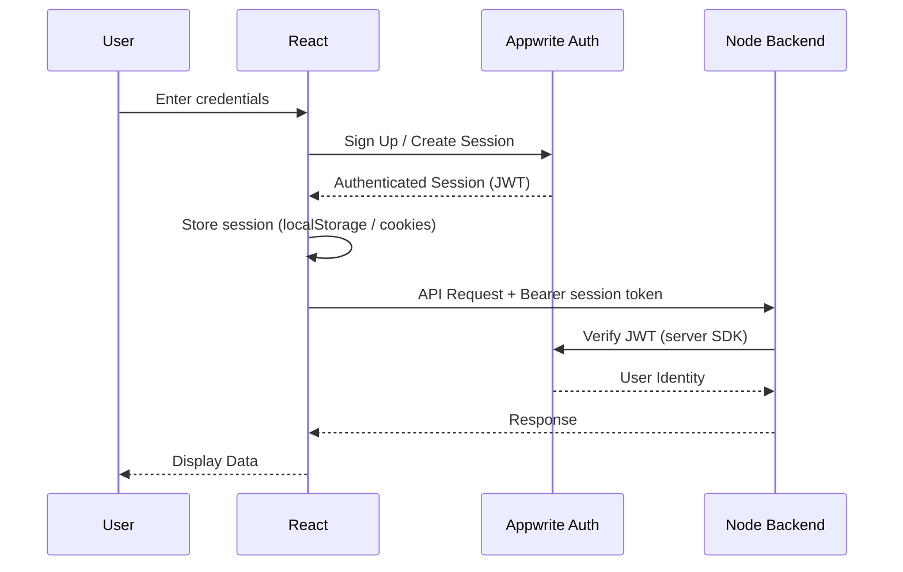
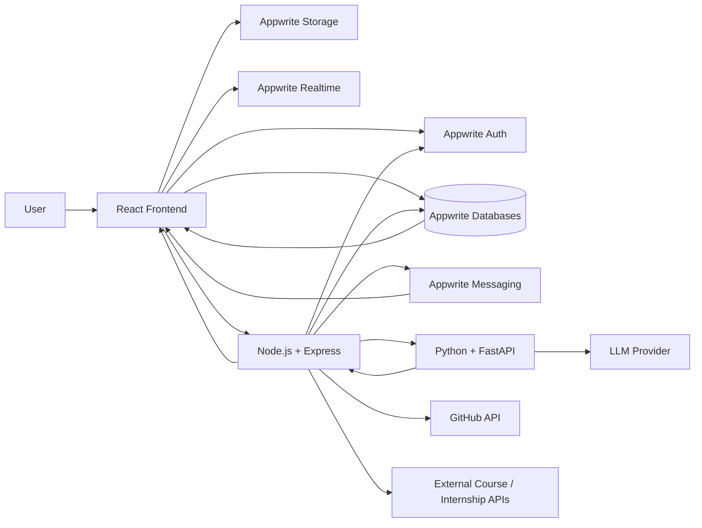

# Main Architecture — Skill Guide

> Technical architecture and implementation blueprint for Skill Guide.
>
> **Product:** One-Stop Personalized Career & Education Advisor
>
> **Architecture:** React + Appwrite (Auth / Databases / Storage / Messaging / Realtime / Functions) + Node.js/Express + Python/FastAPI

---

# 1. Architecture Overview

Skill Guidefollows a modular architecture consisting of four major application layers:

1. **Frontend Layer** — React + Tailwind CSS (repo root)
2. **Infrastructure & Data Layer** — Appwrite (Auth, Databases, Storage, Messaging, Realtime, Functions)
3. **Backend/Application Layer** — Node.js + Express (thin backend for business logic and orchestration)
4. **AI Layer** — Python + FastAPI

The core architectural principle is:

> **Appwrite handles infrastructure and primary data storage, Node.js handles business logic and orchestration, and Python handles AI/ML processing. There is no MySQL — Appwrite Databases is the primary data store.**

---

# 2. High-Level Architecture

```text
                                      ┌──────────────────────┐
                                      │        USER          │
                                      └──────────┬───────────┘
                                                 │
                                                 ▼
                                  ┌──────────────────────────┐
                                  │      React Frontend      │
                                  │      Tailwind CSS        │
                                  │      (repo root)         │
                                  └────────────┬─────────────┘
                                               │
                            ┌──────────────────┴──────────────────┐
                            │                                     │
                            ▼                                     ▼
                 ┌────────────────────────────┐         ┌──────────────────────┐
                 │          Appwrite          │         │    Node.js/Express   │
                 │                            │         │       Backend        │
                 │ • Authentication           │         │   (server/)          │
                 │ • Databases (NoSQL)        │         │                      │
                 │ • File Storage             │         │ • Business Logic     │
                 │ • Messaging                │         │ • REST APIs          │
                 │ • Realtime                 │         │ • Appwrite Access    │
                 │ • Functions                │         │ • AI Orchestration   │
                 └────────────────────────────┘         │ • External APIs      │
                            │                            └───────────┬──────────┘
                            │                                        │
                            └───────────────┬────────────────────────┘
                                            ▼
                                   ┌─────────────────────┐
                                   │   Python/FastAPI    │
                                   │      AI Service     │
                                   │    (ai-service/)    │
                                   │                     │
                                   │ • Skill Matching    │
                                   │ • Recommendations  │
                                   │ • Resume Analysis  │
                                   │ • GitHub Analysis  │
                                   │ • AI Assistant     │
                                   │ • ML Models        │
                                   └─────────────────────┘
```

---

# 3. Responsibility Matrix

| Technology | Responsibility |
|---|---|
| React | User interface |
| Tailwind CSS | UI styling |
| Appwrite Auth | Authentication |
| Appwrite Databases | Primary structured data storage (NoSQL) |
| Appwrite Storage | Resume/file storage |
| Appwrite Messaging | Notifications |
| Appwrite Realtime | Real-time events |
| Appwrite Functions | Lightweight server-side tasks (optional) |
| Node.js | Application backend (business logic, orchestration) |
| Express | REST API framework |
| Python | AI/ML processing |
| FastAPI | AI service API |
| GitHub API | Public GitHub data |
| External course/internship APIs | External opportunities |
| LLM API | Natural-language AI functionality |

---

# 4. Core Architectural Principle

The system must maintain strict separation between:

```text
Presentation & Client State
        ↓
React (repo root)

Infrastructure + Primary Data
        ↓
Appwrite (Auth / Databases / Storage / Messaging / Realtime)

Application Logic & Orchestration
        ↓
Node.js + Express (server/)

Artificial Intelligence
        ↓
Python + FastAPI (ai-service/)
```

- The frontend reads/writes data through Appwrite and calls the Node backend only for business logic.
- Business-critical logic must not live in the frontend.
- The Python service must not handle authentication.
- The AI service must not directly modify application data unless it goes through a controlled backend flow.

---

# 5. Frontend Architecture

## 5.1 Technology

```text
React
Tailwind CSS
React Router
Axios (Node backend calls)
Appwrite Web SDK (client-safe)
```

## 5.2 Responsibilities

The frontend is responsible for:

- Rendering UI
- Navigation
- Forms
- Client-side validation
- Dashboard
- User interaction
- Appwrite client integration (auth, DB reads/writes, file upload, realtime)
- API communication with the Node backend (Axios)
- Displaying AI recommendations
- Roadmap visualization
- Progress tracking

---

# 6. Frontend Structure

```text
skill-guide/                      # repo root = React frontend
│
├── public/
│
├── src/
│   │
│   ├── assets/
│   │
│   ├── components/
│   │   ├── common/
│   │   ├── auth/
│   │   ├── profile/
│   │   ├── career/
│   │   ├── roadmap/
│   │   ├── resume/
│   │   ├── github/
│   │   ├── courses/
│   │   ├── internships/
│   │   └── assistant/
│   │
│   ├── pages/
│   │   ├── public/
│   │   ├── auth/
│   │   └── private/
│   │
│   ├── services/
│   │   ├── api.js            # Axios instance → Node backend
│   │   ├── appwrite.js       # Appwrite client + database helpers
│   │   └── auth.js           # Auth helpers (login/signup/session)
│   │
│   ├── hooks/
│   ├── context/
│   ├── utils/
│   ├── routes/
│   │   └── AppRoutes.jsx
│   │
│   ├── App.jsx
│   ├── main.jsx
│   └── index.css
│
├── .env
├── .env.sample
├── vite.config.js
└── package.json
```

---

# 7. Appwrite Architecture

Appwrite is the application's **infrastructure and primary data layer**.

## 7.1 Appwrite Services Used

```text
Appwrite
│
├── Authentication
├── Databases          ← primary data store (NoSQL)
├── Storage
├── Messaging
└── Realtime
```

Appwrite Functions are optional and may be used later for small server-side tasks. Heavy business logic stays in the Node backend.

---

# 8. Appwrite Authentication

Appwrite handles:

- User registration
- Login
- Logout
- Session management
- Password recovery
- Email verification
- OAuth if implemented

## Authentication Flow

```text
User
 │
 ▼
React
 │
 │ Appwrite Auth SDK
 ▼
Appwrite Authentication
 │
 ├── Validate credentials
 ├── Create session
 └── Return authenticated session
 │
 ▼
React
 │
 │ Authenticated API Request (Appwrite session token)
 ▼
Node.js Backend
```

---

# 9. Authentication Architecture



---

# 10. User Identity Mapping

Appwrite owns the authentication identity.

Appwrite Databases owns the application profile and career data.

```text
Appwrite User (Auth)
      │
      │ user $id
      ▼
profiles collection (Appwrite Databases)
      │
      ├── skills        (user_skills collection)
      ├── interests     (user_interests collection)
      ├── assessments   (assessments collection)
      ├── roadmaps      (roadmaps collection)
      └── recommendations (career_recommendations collection)
```

The `profiles` document should use the Appwrite user ID as its document ID.

Example:

```text
profiles
--------------------
$id             = <Appwrite user $id>
user_id         = <Appwrite user $id>
education_level
degree
branch
study_year
cgpa
career_goal
created_at
updated_at
```

---

# 11. Appwrite Storage

Appwrite Storage is responsible for files.

Primary use case:

```text
Resume Upload
```

Possible future use cases:

- Profile pictures
- Certificates
- Project files
- Other user documents

## Resume Upload Flow

```text
User
 │
 ▼
React
 │
 │ Upload File
 ▼
Appwrite Storage
 │
 │ File ID
 ▼
Node Backend
 │
 ▼
Python AI Service
 │
 ▼
Resume Analysis
```

The database stores metadata rather than the actual resume binary.

Example (`resume_analyses` collection):

```text
resume_analyses
-----------------------------
$id
user_id
appwrite_file_id
file_name
analysis_result
created_at
```

---

# 12. Appwrite Messaging

Appwrite Messaging can be used for:

- Roadmap reminders
- Personalized notifications
- Course notifications
- Internship alerts
- Progress reminders

Flow:

```text
Roadmap Task
     │
     ▼
Node Backend
     │
     ▼
Appwrite Messaging
     │
     ▼
User
```

For MVP simplicity, in-app notifications can be stored in a `notifications` collection in Appwrite Databases and displayed through the dashboard. Appwrite Messaging is used when push/email/SMS delivery is needed.

---

# 13. Appwrite Realtime

Realtime is optional for the MVP.

It can be used for:

- Live roadmap progress updates
- Notification updates
- Dashboard updates
- AI processing status

Example:

```text
User completes task
        ↓
Node Backend
        ↓
Appwrite Databases updated
        ↓
Realtime Event
        ↓
React Dashboard
        ↓
UI updates
```

---

# 14. Node.js Backend Architecture

Node.js is a thin application server used for business logic and orchestration. It is **not** the primary data store.

Responsibilities:

- REST API (business-logic endpoints)
- Business logic
- Authorization checks on server-only operations
- Validation
- Appwrite server-side integration (Admin SDK)
- AI service communication
- External API integration (GitHub, courses, internships)
- Recommendation orchestration
- Roadmap generation orchestration
- Notification triggering

---

# 15. Backend Structure

```text
server/
│
├── src/
│   │
│   ├── config/
│   │   ├── appwrite.js
│   │   └── environment.js
│   │
│   ├── routes/
│   │   ├── profile.routes.js
│   │   ├── career.routes.js
│   │   ├── recommendation.routes.js
│   │   ├── roadmap.routes.js
│   │   ├── resume.routes.js
│   │   ├── github.routes.js
│   │   ├── course.routes.js
│   │   ├── internship.routes.js
│   │   └── assistant.routes.js
│   │
│   ├── controllers/
│   │   ├── career.controller.js
│   │   └── recommendation.controller.js
│   │
│   ├── services/
│   │   ├── recommendation.service.js
│   │   ├── career.service.js
│   │   ├── appwrite.service.js
│   │   ├── ai.service.js
│   │   ├── roadmap.service.js
│   │   ├── github.service.js
│   │   └── ...
│   │
│   ├── middleware/
│   │   ├── auth.middleware.js
│   │   ├── validation.middleware.js
│   │   └── error.middleware.js
│   │
│   ├── utils/
│   │
│   └── app.js
│
├── .env
└── package.json
```

---

# 16. Backend Request Lifecycle

```text
HTTP Request
      ↓
Express Router
      ↓
Authentication Middleware (verify Appwrite JWT)
      ↓
Validation Middleware
      ↓
Controller
      ↓
Service Layer
      ↓
  ┌────┼─────────────┐
  ▼    ▼             ▼
Appwrite   External   AI Service
DB/Storage  APIs      (Python/FastAPI)
      │
      ▼
Response
```

---

# 17. Appwrite Database Architecture

Appwrite Databases is the primary data store. It is a NoSQL document database organized into **collections** (similar to tables) of **documents**.

## Collection Overview

| Collection | Purpose | Key attributes |
|---|---|---|
| `profiles` | One document per user | `user_id`, `education_level`, `degree`, `branch`, `study_year`, `cgpa`, `subjects`, `academic_strengths`, `career_goal`, `preferred_industry`, `preferred_role`, `preferred_location`, `work_preference`, `experience_years`, `assessment_score`, `onboarding_completed`, `github_username` |
| `skills` | Global skill catalog | `name`, `category` |
| `user_skills` | User ↔ skill proficiency | `user_id`, `skill_id`, `proficiency` |
| `interests` | Global interest catalog | `name` |
| `user_interests` | User ↔ interest link | `user_id`, `interest_id` |
| `careers` | Career catalog | `name`, `category`, `description` |
| `career_skills` | Career ↔ required skill | `career_id`, `skill_id`, `required_level` (1–5 proficiency), `importance` (1–5) |
| `assessments` | Assessment attempts | `user_id`, `type`, `score`, `responses`, `completed_at` |
| `career_recommendations` | Generated recommendations | `user_id`, `career_id`, `match_score`, `explanation` |
| `roadmaps` | Roadmaps per user + career | `user_id`, `career_id`, `title`, `status`, `progress_percent` |
| `roadmap_tasks` | Tasks inside a roadmap | `roadmap_id`, `title`, `description`, `order_index`, `estimated_hours`, `status`, `completed_at` |
| `courses` | Course catalog | `name`, `provider`, `skill_id`, `level`, `duration_hours`, `url`, `cost`, `rating` |
| `user_courses` | User course tracking | `user_id`, `course_id`, `status`, `progress` |
| `internships` | Internship catalog | `title`, `company`, `location`, `description`, `url`, `skills` (JSON array), `eligibility`, `status` (pending/active/rejected), `source`, `source_key`, `expires_at`, `fetched_at` |
| `internship_recommendations` | Internship matches | `user_id`, `internship_id`, `match_score` |
| `resume_analyses` | Resume analysis metadata | `user_id`, `appwrite_file_id`, `file_name`, `analysis_result` |
| `github_analyses` | GitHub analysis metadata | `user_id`, `github_username`, `analysis_result` |
| `notifications` | In-app notifications | `user_id`, `title`, `message`, `is_read` |

> **Security note:** Appwrite permissions are configured per collection. Most collections are `user` scoped (a user can only read/write their own documents). Global catalogs (`skills`, `careers`, `courses`, `internships`) are read-only for authenticated users.

---

# 18. Database Relationship Model

```mermaid
erDiagram

    PROFILES {
        string id PK
        string user_id UK
        string education_level
        string degree
        string branch
        int study_year
        decimal cgpa
        text subjects
        text academic_strengths
        text career_goal
        string preferred_industry
        string preferred_role
        string preferred_location
        string work_preference
        int experience_years
        float assessment_score
        boolean onboarding_completed
        string github_username
        datetime created_at
        datetime updated_at
    }

    SKILLS {
        string id PK
        string name UK
        string category
    }

    USER_SKILLS {
        string id PK
        string user_id FK
        string skill_id FK
        int proficiency
    }

    INTERESTS {
        string id PK
        string name UK
    }

    USER_INTERESTS {
        string id PK
        string user_id FK
        string interest_id FK
    }

    CAREERS {
        string id PK
        string name
        string category
        text description
    }

    CAREER_SKILLS {
        string id PK
        string career_id FK
        string skill_id FK
        int required_level
        int importance
    }

    ASSESSMENTS {
        string id PK
        string user_id FK
        string type
        decimal score
        json responses
        datetime completed_at
    }

    CAREER_RECOMMENDATIONS {
        string id PK
        string user_id FK
        string career_id FK
        decimal match_score
        json explanation
        datetime created_at
    }

    ROADMAPS {
        string id PK
        string user_id FK
        string career_id FK
        string title
        string status
        int progress_percent
        datetime created_at
        datetime updated_at
    }

    ROADMAP_TASKS {
        string id PK
        string roadmap_id FK
        string title
        text description
        int order_index
        int estimated_hours
        string status
        datetime completed_at
    }

    COURSES {
        string id PK
        string name
        string provider
        string skill_id FK
        string level
        int duration_hours
        string url
        int cost
        float rating
    }

    USER_COURSES {
        string id PK
        string user_id FK
        string course_id FK
        string status
        int progress
    }

    INTERNSHIPS {
        string id PK
        string title
        string company
        string location
        text description
        string url
        string skills
        string eligibility
        enum   status            // pending | active | rejected
        string source            // manual | file | remotive | <feeder>
        string source_key        // dedup key, e.g. <feed>:<title>:<company>
        datetime expires_at
        datetime fetched_at
    }

    INTERNSHIP_RECOMMENDATIONS {
        string id PK
        string user_id FK
        string internship_id FK
        decimal match_score
        datetime created_at
    }

    RESUME_ANALYSES {
        string id PK
        string user_id FK
        string appwrite_file_id
        string file_name
        json extracted_data
        json analysis_result
        datetime created_at
    }

    GITHUB_ANALYSES {
        string id PK
        string user_id FK
        string github_username
        json analysis_result
        datetime created_at
    }

    NOTIFICATIONS {
        string id PK
        string user_id FK
        string title
        text message
        boolean is_read
        datetime created_at
    }

    PROFILES ||--o{ USER_SKILLS : has
    SKILLS ||--o{ USER_SKILLS : contains

    PROFILES ||--o{ USER_INTERESTS : has
    INTERESTS ||--o{ USER_INTERESTS : contains

    CAREERS ||--o{ CAREER_SKILLS : requires
    SKILLS ||--o{ CAREER_SKILLS : required_by

    PROFILES ||--o{ ASSESSMENTS : completes

    PROFILES ||--o{ CAREER_RECOMMENDATIONS : receives
    CAREERS ||--o{ CAREER_RECOMMENDATIONS : recommended

    PROFILES ||--o{ ROADMAPS : owns
    CAREERS ||--o{ ROADMAPS : targets

    ROADMAPS ||--o{ ROADMAP_TASKS : contains

    SKILLS ||--o{ COURSES : teaches

    PROFILES ||--o{ USER_COURSES : tracks
    COURSES ||--o{ USER_COURSES : selected

    PROFILES ||--o{ INTERNSHIP_RECOMMENDATIONS : receives
    INTERNSHIPS ||--o{ INTERNSHIP_RECOMMENDATIONS : recommended

    PROFILES ||--o{ RESUME_ANALYSES : creates
    PROFILES ||--o{ GITHUB_ANALYSES : creates

    PROFILES ||--o{ NOTIFICATIONS : receives
```

---

# 19. Python AI Service

The AI service is an independent Python application.

Technology:

```text
Python
FastAPI
scikit-learn
pandas
numpy
```

Additional libraries may be introduced when required.

## AI Service Responsibilities

The Python service handles:

- Skill normalization
- Skill matching
- Career recommendation
- Skill-gap calculation
- Resume analysis
- GitHub technical profile analysis
- Career comparison
- Career ranking
- What-if simulation
- LLM-based processing where required

---

# 20. AI Service Architecture

```text
ai-service/
│
├── app/
│   ├── main.py              # FastAPI app: /health, /ai/careers, /ai/recommend-careers, /ai/skill-gaps
│   │
│   ├── api/
│   │
│   ├── preprocessing/
│   │
│   ├── recommendation/
│   │   ├── careers.py       # Career dataset (13 careers with required skills/importance)
│   │   ├── career_ranker.py
│   │   └── scoring.py       # Weighted scoring + skill-gap analysis + explanations
│   │
│   ├── resume/
│   │   ├── parser.py
│   │   └── analyzer.py
│   │
│   ├── github/
│   │   └── analyzer.py
│   │
│   └── assistant/
│       └── llm_service.py
│
├── models/
├── data/
└── requirements.txt
```

---

# 21. AI Communication

Node.js communicates with Python through HTTP.

```text
Node.js
   │
   │ HTTP POST
   ▼
FastAPI
   │
   ▼
AI Processing
   │
   ▼
JSON Response
   │
   ▼
Node.js
```

Example endpoint:

```http
POST /ai/recommend-careers
```

Example request:

```json
{
  "education_level": "college",
  "skills": [
    {
      "name": "JavaScript",
      "proficiency": 4
    },
    {
      "name": "React",
      "proficiency": 4
    }
  ],
  "interests": [
    "Web Development",
    "Software Engineering"
  ],
  "goals": ["internship", "software engineering job"],
  "assessment_score": 80,
  "experience_years": 2
}
```

Example response (Phase 3):

```json
{
  "recommendations": [
    {
      "career_id": "career_12",
      "career": "Frontend Developer",
      "category": "Software & Technology",
      "description": "Creates responsive user interfaces...",
      "score": 91,
      "breakdown": {
        "skill": 92.5,
        "interest": 100.0,
        "education": 100.0,
        "goal": 50.0,
        "assessment": 100.0,
        "experience": 100.0
      },
      "reasons": [
        "Strong React skills (4/4)",
        "Strong JavaScript skills (4/4)",
        "Interest in Web Development"
      ],
      "strengths": ["JavaScript", "React"],
      "skill_gaps": ["Testing", "Accessibility"],
      "next_steps": ["Learn TypeScript (level 0 → 3)"]
    }
  ]
}
```

Skill-gap analysis for a single target career:

```http
POST /ai/skill-gaps
```

Example request:

```json
{
  "career": "Full Stack Developer",
  "skills": [
    { "name": "JavaScript", "proficiency": 4 },
    { "name": "Node.js", "proficiency": 1 }
  ]
}
```

Example response:

```json
{
  "career_id": "career_full_stack_developer",
  "career": "Full Stack Developer",
  "category": "Software & Technology",
  "description": "Builds and maintains both front-end and back-end...",
  "strong": [
    { "skill": "javascript", "required": 4, "current": 4, "importance": 5 }
  ],
  "needs_improvement": [
    { "skill": "node.js", "required": 4, "current": 1, "importance": 4 }
  ]
}
```

The AI service also exposes the scoring catalog its engine uses:

```http
GET /ai/careers
```

---

# 22. Career Recommendation Pipeline

```text
User Profile (Appwrite Databases)
     ↓
Node Backend
     ↓
FastAPI
     ↓
Input Validation
     ↓
Feature Extraction
     ↓
Skill Normalization
     ↓
Career Matching
     ↓
Career Scoring
     ↓
Skill Gap Calculation
     ↓
Recommendation Ranking
     ↓
JSON Response
     ↓
Node Backend
     ↓
Appwrite Databases
     ↓
React Dashboard
```

---

# 23. Recommendation Engine

The first implementation should **not** depend entirely on a complex ML model.

The recommended approach is a hybrid system:

```text
               Career Recommendation
                       │
          ┌────────────┼────────────┐
          ▼            ▼            ▼
      Skill Match   Interest     Education
                      Match        Match
          │            │            │
          └────────────┼────────────┘
                       ▼
                  Score Engine
                       │
                       ▼
                Career Ranking
```

The initial scoring model uses weighted factors:

```text
Career Score =
    Skill Match       × 0.40
  + Interest Match    × 0.20
  + Assessment Match  × 0.15
  + Education Match   × 0.10
  + Goal Match        × 0.10
  + Experience Match  × 0.05
```

Skill match is **importance-weighted**: each required skill contributes
`min(user, required) / required` scaled by its `importance` (1–5), so the skills
that matter most for a career dominate the score. Each career in the dataset
accepts a list of `education_levels` (comparison against the user's
`education_level`), a minimum assessment `assessment` threshold, minimum
`experience` years, and matching `interests` / `goals`.

Weights are configurable in `ai-service/app/recommendation/scoring.py` and can be
changed during testing.

Machine learning can be introduced later when enough suitable training/evaluation data exists.

### Career Comparison

Career comparison (PRD §18) reuses the same hybrid scoring engine instead of
inventing a separate metric, so a career ranked #1 in *matches* also wins the
side-by-side *comparison* as the "best pick".

```text
User selects career names (Backend) → compare_careers(profile, career_names)
    ├── score via §23 formula (breakdown + reasons + strengths)
    ├── skill gaps (strong vs needs_improvement, current → required levels)
    ├── difficulty = f(avg required proficiency, assessment bar, years exp.)
    └── best pick = highest score, summary sentence
```

Data flow: frontend (`/career-compare`) → `POST /api/careers/compare` (Node
backend builds the profile and maps names to the Appwrite career catalog) →
`POST /ai/compare-careers` (Python, `compare_careers` in
`ai-service/app/recommendation/scoring.py`). Comparison is stateless — nothing is
persisted; when the AI service is down the backend scores the selected careers
with a skills-only fallback and tags the response `source: "fallback"`.

---

# 24. Skill Gap Engine

The skill-gap engine compares:

```text
Required Career Skills
        VS
User Skills
```

Example:

```text
Career: Full Stack Developer

Required:

JavaScript → 4
React      → 4
Node.js    → 3
SQL        → 3
Git        → 2

User:

JavaScript → 4
React      → 4
Node.js    → 1
SQL        → 1
Git        → 3
```

Output:

```text
Strong:
JavaScript
React
Git

Needs Improvement:
Node.js
SQL
```

---

# 25. Roadmap Generation

The roadmap engine uses the output of the skill-gap engine.

```text
Target Career
      ↓
Required Skills
      ↓
User Skills
      ↓
Skill Gap
      ↓
Priority Calculation
      ↓
Learning Resources
      ↓
Projects
      ↓
Roadmap Tasks
      ↓
Appwrite Databases
```

Example:

```text
Career:
Full Stack Developer

Roadmap:

1. Learn Node.js
2. Build REST API
3. Learn SQL
4. Build database-backed project
5. Learn authentication
6. Build full-stack project
7. Deploy project
```

---

# 26. What-If Simulator

The simulator must not modify the real user profile unless the user explicitly chooses to apply the changes.

```text
Current Profile
      ↓
Temporary Copy (in memory)
      ↓
Modify Skills / Goals / Interests
      ↓
Recommendation Engine
      ↓
Simulated Results
      ↓
Compare Results
```

Example:

```text
Current:

React = 3
Python = 1

What If:

Python = 4

↓

New Career Recommendations
```

---

# 27. Resume Analysis

Resume files are stored in Appwrite Storage.

The analysis metadata is stored in the `resume_analyses` collection in Appwrite Databases.

```text
Resume
   ↓
Appwrite Storage
   ↓
File ID
   ↓
Node Backend
   ↓
Python/FastAPI
   ↓
Text Extraction
   ↓
Skill Extraction
   ↓
Experience Extraction
   ↓
Career Alignment
   ↓
Appwrite Databases
   ↓
React
```

### Implementation

The frontend (`src/pages/private/ResumeAnalysis.jsx`) supports click-to-browse and
drag-and-drop upload, storing the file in the Appwrite `resumes` bucket via the web
SDK. The Node backend (`server/src/services/resume.service.js`) fetches the file
bytes and calls the Python analyzer at `POST /ai/resume/analyze`, which uses pypdf
to extract the text layer and normalizes letter-spaced fonts (`densify_text`) so
word-boundary detection works. Results are persisted in `resume_analyses`
(latest analysis per user), and detected skills can optionally be written to
`user_skills` to feed recommendations. If the AI service is unreachable, a built-in
heuristic (`computeFallbackAnalysis`) returns the same result shape with
`source: "fallback"`.

---

# 28. GitHub Analysis

The GitHub analysis service uses the GitHub API to retrieve publicly accessible information.

```text
GitHub Username
       ↓
Node Backend
       ↓
GitHub API
       ↓
Public Repository Data
       ↓
Python Analyzer
       ↓
Languages
Repositories
Activity
Project Signals
       ↓
Technical Profile
       ↓
Appwrite Databases
```

The system should only process publicly available GitHub information.

### Implementation

*Only public data is used* — the user's profile fields and repository metadata (name, description, language, topics, star/fork counts, activity dates). No private or code content is ever fetched or stored.
The Node backend (`server/src/services/github.service.js`) calls the GitHub API, sends the payload to the Python analyzer at `POST /ai/github/analyze`, and persists the result in `github_analyses`. If the AI service is unreachable, a built-in heuristic analyzer (`computeFallbackAnalysis`) produces the same result shape so the feature degrades gracefully. Optionally, detected skills at ≥70 confidence can be written to the user's `user_skills` to feed recommendations and internships.
An optional `GITHUB_TOKEN` in the backend environment raises GitHub API rate limits.

---

# 29. AI Career Assistant

The AI assistant uses the user's Skill Guidecontext.

Context can include:

```text
User Profile
Skills
Interests
Target Career
Skill Gaps
Roadmap
Progress
```

Architecture:

```text
User Question
      ↓
React
      ↓
Node Backend
      ↓
Context Builder
      ↓
Python AI Service
      ↓
LLM
      ↓
Response
      ↓
Node Backend
      ↓
React
```

The assistant should not invent structured career information when reliable application data exists.

---

# 30. Course Recommendation Architecture

Courses are stored in the `courses` collection in Appwrite Databases.

```text
User Skill Gap
      ↓
Required Skills
      ↓
Course Matching
      ↓
Filtering
      ↓
Ranking
      ↓
Recommended Courses
```

Filtering parameters can include:

- Skill
- Difficulty
- Duration
- Provider
- Free/Paid
- Rating
- User preference

---

# 31. Internship Recommendation Architecture

```text
User Profile
      ↓
Skills
      ↓
Career Interest
      ↓
Education Level
      ↓
Location Preference
      ↓
Internship Data
      ↓
Matching
      ↓
Ranking
      ↓
Recommended Internships
```

External internship data must pass through the Node backend before reaching the frontend.

### Implementation

Internship rows live in the `internships` catalog with a JSON `skills` array and `eligibility` string. Matching is a weighted formula in `server/src/services/internship.service.js`:

```text
Internship Score =
    Skill Match            × 0.55   (against the user's skill proficiencies)
  + Role/Goals/Interests   × 0.20   (tokens from preferred_role, career_goal, interests)
  + Education Match        × 0.15   (against the internship eligibility text)
  + Location Match         × 0.10   (preferred_location, remote/hybrid preference)
```

The top 10 matches are persisted per user in `internship_recommendations`, and scores ≥80 are surfaced as strong matches in the UI.

### Hybrid catalog lifecycle

Listings pass through a review gate instead of being published automatically:

- The scheduled importer (`scripts/import-internships.mjs`) reads a JSON feed (`scripts/feeds/internships.json`, `FEED_FILE` override) or the Remotive API (`--source remotive`), dedups by `source_key`, and creates **new** rows as `pending`. Re-imports refresh existing rows and keep their status.
- An admin approves (`active`) or rejects (`rejected`) rows from the admin page (`src/pages/private/AdminInternships.jsx`).
- The admin page loads the full list once and filters client-side by status/search, so status counts stay accurate under any filter; the manual add form includes a `description` field and pre-fills `expires_at` 30 days out (importer default TTL).
- Admin accounts bypass the student onboarding flow: signup routes admins to `/home`, the home hero shows an "Open admin panel" CTA, and `ProfileCompleteRoute` skips the `onboarding_completed` gate for admins. `useAdmin` caches the `/api/admin/me` result per user to avoid a flash of the non-admin UI on revisit.
- `expires_at` + the `active`-only public filter make stale listings disappear automatically without manual cleanup.
- Manually added listings default to `pending`; seeded catalog rows are `active`.

---

# 32. API Architecture

Authentication is handled entirely by Appwrite Auth from the client — the Node backend exposes business-logic APIs only.

## Profile

```text
GET    /api/profile
PUT    /api/profile
POST   /api/profile/skills
DELETE /api/profile/skills/:skillId
POST   /api/profile/interests
```

## Careers

```text
GET  /api/careers
GET  /api/careers/:careerId
POST /api/careers/compare
```

## Recommendations

```text
POST /api/recommendations/generate
GET  /api/recommendations
GET  /api/recommendations/:id
GET  /api/recommendations/careers/:careerId/skill-gaps
```

## Roadmaps

```text
POST   /api/roadmaps
GET    /api/roadmaps
GET    /api/roadmaps/:id
PUT    /api/roadmaps/:id
DELETE /api/roadmaps/:id
```

## Roadmap Tasks

```text
POST   /api/roadmaps/:id/tasks
PUT    /api/roadmaps/:id/tasks/:taskId
DELETE /api/roadmaps/:id/tasks/:taskId
```

## Resume

```text
POST /api/resume/analyze
GET  /api/resume/analysis/:id
```

## GitHub

```text
POST /api/github/analyze          (implemented)
GET  /api/github/analysis/:id     (implemented)
```

## What-If

```text
POST /api/what-if/simulate
```

## Courses

```text
GET /api/courses
GET /api/courses/recommended
```

## Internships

```text
GET /api/internships              (implemented)
GET /api/internships/recommended  (implemented)
```

## Admin (internships)

```text
GET    /api/admin/me              (implemented)
GET    /api/admin/internships     (implemented)
POST   /api/admin/internships     (implemented)
PATCH  /api/admin/internships/:id (implemented)
DELETE /api/admin/internships/:id (implemented)
```

Admin endpoints require `requireAuth` + `requireAdmin` (`ADMIN_EMAILS` in the
backend environment; empty = admin API disabled). The public catalog
`GET /api/internships` returns only `active`, non-expired rows.

## Assistant

```text
POST /api/assistant/chat
```

## Notifications

```text
GET /api/notifications
PUT /api/notifications/:id/read
```

---

# 33. Complete Request Flow

A typical recommendation request:

```text
                         USER
                           │
                           ▼
                    React Frontend
                           │
                           │ Appwrite session (JWT)
                           ▼
                    Node REST API
                           │
                    Auth Middleware
                           │
                           ▼
              Fetch Profile (Appwrite Databases)
                           │
                           ▼
                  Recommendation Service
                           │
                           ▼
                     Python/FastAPI
                           │
                           ▼
                   AI Recommendation
                           │
                           ▼
                     JSON Response
                           │
                           ▼
                      Node Backend
                           │
                           ├── Store Result (Appwrite Databases)
                           │
                           ▼
                    React Dashboard
```

---

# 34. Complete System Interaction



---

# 35. Data Ownership

A strict data ownership model must be followed.

| Data | Owner |
|---|---|
| Authentication identity | Appwrite Auth |
| Sessions | Appwrite Auth |
| Password | Appwrite Auth |
| Resume binary | Appwrite Storage |
| Profile | Appwrite Databases |
| Skills | Appwrite Databases |
| Careers | Appwrite Databases |
| Recommendations | Appwrite Databases |
| Roadmaps | Appwrite Databases |
| Courses | Appwrite Databases |
| Internships | Appwrite Databases |
| AI calculations | Python |
| AI analysis results | Appwrite Databases |
| Notifications | Appwrite Messaging + `notifications` collection |

---

# 36. Environment Configuration

No secrets should be committed to Git.

## Frontend (repo root `.env`)

```env
VITE_APPWRITE_ENDPOINT=
VITE_APPWRITE_PROJECT_ID=
VITE_APPWRITE_DATABASE_ID=
VITE_API_BASE_URL=
```

Only values safe for client-side exposure should use the `VITE_` prefix.

## Node Backend (`server/.env`)

```env
PORT=5000

APPWRITE_ENDPOINT=
APPWRITE_PROJECT_ID=
APPWRITE_API_KEY=
APPWRITE_DATABASE_ID=

AI_SERVICE_URL=http://localhost:8000

GITHUB_TOKEN=
LLM_API_KEY=
```

## Python AI Service (`ai-service/.env`)

```env
PORT=8000

LLM_API_KEY=
```

---

# 37. Local Development Architecture

Docker is not required.

The development environment consists of:

```text
React (Vite)
localhost:5173

Node.js / Express
localhost:5000

Python / FastAPI
localhost:8000

Appwrite
Cloud / configured Appwrite instance
```

---

# 38. Local Development Flow

Start:

```text
1. Appwrite (cloud console or local instance)
      ↓
2. Node.js Backend
      ↓
3. Python AI Service
      ↓
4. React Frontend
```

Appwrite services remain accessible through the configured Appwrite endpoint.

---

# 39. Security Architecture

Security responsibilities are divided between Appwrite and the application backend.

## Appwrite

Handles:

- Authentication
- Sessions
- User identity
- File permissions
- Database document permissions

## Node Backend

Handles:

- Authorization
- Business-level permissions
- Input validation
- API security
- Rate limiting
- User-resource ownership
- Server-side secrets (API keys, tokens)

## Python

Handles:

- AI processing
- Input validation
- AI-specific security controls

---

# 40. Important Security Rule

The frontend must never contain:

```text
Appwrite server API key
GitHub private token
LLM secret key
```

Only public Appwrite client configuration may be exposed to the frontend.

---

# 41. Error Handling

All backend APIs should return consistent responses.

Success:

```json
{
  "success": true,
  "data": {}
}
```

Error:

```json
{
  "success": false,
  "message": "Unable to generate recommendations",
  "code": "RECOMMENDATION_SERVICE_ERROR"
}
```

Internal implementation details must not be exposed to users.

---

# 42. AI Failure Handling

The application must remain usable if the AI service is unavailable.

```text
User requests recommendation
          ↓
Node Backend
          ↓
Python AI Service
          ↓
Service unavailable
          ↓
Node detects failure
          ↓
Return controlled error
          ↓
Frontend displays:
"Recommendations are temporarily unavailable."
```

The application must not crash because the AI service is temporarily unavailable.

---

# 43. Repository Architecture

```text
skill-guide/
│
├── src/                      # React frontend (repo root)
│   ├── assets/
│   ├── components/
│   ├── pages/
│   ├── services/
│   ├── hooks/
│   ├── context/
│   ├── routes/
│   ├── App.jsx
│   └── main.jsx
│
├── public/
│
├── server/                   # Node.js + Express backend
│   ├── src/
│   └── package.json
│
├── ai-service/               # Python AI/ML service
│   ├── app/
│   ├── models/
│   ├── data/
│   └── requirements.txt
│
├── docs/
│   ├── PRD.md
│   ├── main_architecture.md
│   └── rules.md
│
├── .env
├── .env.sample
├── .gitignore
├── vite.config.js
├── package.json
└── README.md
```

---

# 44. Development Strategy

## Phase 1 — Foundation

```text
React
+
Appwrite Authentication
+
Appwrite Databases
+
Node.js
```

## Phase 2 — Profile

Implement:

```text
User Profile
Education
Skills
Interests
Career Goals
```

## Phase 3 — Career Engine (complete)

```text
Career Database          ✓   careers.py (13 careers) + Appwrite careers collection
Skill Database           ✓   Appwrite skills collection (seeded)
Career-Skill Mapping     ✓   Appwrite career_skills (required_level 1–5, importance 1–5)
Basic Recommendation Engine ✓ scoring.py (hybrid weighted scoring)
Skill-gap analysis       ✓   analyze_skill_gaps / POST /ai/skill-gaps
Recommendation explanations ✓ reasons / strengths / next_steps / breakdown
Node API                 ✓   /api/careers, /api/recommendations/*, skill-gaps
```

## Phase 4 — AI (complete)

```text
Python                       ✓   ai-service/ (FastAPI on port 8000)
FastAPI                      ✓   /health, /ai/careers, /ai/recommend-careers, /ai/skill-gaps, /ai/github/analyze
Skill Matching               ✓   importance-weighted matching (scoring.py, §23)
Recommendation Ranking       ✓   score_careers — hybrid weights, sorted, reasons/strengths/next_steps
Skill Gap                    ✓   analyze_skill_gaps (§24, strong vs needs_improvement)
Tests                        ✓   ai-service/tests (pytest) — 15 tests, incl. alias normalization
Node resilience              ✓   rule-based fallback in recommendation.service.js when the AI
                                 service is down (200 + source:"fallback" instead of 503); mirrored
                                 UI badges ("Estimated · AI offline")
```

## Phase 5 — Roadmap (complete)

```text
Roadmap generator       ✓   roadmap.service.js — buildSkillTasks + milestones from analyzeCareerGaps (AI or fallback)
Roadmap tasks           ✓   /api/roadmaps/:id/tasks — add, start/pause/complete, batch reorder, delete
Progress tracking       ✓   completed / total × 100, recomputed on every write; completed→active auto-revert
Roadmap management      ✓   rename, pause, mark completed (auto-completes tasks), delete (cascade)
Dashboard wiring        ✓   /roadmaps pages + Home "Jump back in" card + Dashboard "Current roadmap" card
```

### Data model (already deployed)

Both collections are user-scoped (`USER_SCOPE`). Statuses are stored as plain strings
(no enum constraint in the live DB).

| Collection | Attributes (key → type) | Indexes |
|---|---|---|
| `roadmaps` | `user_id` (string, 100, `required`), `career_id` (string, 100, `required`), `title` (string, 200, `required`), `status` (`active` \| `paused` \| `completed`, default `active`), `progress_percent` (integer, default 0), `created_at`, `updated_at` | `user_idx` (`user_id`) |
| `roadmap_tasks` | `roadmap_id` (string, 100, `required`), `title` (string, 300, `required`), `description` (string, 4000), `order_index` (integer, default 0), `estimated_hours` (integer, default 0), `status` (`pending` \| `in_progress` \| `paused` \| `completed`, default `pending`), `completed_at` (datetime) | `roadmap_idx` (`roadmap_id`) |

`roadmap_tasks` docs **create the parent roadmap** (`roadmap_id`), cascade-delete with it,
and order by `order_index ASC` (kept contiguous 1..n on add/remove).

### Generation algorithm (`roadmap.service.js::generateRoadmap`)

Inputs: `career_id` + `userId`. Reuses `recommendation.service.js::analyzeCareerGaps`
(strong / `needs_improvement[]` with `skill`, `required`, `current`, `importance`), so the
AI-service + fallback path comes for free.

1. For each `needs_improvement` entry create a task: title
   `Learn {skill}` / `Strengthen {skill}`, `estimated_hours = (required - current) × 8`.
2. Append milestone tasks: `Build {career} project` (40h) and
   `Update resume and prepare for interviews` (8h).
3. Assign `order_index` 1..n; persist roadmap (`title` default `{career} Roadmap`) + tasks.
4. Skills the user already meets are not turned into tasks (they remain "strong" in gaps).

### Progress tracking

`completed / total × 100`. Recompute on every task status/CRUD write and update the parent
`roadmaps.progress_percent`. `roadmaps.status = completed` auto-marks remaining tasks completed.

**Status auto-revert:** a `completed` roadmap flips back to `active` the moment it no longer
holds every task completed — reopening, adding, or removing a task recalculates progress and
reverts the roadmap status (`progressRoadmapUpdate` in `roadmap.service.js`). The UI chip and
Dashboard card reflect this immediately.

### Performance

Appwrite cloud round-trips dominate latency, so the service layer minimizes and parallelizes them:

- Independent reads (`getRoadmap` ownership check + `listRoadmapTasks`) run concurrently via
  `Promise.all`; independent writes (task update + progress update) run concurrently too.
- Mutations return detail from in-memory state instead of re-fetching via `getRoadmapDetail`
  (eliminates 2 redundant round-trips per write).
- Roadmap generation creates the roadmap and runs skill-gap analysis in parallel, and creates
  all tasks in parallel (`Promise.all`).
- Reordering is a single **batch** call — `PUT /api/roadmaps/:id/tasks` with the full ordered
  id list — instead of N sequential updates + a reload. The frontend applies the returned
  state without re-fetching.
- Renumbering (`order_index` 1..n) and cascade operations (mark completed, delete roadmap)
  batch their writes with `Promise.all`.

Measured live (Appwrite cloud): single task status change ~0.8s, reorder ~0.9s,
generate a 10-task roadmap ~1.5s.

### API (new `roadmap.routes.js`, mounted at `/api/roadmaps`, JWT-guarded)

| Method | Route | Body / Notes |
|---|---|---|
| `POST` | `/api/roadmaps` | `{ career_id, title? }` → generate + save; returns `{ roadmap, tasks }` |
| `GET` | `/api/roadmaps` | list user's roadmaps (active first) with `progress_percent` |
| `GET` | `/api/roadmaps/:id` | roadmap + tasks sorted by `order_index` |
| `PUT` | `/api/roadmaps/:id` | `{ title?, status? }` (`completed` → complete all tasks; later task reopen reverts to `active`) |
| `DELETE` | `/api/roadmaps/:id` | cascade-delete tasks |
| `POST` | `/api/roadmaps/:id/tasks` | custom task `{ title, description?, estimated_hours?, order_index? }` (append) |
| `PUT` | `/api/roadmaps/:id/tasks` | batch reorder `{ order: [taskId, …] }` (renumbers 1..n, single call) |
| `PUT` | `/api/roadmaps/:id/tasks/:taskId` | `{ status?, title?, estimated_hours?, order_index? }` → start/pause/complete/reorder, recompute progress |
| `DELETE` | `/api/roadmaps/:id/tasks/:taskId` | remove task, recompute + renumber `order_index` |

### File layout

```text
scripts/setup-appwrite.mjs                    roadmaps + roadmap_tasks collections (idempotent, already deployed)
server/src/services/appwrite.service.js       roadmap/task CRUD helpers (owner-scoped)
server/src/services/roadmap.service.js         generateRoadmap, progress recompute, task ops, ownership guards
server/src/controllers/roadmap.controller.js   thin handlers
server/src/routes/roadmap.routes.js            routes (mirror recommendation.routes.js)
server/src/app.js                              roadmapRoutes mounted at /api/roadmaps
src/services/roadmaps.js                       frontend API calls
src/pages/private/Roadmaps.jsx                 list + "Generate roadmap from career" + progress bars
src/pages/private/RoadmapDetail.jsx            task start/pause/complete, reorder, add custom task, rename, delete
src/routes/AppRoutes.jsx + TopBar.jsx           /roadmaps + /roadmaps/:id (behind ProfileCompleteRoute), nav link
Home.jsx + Dashboard.jsx                        "Jump back in" card + "Current roadmap" card with progress
```

Static milestone templates live in `roadmap.service.js`; the catalog stays user-data-free.

## Phase 6 — Advanced Features

Implement:

```text
Resume Analysis (implemented)
GitHub Analysis (implemented)
What-If Simulator
Career Comparison (implemented)
AI Assistant
```

## Phase 7 — External Integrations

Implement:

```text
Courses
Internships (implemented)
Notifications
```

---

# 45. Recommended Architecture Boundary

```text
┌───────────────────────────────────────────────────────┐
│                    React Frontend                    │
│                    Presentation                       │
│                    Appwrite client SDK                │
└───────────────────────┬───────────────────────────────┘
                        │
                        ▼
┌───────────────────────────────────────────────────────┐
│                  Appwrite Services                    │
│                                                       │
│   Auth │ Databases │ Storage │ Messaging │ Realtime  │
└───────────────────────────────────────────────────────┘
                        │
                        │
                        ▼
┌───────────────────────────────────────────────────────┐
│                Node.js + Express                     │
│                                                       │
│       APIs │ Business Logic │ Integrations           │
└───────────────┬───────────────────────┬───────────────┘
                │                       │
                ▼                       ▼
       ┌─────────────────┐      ┌─────────────────────┐
       │  Appwrite DB    │      │   Python/FastAPI    │
       │  (via SDK)      │      │                     │
       │                 │      │ AI / ML             │
       └─────────────────┘      └─────────────────────┘
```

---

# 46. Architecture Decision Summary

Skill Guideuses Appwrite as its infrastructure and primary data layer instead of running a separate database.

### Appwrite

Used for:

```text
Authentication
Databases (primary data store)
Storage
Messaging
Realtime
```

### Node.js

Used for:

```text
REST APIs
Business Logic
Authorization
External Integrations
AI Orchestration
```

### Python/FastAPI

Used for:

```text
AI
ML
Recommendation
Skill Matching
Resume Analysis
GitHub Analysis
LLM Integration
```

This separation keeps the system understandable, maintainable, and scalable while allowing the team to develop each part independently.
