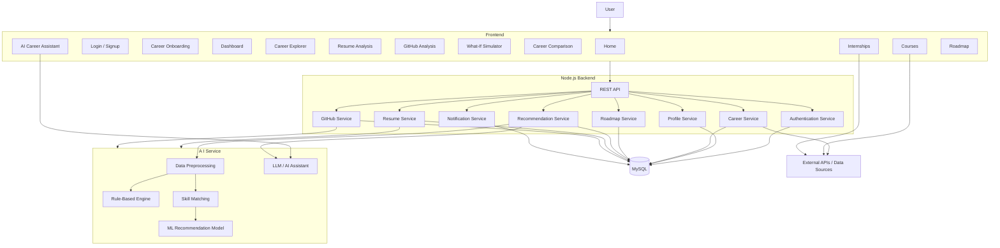
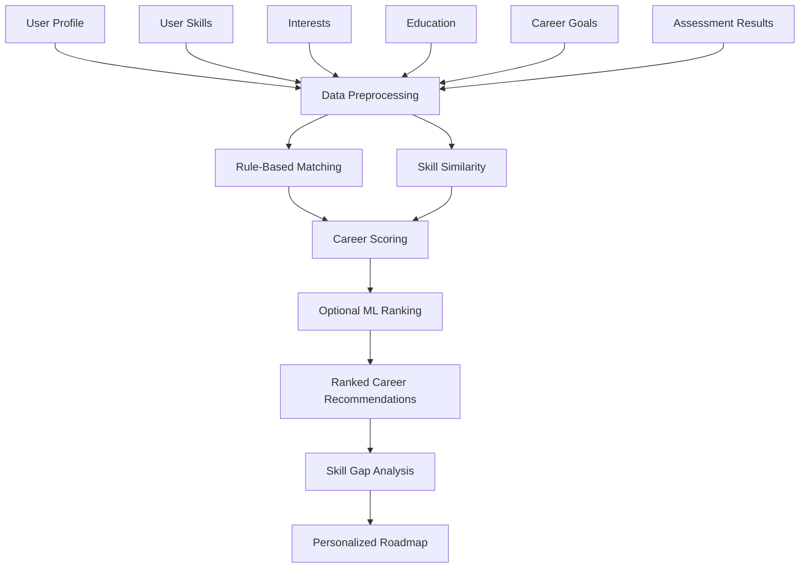
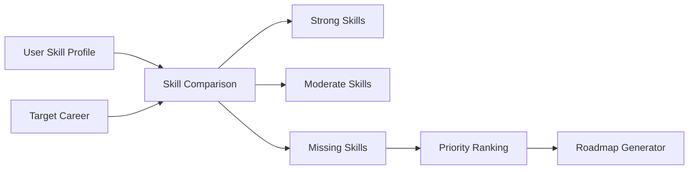
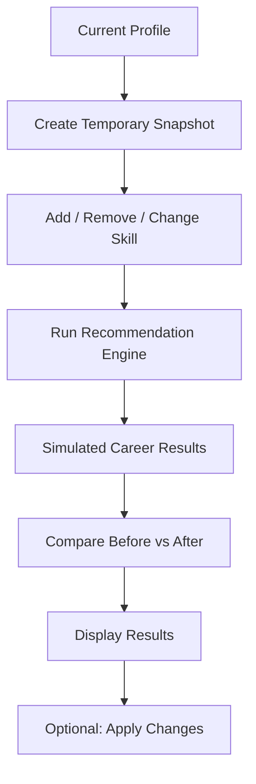
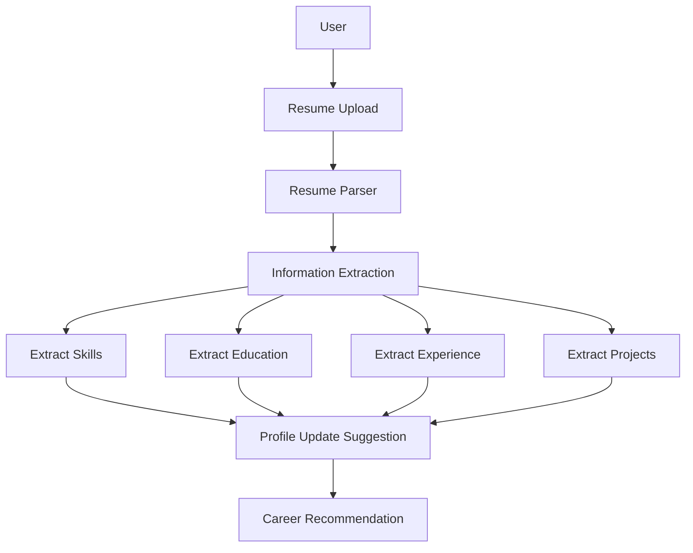
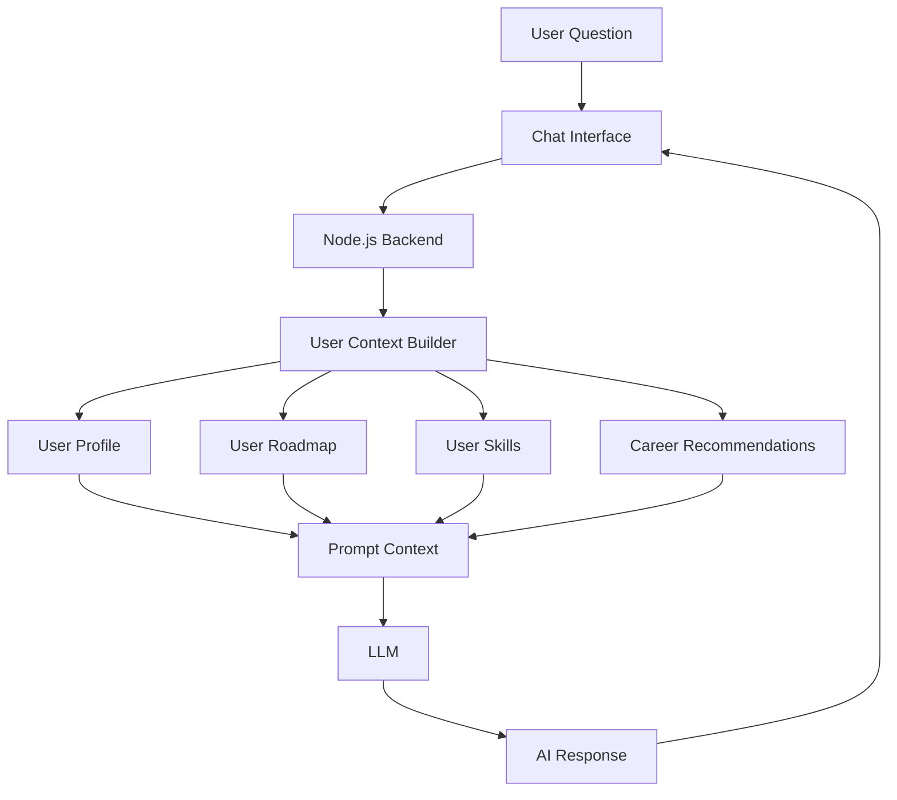
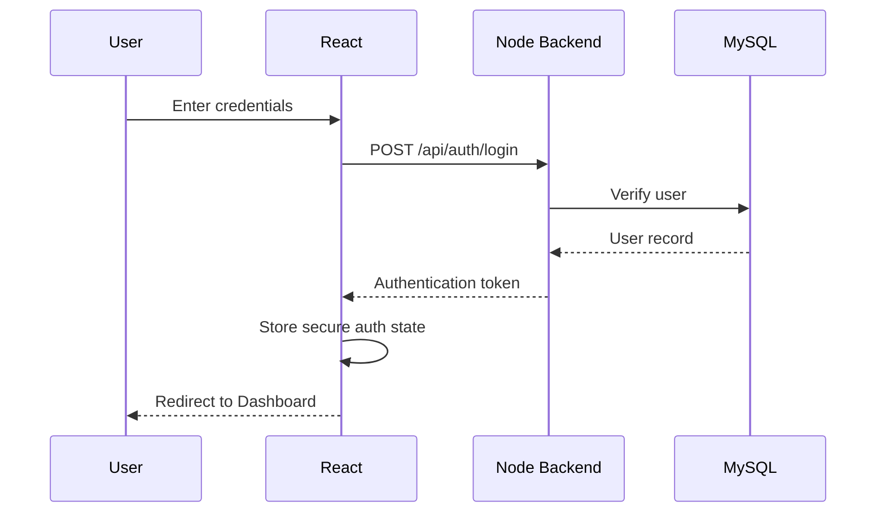
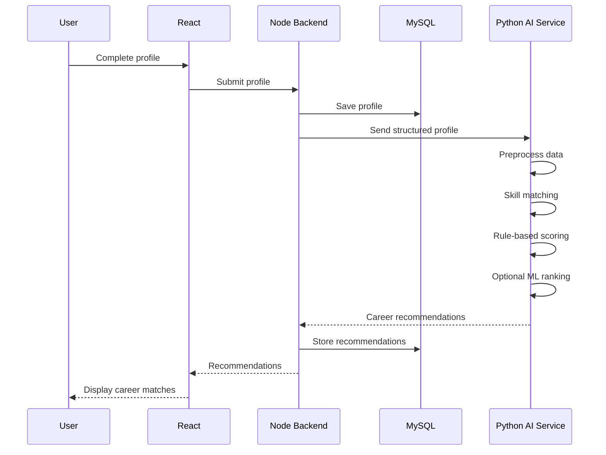

# Main Architecture

# One-Stop Personalized Career & Education Advisor

---

# 1. Architecture Overview

The system follows a modular, service-oriented architecture while remaining simple enough for a six-member student development team.

The primary architecture is:

```text
                    USER
                      │
                      ▼
              ┌───────────────┐
              │ React +       │
              │ Tailwind      │
              └───────┬───────┘
                      │
          ┌───────────┴────────────┐
          │                        │
          ▼                        ▼
   ┌──────────────┐        ┌──────────────┐
   │   Appwrite   │        │ Node/Express  │
   │              │        │   Backend     │
   │ Auth         │        │               │
   │ Storage      │        │ Business      │
   │ Messaging    │        │ Logic         │
   │ Realtime     │        │ APIs          │
   └──────────────┘        └───────┬───────┘
                                   │
                         ┌─────────┴─────────┐
                         ▼                   ▼
                  ┌─────────────┐    ┌──────────────┐
                  │    MySQL    │    │ Python AI    │
                  │             │    │ FastAPI      │
                  └─────────────┘    └──────────────┘
```

---
# 2. Technology Stack

## Frontend

* React
* JavaScript
* Tailwind CSS
* React Router
* Axios / Fetch

## Backend

* Main backend
* REST APIs
* Business logic
* Appwrite server integration
* MySQL integration
* External APIs

## Database

* MySQL
* Users' career data
* Skills
* Careers
* Career-skill mappings
* Recommendations
* Roadmaps
* Courses
* Internships
* Assessments

## AppWrite

* Authentication
* Storage
* Messaging
* Realtime

## AI / ML

* Python
* FastAPI
* Pandas
* NumPy
* Scikit-learn
* Optional LLM integration

## Development

* Git
* GitHub

---

# 3. System Architecture



---

# 4. Frontend Architecture

Recommended frontend structure:

```text
src/
│
├── assets/
│
├── components/
│   ├── common/
│   ├── forms/
│   ├── dashboard/
│   ├── career/
│   ├── roadmap/
│   ├── resume/
│   └── github/
│
├── pages/
│   ├── public/
│   │   ├── Home.jsx
│   │   ├── About.jsx
│   │   ├── HowItWorks.jsx
│   │   └── ExploreCareers.jsx
│   │
│   ├── auth/
│   │   ├── Login.jsx
│   │   ├── Signup.jsx
│   │   └── ForgotPassword.jsx
│   │
│   └── private/
│       ├── Dashboard.jsx
│       ├── Profile.jsx
│       ├── Assessment.jsx
│       ├── Recommendations.jsx
│       ├── SkillGap.jsx
│       ├── Roadmap.jsx
│       ├── ResumeAnalysis.jsx
│       ├── GitHubAnalysis.jsx
│       ├── CareerComparison.jsx
│       ├── WhatIf.jsx
│       ├── Courses.jsx
│       ├── Internships.jsx
│       ├── CareerAssistant.jsx
│       └── Settings.jsx
│
├── hooks/
├── services/
├── context/
├── utils/
├── routes/
└── App.jsx
```

---

# 5. Backend Architecture

Recommended structure:

```text
server/
│
├── src/
│   │
│   ├── config/
│   │
│   ├── controllers/
│   │   ├── authController.js
│   │   ├── profileController.js
│   │   ├── careerController.js
│   │   ├── roadmapController.js
│   │   ├── recommendationController.js
│   │   ├── resumeController.js
│   │   ├── githubController.js
│   │   └── notificationController.js
│   │
│   ├── routes/
│   │   ├── authRoutes.js
│   │   ├── profileRoutes.js
│   │   ├── careerRoutes.js
│   │   ├── roadmapRoutes.js
│   │   ├── recommendationRoutes.js
│   │   ├── resumeRoutes.js
│   │   └── githubRoutes.js
│   │
│   ├── services/
│   │   ├── authService.js
│   │   ├── profileService.js
│   │   ├── careerService.js
│   │   ├── recommendationService.js
│   │   ├── roadmapService.js
│   │   └── notificationService.js
│   │
│   ├── middleware/
│   │   ├── authMiddleware.js
│   │   ├── errorMiddleware.js
│   │   └── validationMiddleware.js
│   │
│   ├── models/
│   ├── utils/
│   └── app.js
│
└── package.json
```

---

# 6. AI Architecture

The AI system should be a separate Python service.

```text
                 Node.js Backend
                        │
                        │ HTTP
                        ↓
              ┌───────────────────┐
              │   Python FastAPI  │
              └─────────┬─────────┘
                        │
             ┌──────────┼──────────┐
             ↓          ↓          ↓
          Rules      Matching      ML
          Engine     Engine       Model
             │          │          │
             └──────────┼──────────┘
                        ↓
               Recommendation
                        │
                        ↓
                 Node.js Backend
```

---

# 7. AI Recommendation Pipeline



---

# 8. Career Recommendation Formula

The initial system can use a weighted scoring model.

Example:

```text
Career Score =

Skill Match          × 40%
Interest Match       × 20%
Assessment Match     × 15%
Education Match      × 10%
Goal Match            × 10%
Experience Match      × 5%
```

The weights must be configurable.

The system should not claim that these percentages represent scientifically validated career probabilities.

They are internal recommendation scores.

---

# 9. Skill Matching

Every career should have a skill profile.

Example:

```text
Full Stack Developer

JavaScript      → Required: Advanced
React           → Required: Advanced
Node.js         → Required: Intermediate
SQL             → Required: Intermediate
Git             → Required: Intermediate
Docker          → Required: Beginner
```

User:

```text
JavaScript → Advanced
React      → Advanced
Node.js    → Beginner
SQL        → Beginner
Git        → Intermediate
```

The system compares the two profiles.

---

# 10. Skill Gap Architecture



---

# 11. Personalized Roadmap Architecture

```text
Career Goal
     +
Current Skills
     +
Skill Gaps
     +
Available Time
     +
Learning Preferences
     ↓
Roadmap Generator
     ↓
Ordered Tasks
     ↓
Courses
Projects
Certifications
Assessments
     ↓
Progress Tracking
```

---

# 12. What-If Architecture

The What-If simulator must not permanently change the user's profile.



Example:

```text
Current:
Python = Beginner

Simulation:
Python = Advanced

↓

Recalculate

↓

Data Scientist
51% → 79%
```

---

# 13. Resume Analysis Architecture



---

# 14. GitHub Analysis Architecture

```text
GitHub Username
      ↓
GitHub API
      ↓
Public Repository Data
      ↓
Language Analysis
      ↓
Project Analysis
      ↓
Activity Analysis
      ↓
Skill Inference
      ↓
Profile Enhancement
```

The system should only analyze information legitimately accessible through the GitHub API/public profile.

---

# 15. AI Career Assistant Architecture



The AI assistant should be grounded in structured user data wherever possible.

---

# 16. MySQL Database Architecture

The database is relational.

Core relationships:

```text
User
 │
 ├── Profile
 │
 ├── Education
 │
 ├── Skills
 │
 ├── Interests
 │
 ├── Assessments
 │
 ├── Career Recommendations
 │
 ├── Roadmaps
 │      └── Roadmap Tasks
 │
 ├── Resume Analyses
 │
 └── GitHub Analyses
```

Career-side:

```text
Career
 │
 ├── Career Skills
 │
 ├── Courses
 │
 ├── Projects
 │
 ├── Certifications
 │
 └── Internships
```

---

# 17. Entity Relationship Diagram

```mermaid
erDiagram

    USERS {
        bigint id PK
        varchar email UK
        varchar password_hash
        varchar role
        datetime created_at
        datetime updated_at
    }

    PROFILES {
        bigint id PK
        bigint user_id FK
        varchar education_level
        varchar degree
        varchar branch
        int year
        decimal cgpa
        text career_goal
        varchar preferred_industry
        varchar preferred_location
        datetime created_at
        datetime updated_at
    }

    SKILLS {
        bigint id PK
        varchar name UK
        varchar category
    }

    USER_SKILLS {
        bigint id PK
        bigint user_id FK
        bigint skill_id FK
        int proficiency
        datetime updated_at
    }

    INTERESTS {
        bigint id PK
        varchar name UK
    }

    USER_INTERESTS {
        bigint id PK
        bigint user_id FK
        bigint interest_id FK
    }

    CAREERS {
        bigint id PK
        varchar name
        varchar category
        text description
    }

    CAREER_SKILLS {
        bigint id PK
        bigint career_id FK
        bigint skill_id FK
        int required_level
        int importance
    }

    CAREER_RECOMMENDATIONS {
        bigint id PK
        bigint user_id FK
        bigint career_id FK
        decimal match_score
        text explanation
        datetime created_at
    }

    ROADMAPS {
        bigint id PK
        bigint user_id FK
        bigint career_id FK
        varchar title
        int progress
        varchar status
        datetime created_at
        datetime updated_at
    }

    ROADMAP_TASKS {
        bigint id PK
        bigint roadmap_id FK
        varchar title
        text description
        int order_index
        varchar status
        int estimated_hours
        datetime completed_at
    }

    COURSES {
        bigint id PK
        varchar name
        varchar provider
        bigint skill_id FK
        varchar level
        int duration_hours
        varchar url
    }

    PROJECTS {
        bigint id PK
        varchar name
        bigint career_id FK
        text description
        varchar difficulty
    }

    USER_COURSES {
        bigint id PK
        bigint user_id FK
        bigint course_id FK
        varchar status
        int progress
    }

    ASSESSMENTS {
        bigint id PK
        bigint user_id FK
        varchar assessment_type
        decimal score
        datetime completed_at
    }

    RESUME_ANALYSES {
        bigint id PK
        bigint user_id FK
        varchar file_name
        text extracted_data
        text analysis_result
        datetime created_at
    }

    GITHUB_ANALYSES {
        bigint id PK
        bigint user_id FK
        varchar github_username
        text analysis_result
        datetime created_at
    }

    INTERNSHIPS {
        bigint id PK
        varchar title
        varchar company
        varchar location
        varchar url
        text description
    }

    USER_INTERNSHIP_RECOMMENDATIONS {
        bigint id PK
        bigint user_id FK
        bigint internship_id FK
        decimal match_score
        datetime created_at
    }

    NOTIFICATIONS {
        bigint id PK
        bigint user_id FK
        varchar title
        text message
        boolean is_read
        datetime created_at
    }

    USERS ||--|| PROFILES : has
    USERS ||--o{ USER_SKILLS : has
    SKILLS ||--o{ USER_SKILLS : assigned

    USERS ||--o{ USER_INTERESTS : has
    INTERESTS ||--o{ USER_INTERESTS : selected

    CAREERS ||--o{ CAREER_SKILLS : requires
    SKILLS ||--o{ CAREER_SKILLS : required_for

    USERS ||--o{ CAREER_RECOMMENDATIONS : receives
    CAREERS ||--o{ CAREER_RECOMMENDATIONS : recommended

    USERS ||--o{ ROADMAPS : owns
    CAREERS ||--o{ ROADMAPS : targets

    ROADMAPS ||--o{ ROADMAP_TASKS : contains

    SKILLS ||--o{ COURSES : teaches
    USERS ||--o{ USER_COURSES : enrolls
    COURSES ||--o{ USER_COURSES : selected

    CAREERS ||--o{ PROJECTS : related_to

    USERS ||--o{ ASSESSMENTS : completes
    USERS ||--o{ RESUME_ANALYSES : uploads
    USERS ||--o{ GITHUB_ANALYSES : analyzes

    USERS ||--o{ USER_INTERNSHIP_RECOMMENDATIONS : receives
    INTERNSHIPS ||--o{ USER_INTERNSHIP_RECOMMENDATIONS : recommended

    USERS ||--o{ NOTIFICATIONS : receives
```



---

# 18. Simplified ER Relationship

```text
                    ┌──────────────┐
                    │     USER     │
                    └──────┬───────┘
                           │
          ┌────────────────┼────────────────┐
          │                │                │
          ↓                ↓                ↓
      PROFILE           SKILLS         INTERESTS
          │
          ↓
     ASSESSMENTS
          │
          ↓
   RECOMMENDATIONS
          │
          ↓
       CAREER
          │
          ├────────── CAREER SKILLS
          │
          ├────────── COURSES
          │
          ├────────── PROJECTS
          │
          └────────── INTERNSHIPS
          │
          ↓
       ROADMAP
          │
          ↓
     ROADMAP TASKS
          │
          ↓
       PROGRESS
```

---

# 19. Authentication Flow



---

# 20. Recommendation Flow



---

# 21. Roadmap Generation Flow

```text
User Profile
     ↓
Target Career
     ↓
Required Skills
     ↓
Current Skills
     ↓
Skill Gap
     ↓
Priority Calculation
     ↓
Learning Resources
     ↓
Project Recommendations
     ↓
Ordered Roadmap
     ↓
Roadmap Tasks
     ↓
Dashboard
```

---

# 22. What-If Flow

```text
Current Profile
       ↓
Temporary Copy
       ↓
User changes skill
       ↓
Recommendation Engine
       ↓
New Career Scores
       ↓
Compare with Original
       ↓
Display Difference
```

---

# 23. API Architecture

Example endpoint structure:

```text
/api/auth
    POST /signup
    POST /login
    POST /logout

/api/profile
    GET /
    PUT /
    POST /skills
    DELETE /skills/:id

/api/careers
    GET /
    GET /:id
    GET /:id/skills
    POST /compare

/api/recommendations
    POST /generate
    GET /
    GET /:id

/api/roadmaps
    GET /
    POST /
    GET /:id
    PUT /:id
    DELETE /:id

/api/roadmaps/:id/tasks
    POST /
    PUT /:taskId
    DELETE /:taskId

/api/what-if
    POST /simulate

/api/resume
    POST /upload
    GET /analysis/:id

/api/github
    POST /analyze
    GET /:id

/api/courses
    GET /
    GET /recommended

/api/internships
    GET /
    GET /recommended

/api/assistant
    POST /chat

/api/notifications
    GET /
    PUT /:id/read
```

---

# 24. Deployment Architecture

For the hackathon prototype:

```text
                       INTERNET
                           │
                           ↓
                    ┌─────────────┐
                    │   Frontend  │
                    │ React Build │
                    └──────┬──────┘
                           │
                           ↓
                    ┌─────────────┐
                    │ Backend API │
                    │ Node/Express│
                    └──────┬──────┘
                           │
             ┌─────────────┼─────────────┐
             ↓             ↓             ↓
         ┌───────┐     ┌───────┐    ┌─────────┐
         │ MySQL │     │ Python│    │External │
         │       │     │ FastAPI│   │ APIs    │
         └───────┘     └───────┘    └─────────┘
```

---

# 25. Security Architecture

```text
User
 ↓
HTTPS
 ↓
Authentication
 ↓
Authorization Middleware
 ↓
Input Validation
 ↓
Controller
 ↓
Service Layer
 ↓
Database
```

Security requirements:

* HTTPS
* Password hashing
* Authentication middleware
* Authorization checks
* Input validation
* SQL injection prevention
* File upload validation
* API rate limiting where appropriate
* Secure environment variables
* No secrets in GitHub

---

# 26. Data Flow Summary

```text
USER INPUT
   ↓
FRONTEND
   ↓
BACKEND API
   ↓
VALIDATION
   ↓
MYSQL
   ↓
AI SERVICE
   ↓
RECOMMENDATION
   ↓
BACKEND
   ↓
MYSQL
   ↓
FRONTEND
   ↓
DASHBOARD
```

---

# 27. Architecture Principle

The system should follow:

> **Frontend handles presentation.**

> **Backend handles business logic and orchestration.**

> **MySQL handles persistent structured data.**

> **Python handles AI/ML-specific processing.**

> **External APIs provide external information.**

No layer should unnecessarily contain another layer's responsibilities.
